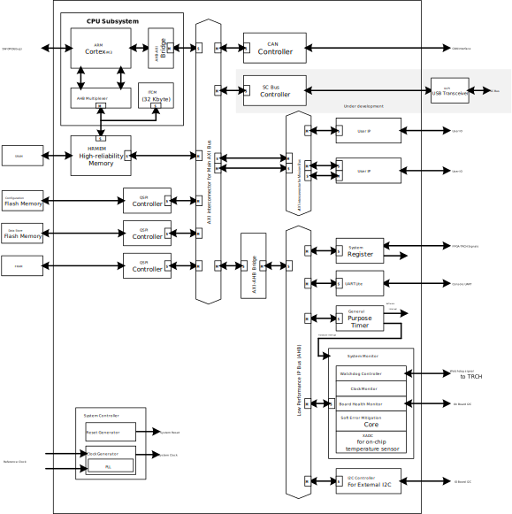
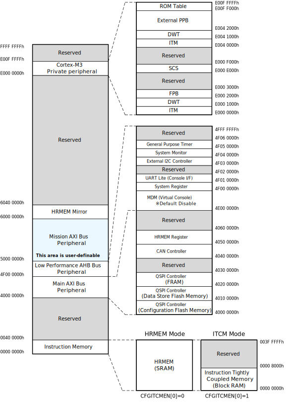
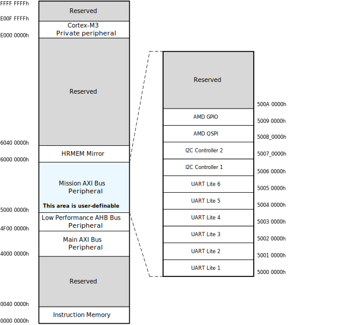
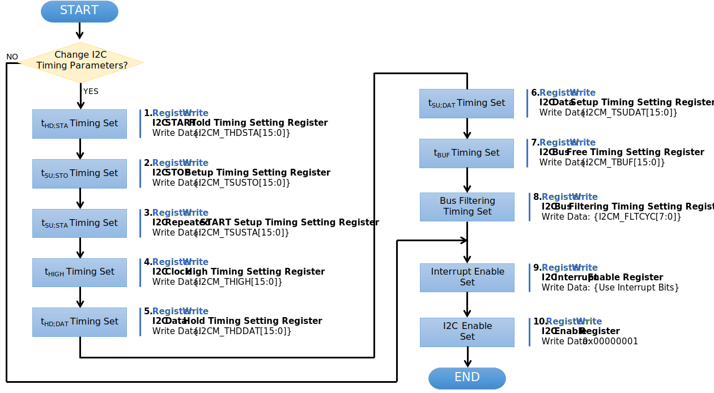
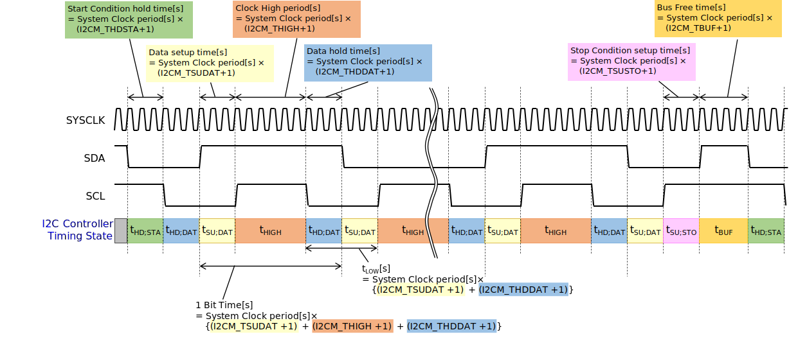
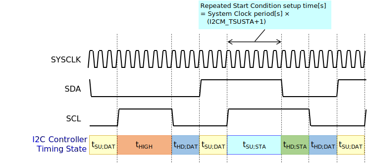

このドキュメントは、Space Cubics OBCに搭載する
FPGAの仕様を説明する「SC-OBC-A1 FPGA Technical Reference
Manual」に関するものです。

SC-OBC-A1
FPGAの開発や、ソフトウェアの開発に必要な、FPGA機能に関する仕様やレジスタの仕様が記載されています。

== Overview

SC-OBC Module A1 FPGA (以下 SC-OBC-A1 FPGA)は、Space Cubics製 OBC
"SC-OBC Module A1"の FPGAに搭載されるシステムです。

SC-OBC Module A1は 3U以上の CubeSatをターゲットとする On Board
Computer(以下、OBC)です。 メインプロセッサ用デバイスとして AMD (旧
Xilinx) 製 Artix-7 FPGAを採用し、FPGAにインプリするソフトコアの ARM
Cortex-M3を核としシステムを構成します。
FPGAを採用する事で、インターフェースの種類や数を
柔軟にカスタマイズする事が可能です。

SC-OBC-A1
FPGAには、ユーザーのIPコアを実装するためのモジュールが準備されており、AXIバス規格に適合した
IPコアを設計する事で、簡単にシステムに組み込む事ができます。

.SC-OBC-A1 FPGA Block Diagram

SC-OBC-A1 FPGAのシステムは大きく 6つの機能に分割されます。

*System Controller*

System Controllerは、FPGAのクロック,
リセットを生成するためのモジュールです。
このモジュールで生成されるクロック, リセットは、FPGA全体に供給されます。

*CPU Subsystem*

Space Cubics OBCの FPGA機能を司る CPUを構成するモジュールです。 CPUには
ARM製の Cortex-M3を採用しています。 ARM Cortex-M3 Design Start
FPGA-Xilinx editionをベースとし、ITCM(Instruction Tightly Coupled
Memory)や、バスIPなどで構成されます。

*HRMEM (High-reliability Memory)*

HRMEMは、CPUが使用するメインメモリです。 CPUとの接続は AMBA
AHBで構成される CPU Local Busで行われます。

CPU Local Busは ARM Cortex-M3の Instruction code AHB, Data code
AHBをまとめたバスで構成されています。 CPU Local
Busでメモリと直接接続する構成とする事で、Instructionアクセスのレイテンシーを最小限に抑えるように設計されています。

*Main AXI Bus System*

Main AXI Bus Systemは、CubeSat向けの
OBCシステムとして必須となる機能の中で、アクセススピードが比較的重視されるIPコアをまとめたシステムです。

このバスには、コンピュータシステムとして必要なメモリコントロールIPや
CubeSatのメインの通信バスとなる
CANのコントローラIPなどが接続されています。

*Low Performance IP Bus System*

Low Performance IP Bus Systemは、CubeSat向け
OBCシステムとして必須となる機能の中、アクセス頻度の低いIPコアをまとめたシステムです。

このシステムは
AHBを採用する事で、IPコアの回路規模を小さくする事ができます。
このバスには、システムレジスタやI2Cコントローラなどが接続されます。

*Mission Bus System*

Mission Bus Systemはユーザーが
CubeSatのミッションを行うための機能を実装するシステムです。
OBCの出荷時に Flash Memoryに書き込まれている標準イメージ
(以下、標準イメージ)では、このシステムには
UART、I2C、SPI、GPIOコアが接続されています。 ユーザーは、Mission Bus
Systemを再設計したり、標準イメージとして実装される回路を修正したりする事により任意のシステムを実現する事ができます。

このシステムは、バスとして
AXIが採用されています。ユーザーはAMDが提供する
IPコアを用いる事によって簡単にシステムを構築する事ができます。

=== Outline

[cols=",",options="header",]
|===
|Feature |Description
|FPGA Device |AMD (旧 Xilinx) Artix-7 (XC7A200T-1FBG676I)

| |- Logic Cell 215,360

| |- CLB スライス数(4 LUT, 8 F/F) 33,650

| |- CLB 最大分散RAM 2,888 Kb

| |- DSP48E1スライス 740

| |- BlockRAM 36 Kb x 365 (18 Kb x 730)

| |- CMT 10

| |- XADC 1 (for FPGA die temperature measurement)

| |- I/O Bank 10

|CPU Core |ARM Cortex-M3 Design Start FPGA Xilinx Edition r0p1

| |- CPU Revision r2p1

| |- ARMv7-M architecture profile

| |- Maximum operation frequency up to 48 MHz (※)

| |※ユーザーの回路も含めタイミング検証を行い
最高動作周波数を確認する必要があります

|On Chip SRAM (ITCM for Boot) |32 KByte

|HRMEM [High-reliability Memory] |4 MByte

| |- ECC Memory Protection

| |- Memory Scrubbing

|Internal System Bus |CPU Local Bus: AMBA AHB3 32 bitMain Bus: AMBA AXI4
32bit

| |Mission Bus (for User): AMBA AXI4 32 bit

| |Low Performance IP Bus: AMBA AHB3 32 bit

|DMA |Not Support

|Interrupt Support |16 User interrupt signal

|Watchdog Timer |Space Cubics TRCH-FPGA watchdog system

|FPGA Configuration Flash Memory |32 MByte/Redundancy (S25FL256L)

|Data Store Flash Memory |32 MByte/Redundancy (S25FL256L)

|FRAM |512 kByte x 2 (CY15B104QSN)

|Control Area Network (CAN) |Conforms to the ISO 11898-1, CAN2.0A, and
CAN2.0B standards Supports bit rates up to 1 Mb/s

|Space Communication Bus (SCBus) |この機能は、現在開発中です

| |Compliant with the USB-based communication interface proposed by
Space Cubics (T.B.D.)

| |- Supports bit rates 12 Mbps (USB Full-Speed)

|I2C Interface |SC-OBC Module A1 On Board I2C x 1 channel

| |External I2C x 1 channel

|FPGA User IO |User IO Group 1 x 16 pin (IO電圧可変)

| |User IO Group 2 x 16 pin (IO電圧可変)

| |User IO Group 4 x 6 pin, Cortex-M3 Debug Port兼用 (3.3V固定)

| |標準イメージでは、以下のインターフェースが実装されています。

| |- UART x 6 channel

| |- I2C x 2 channel

| |- SPI x 1 channel (Chip Select 3本)

| |- GPIO x 10 bit

|Debug Port |ARM SW-DP (Serial Wire Debug Port) Interface
|===

== Memory Map

以下に、SC-OBC-A1 FPGAのメモリマップを示します。

.SC-OBC-A1 FPGA Memory Map

.SC-OBC-A1 FPGA メモリマップ
[cols=",,",options="header",]
|===
|Field |Address Space |Comment
|Instruction Tightly Coupled Memory (Block RAM) |0x0000~0000~ -
0x0000~7FFF~ |CFGITCMEN[0] is 1

|HRMEM (SRAM) |0x0000~0000~ - 0x003F~FFFF~ |CFGITCMEM[0] is 0

|Main AXI Bus |0x4000~0000~ - 0x4EFF~FFFF~ |

|- QSPI Controller (Configuration Flash) |0x4000~0000~ - 0x4000~FFFF~ |

|- QSPI Controller (Data Store Flash) |0x4010~0000~ - 0x4010~FFFF~ |

|- QSPI Controller(FRAM) |0x4020~0000~ - 0x4020~FFFF~ |

|- CAN Controller |0x4040~0000~ - 0x4040~FFFF~ |

|- HRMEM Register |0x4050~0000~ - 0x4050~FFFF~ |

|Low Performance IP Bus |0x4F00~0000~ - 0x4FFF~FFFF~ |

|- System Register |0x4F00~0000~ - 0x4F00~FFFF~ |

|- UART Lite (Console Interface) |0x4F01~0000~ - 0x4F01~FFFF~ |

|- External I2C Controller |0x4F03~0000~ - 0x4F03~FFFF~ |

|- System Monitor |0x4F04~0000~ - 0x4F04~FFFF~ |

|- General Purpose Timer |0x4F05~0000~ - 0x4F05~FFFF~ |

|Mission(UDL) Bus |0x5000~0000~ - 0x5FFF~FFFF~ |

|HRMEM Memory Mirror |0x6000~0000~ - 0x603F~FFFF~ |

|Coretex-M3 Internal Private peripheral bus |0xE000~0000~ - 0xE003~FFFF~
|

|- ITM |0xE000~0000~ - 0xE000~0FFF~ |

|- DWT |0xE000~1000~ - 0xE000~1FFF~ |

|- FPB |0xE000~2000~ - 0xE000~2FFF~ |

|- SCS |0xE000~E000~ - 0xE000~EFFF~ |

|Coretex-M3 External Private peripheral bus |0xE004~0000~ - 0xE00F~FFFF~
|

|- TPIU |0xE004~0000~ - 0xE004~0FFF~ |

|- ETM |0xE004~1000~ - 0xE004~1FFF~ |

|- External PPB |0xE004~2000~ - 0xE00F~EFFF~ |

|- ROM Table |0xE00F~F000~ - 0xE00F~FFFF~ |
|===

SC-OBC-A1 FPGAのメモリ空間において、0x50000000〜0x5FFFFFFFは Mission Bus
Systemに予約された空間です。 このメモリ空間は、Mission Bus
Systemの設計によって任意の構成に実装することができます。
以下に示すメモリマップは、標準イメージに実装されている Mission Bus
Systemのメモリマップです。

.SC-OBC-A1 FPGA Mission Bus System Memory Map

[cols=",,",options="header",]
|===
|Field |Address Space |Comment
|Mission(UDL) Bus |0x5000~0000~ - 0x5FFF~FFFF~ |
|- UART Lite 1 |0x5000~0000~ - 0x5000~FFFF~ |
|- UART Lite 2 |0x5001~0000~ - 0x5001~FFFF~ |
|- UART Lite 3 |0x5002~0000~ - 0x5002~FFFF~ |
|- UART Lite 4 |0x5003~0000~ - 0x5003~FFFF~ |
|- UART Lite 5 |0x5004~0000~ - 0x5004~FFFF~ |
|- UART Lite 6 |0x5005~0000~ - 0x5005~FFFF~ |
|- I2C Controller 1 |0x5006~0000~ - 0x5006~FFFF~ |
|- I2C Controller 2 |0x5007~0000~ - 0x5007~FFFF~ |
|- AMD QSPI |0x5008~0000~ - 0x5008~FFFF~ |
|- AMD GPIO |0x5009~0000~ - 0x5009~FFFF~ |
|===

CPUが使用する メインメモリーは アドレス
0x00000000にマッピングされています。 メインメモリーは、ITCM (Instruction
Tightly Coupled Memory)と HRMEM (High Reliability
Memory)を選択する事ができます。 ITCMと HRMEMの切り替えは Code Memory
Select Registerの ITCMENビットによって行います。

ITCMは FPGAの Block RAMで構成されています。 このメモリは FPGAの
Configurationデータ (Bit Streamデータ)にプログラムを格納する事で、FPGAの
Configuration後 すぐに CPUが動作します。 HRMEMは On Boardの
SRAMで構成されています。
このメモリを使用する場合には、電源の投入後にデータを書き込んで使用する必要があります。
HRMEMは IPコアの内部に
SRAMのデータが放射線によって破壊された場合に訂正する仕組みを実装しているため、通常はこのメモリを使って動作します。

.CPU Main Memory構成
image::./images/itcm_hrmem_select.png[./images/itcm_hrmem_select]

FPGAの Configuration後、アドレス 0x00000000に
ITCMがマッピングされています。 ITCMには
プログラムローダーを書き込んで使用します。 プログラムローダーは NOR
Flash Memoryに書き込まれているプログラムを
HRMEMに転送するために使用します。 HRMEMのアドレス
0x60000000番地は、アドレス
0x00000000番地のミラーとなっており、プログラムローダーによって
0x60000000に書き込まれたデータは、メインメモリーを HRMEMに切り替えた時に
0x00000000から読み出す事ができます。 プログラムローダーが
HRMEMへのプログラムを書き込む最後の手順として、Code Memory Select
Registerの ITCMENビットを 0に書き込みます。
ITCMENビットの書き込みにより、メインメモリーを切り替えるとシステムにリセットがかかり、切り替えたメモリのアドレス
0x00000000から書き込まれたデータで CPUが動作します。

== Interrupt

SC-OBC-A1
FPGAは、Cortex-M3に組み込まれる割り込みコントローラの外部割り込みを使用し、IPコアの割り込みをCPUに伝えます。
Cortex-M3の 割り込みコントローラの仕様については、ARM Cortex-M3
Technical Reference Manualを参照してください。

IRQ Bit [31:16]は、Mission Bus
Systemに割り当てられた割り込みビットです。
ユーザーが設計した回路に応じて割り当てが決定します。

以下に、SC-OBC-A1 FPGAの IPコアが出力する割り込みの割り当てを示します。
IRQ Bit [31:16]は、標準イメージにて実装されている割り込みビットです。

.SC-OBC-A1 FPGA割り込みリスト
[cols=",,,",options="header",]
|===
|Exception No. |IRQ Bit |Interrupt |Type
|16 |[0] |UART (Console) |Pulse
|17 |[1] |HRMEM (High-reliability Memory) |Level
|18 |[2] |QSPI Controller (Configuration Flash Memory) |Level
|19 |[3] |QSPI Controller (Data Store Flash Memory) |Level
|20 |[4] |QSPI Controller (FRAM) |Level
|21 |[5] |CAN Controller |Level
|22 |[6] |Reserved (OBC System Interrupt Area) |-
|23 |[7] |External I2C Controller |Level
|24 |[8] |System Monitor (Hardware Error) |Level
|25 |[9] |System Monitor (Board Health Monitor) |Level
|26 |[10] |General Purpose Timer (Global Timer) |Level
|27 |[11] |General Purpose Timer (Software Interrupt Timer) |Level
|28 - 31 |[15:12] |Reserved (OBC System Interrupt Area) |-
|32 - 47 |[31:16] |UDL IP Interrupt Area |-
|32 |[16] |UART 1 |Pulse
|33 |[17] |UART 2 |Pulse
|34 |[18] |UART 3 |Pulse
|35 |[19] |UART 4 |Pulse
|36 |[20] |UART 5 |Pulse
|37 |[21] |UART 6 |Pulse
|38 |[22] |I2C Controller 1 |Levle
|39 |[23] |I2C Controller 2 |Level
|40 |[24] |AMD QSPI Controller |Level
|41 |[25] |AMD GPIO Controller |Level
|47 - 42 |[31:26] |Reserved (UDL IP Interrupt Area) |-
|===

== System Register

System Registerは、SC-OBC-A1
FPGAのシステム制御を司るレジスタで構成されるモジュールです。

=== レジスタ詳細

System Registerは、Base Address 0x4F00~0000に配置されています~。

.System Registerメモリマップ
[cols=",,,",options="header",]
|===
|Offset |Symbol |Register |Initial
|0x0000 |SYSREG~CODEMSEL~ |Code Memory Select Register |0x00000001

|0x0004 |SYSREG~SYSCLKCTL~ |System Clock Control Register |0x00000001

|0x0008 |SYSREG~PLLINFO~ |PLL Infomation Register |0x00280014

|0x0010 |SYSREG~CFGMEMCTL~ |Configuration Flash Memory Register
|0x000x0000

|0x0020 |SYSREG~PWRCYCLE~ |Power Cycle Register |0x00000000

|0x0030 |SYSREG~PWRMANAGE~ |Power Management Register |0x00000000

|0x00F0 |SYSREG~SPAD1~ |Scratchpad 1 Register |0x00000000

|0x00F4 |SYSREG~SPAD2~ |Scratchpad 2 Register |0x00000000

|0x00F8 |SYSREG~SPAD3~ |Scratchpad 3 Register |0x00000000

|0x00FC |SYSREG~SPAD4~ |Scratchpad 4 Register |0x00000000

|0xF000 |SYSREG~VER~ |System Register IP Version Register |-

|0xFF00 |SYSREG~BUILDINFO~ |Build Information Register |-

|0xFF10 |SYSREG~DNA1~ |Device DNA 1 Register |-

|0xFF14 |SYSREG~DNA2~ |Device DNA 2 Register |-
|===

==== Code Memory Select Register (Offset 0x0000)

Code Memory Select Registerは CPUの Instruction
codeが格納されているメモリを選択するためのレジスタです。
本レジスタの制御により、メモリ空間の アドレス
0x00000000にマッピングされるメモリを選択します。

電源投入時、ITCMENビットは "1"となっており、メモリ空間のアドレス
0x00000000には ITCMがマッピングされています。
CPUによって、ITCMENビットが "0"に書き換えられると、メモリ空間のアドレス
0x00000000に HRMEMがマッピングされます。

ITCMENビットの設定値が変更された時、システム全体にリセットが発行されます。
ITCMENビットの変更は、ITCMに書き込まれた Boot用のソフトウェアから
HRMEMに書き込まれたメインのソフトウェアに遷移する時に
1度だけ制御する事を想定しています。

.Code Memory Select Regsiter ビットフィールド
[cols=",,,,",options="header",]
|===
|bit |Symbol |Field |Description |R/W
|31:16 |ITCMENPKC |Protect Keycode
|ITCMENビットの書き込みプロテクトフィールドです。ITCMENビットに書き込みを行う場合は、このフィールドに0x5A5Aを書き込んでください。このフィールドに0x5A5A以外が設定された場合、ITCMENビットへの書き込みは無視されます。
|WO

|15:1 |- |Reserved |Reserved |-

|0 |ITCMEN |ITCM Enable |メモリ空間のアドレス
0x00000000にマッピングされるメモリを選択します。0: HRMEM 1: ITCMEN |R/W
|===

==== System Clock Control Register (Offset 0x0004)

System Clock Control
Registerは、システム内部で使われるクロックの周波数を設定するためのレジスタです。

このレジスタの制御により、SC-OBC-A1 FPGA内部の
PLLを停止させ、低消費電力動作させることが可能です。

.System Clock Control Register ビットフィールド
[cols=",,,,",options="header",]
|===
|bit |Symbol |Field |Description |R/W
|31:2 |- |Reserved |Reserved |-

|1:0 |CLKMODE |CLKMODE Control
|システムのクロックモードを制御します。設定値とクロック周波数の関係は
"CLKMODE設定と PLL状態 及び クロック周波数の関係"を参照してください。
|R/W
|===

CLKMODE信号の設定値と、PLLの状態 及び
システムクロック周波数の関係は以下となります。

.CLKMODE設定と PLL状態 及び クロック周波数の関係
[cols=",,,,,",options="header",]
|===
|CLKMODE[1:0] |PLL Status |REF~CLK~ |SYS~CLK~ |MAXI~CLK~ |USER~CLK1~ /
USER~CLK2~
|0b00 |PowerDown |24 MHz (Reference Clock) |24 MHz (Reference Clock) |24
MHz (Reference Clock) |RTLパラメータにより設定 (Stop or Reference Clock)

|0b01 |Normal Operation |24 MHz (Reference Clock) |48 MHz (PLL Output)
|48 MHz (PLL Output) |RTLパラメータにより設定 (PLL Output)

|0b10 |Normal Operation |24 MHz (Reference Clock) |96 MHz (PLL Output)
|96 MHz (PLL Output) |RTLパラメータにより設定 (PLL Output)

|0b11 (設定禁止) |- |- |- |- |-
|===

==== PLL Infomation Register (Offset 0x0008)

PLL Infomation
Registerは、システムクロックの設定状況を示すレジスタです。
ソフトウェアはこのレジスタの値から、現在のシステムクロックの周波数を計算する事ができます。

.System Clock Control Register ビットフィールド
[cols=",,,,",options="header",]
|===
|bit |Symbol |Field |Description |R/W
|31:16 |PLL~MULT~ |PLL Multiple Rate
|システムクロックを生成するPLLの現在の逓倍率を示すフィールドです。 |RO

|15:0 |PLL~DIV~ |PLL Divide Rate
|システムクロックを生成するPLLの現在の分周率を示すフィールドです。 |RO
|===

システムクロック周波数は PLL Infomation
Registerから読み出した値を使い以下の式で計算する事ができます。

____
latexmath:[システムクロック周波数 (MHz) = リファレンスクロック (24 MHz) \times \frac{PLL\_MULT}{PLL\_DIV}]
____

==== Configuration Flash Memory Register (Offset 0x0010)

Configuration Flash Memory Registerは SC-OBC-A1 Moduleに実装される 2つの
Configuration Flash Memory (NOR FLash
Memory)に関する制御を行うためのレジスタです。

.Configuration Flash Memory Register ビットフィールド
[cols=",,,,",options="header",]
|===
|bit |Symbol |Field |Description |R/W
|31:13 |- |Reserved |Reserved |-

|12 |CFGBOOTMEM |Boot Memory |SC-OBC-A1 FPGAが Configurationsに使用した
Flash Memoryを示すビットです。このフィールドを読み出す事で、SC-OBC-A1
FPGAがどちらの Flash Memoryから起動したか知る事ができます。SC-OBC-A1
FPGAの Configuration後 Resetが解除される時に確定します。 |RO

|11:6 |- |Reserved |Reserved |-

|5 |CFGMEMMON |Configuration Flash Memory Monitor |現在選択されている
Configuration Flash Memoryの選択状態を示すビットです。 |RO

|4 |CFGMEMSEL |Configuration Flash Memory Select |Configuration Flash
Memoryを選択するためのビットです。CFGMEMOWNERフィールドが
"0"にクリアされている時のみ、このビットが有効になります。0:
Configuration Flash Memory 0を選択. 1: Configuration Flash Memory
1を選択 |R/W

|3:1 |- |Reserved |Reserved |-

|0 |CFGMEMOWNER |Configuration Flash Memory Owner |Configuration Flash
Memoryの選択をレジスタによって選択するか、QSPIコアによって選択するかを決定するフィールドです。0:
Configuration Flash Memoryは CFGMEMSELビットにより選択される. 1:
Configuration Flash Memoryは QSPIコアにより選択される. QSPIコアによる
Configuration Flash Memoryのメモリパトロールを行う場合は、このビットを
"1"にセットしてください。 |R/W
|===

Configuration Flash Memoryの選択は、以下の 3つの制御状態を持っています。

[cols=",",options="header",]
|===
|状態 |選択条件
|TRCHによる選択 |OBC Moduleへの電源投入後、TRCHが FPGAの
起動完了を認識するまでの間

|レジスタによる選択 |TRCHが FPGAの Configuration完了を認識し、且つ
CFGMEMOWNER=0の場合

|QSPIコアによる選択 |TRCHが FPGAの Configuration完了を認識し、且つ
CFGMEMOWNER=1の場合
|===

SC-OBC-A1 FPGAが Configurationし TRCHが
FPGAの起動完了を認識する間、Configuration Flash Memoryの選択は
TRCHによって行われます。 この仕様により、SC-OBC-A1 FPGAが
Configurationするための Memoryは TRCHによって選択されます。

TRCHが FPGAの起動完了を認識すると、Configuration Flash Memoryの制御権は
FPGAに移行します。 FPGAは
CFGMEMSELビットの設定によって、ソフトウェアによる選択を行うか、QSPIコアによる選択を行うかを決定します。

Configuration Flash
Memoryの選択を切り替える場合は、CFGMEMSELビットの値を変更後、CFGMEMMONビットを読み出し切り替えが完了した事を確認してください。
Configuration Flash Memoryへのアクセス開始は、必ず
CFGMEMMONビットが切り替わった後に開始してください。

現状の SC-OBC-A1 FPGAには QSPIコアによる Configuration Flash
Memoryのメモリパトロール機能は実装されていません。
CFGMEMOWNERビットは必ず "0"に設定し使用してください。

==== Power Cycle Register (Offset 0x0020)

Power Cycle Registerは SC-OBC-A1 FPGAに対する Power
Cycle要求を発行するためのレジスタです。

このレジスタの制御により Power Cycleを要求すると、TRCHによって Power
Cycleが実行されます。

.Power Cycle Register ビットフィールド
[cols=",,,,",options="header",]
|===
|bit |Symbol |Field |Description |R/W
|31:16 |PWRCYCLEPKC |Power Cycle Protect Keycode
|PWRCYCLEREQビットの書き込みプロテクトフィールドです。PWRCYCLEREQビットに書き込みを行う場合は、このフィールドに0x5A5Aを書き込んでください。このフィールドに0x5A5A以外が設定された場合、PWRCYCLEREQビットへの書き込みは無視されます。
|WO

|15:1 |- |Reserved |Reserved |-

|0 |PWRCYCLEREQ |Power Cycle Request |TRCHに対し Power Cycle
Requestを発行するためのビットです。このビットに "1"を書き込むと
TRCHによる FPGAの Power Cycleが実行されます。このビットへの
"0"の書き込みは何も影響しません。 |R/W
|===

==== Power Management Register (Offset 0x0030)

Power Management Registerは、SC-OBC-A1
FPGAの低電力制御を行うためのレジスタです。

このレジスタは、CPUが WFI (Wait For Interrupt)命令や WFE (Wait For
Event)命令を実行したときに遷移する、Sleepモードにおける SC-OBC-A1
FPGAの状態を決定します。 WFI命令や WFE命令を実行すると、CPUは
条件によって Sleepモードに遷移し 命令の実行を停止します。

PWRDOWNENがセットされた状態で CPUが
Sleepモードに遷移すると、システムクロックを生成する
PLLは停止状態になります。 PWRDOWNENがセットされていない状態では、CPUが
Sleepモードに遷移しても、PLLは停止しません。

PLLが停止すると、UARTや QSPI Controllerなどのクロックも停止します。
したがって、低消費電力化のため PWRDOWNENをセットして
WFI命令を実行する場合は、全ての
Peripheralのデータ転送が完全に完了した後で、WFI命令を実行してください。

.Power Management Register ビットフィールド
[cols=",,,,",options="header",]
|===
|bit |Symbol |Field |Description |R/W
|31:16 |PWRDOWNPKC |Power Down Protect Keycode
|PWRDOWNENビットの書き込みプロテクトフィールドです。PWRDOWNENビットに書き込みを行う場合は、このフィールドに0x5A5Aを書き込んでください。このフィールドに0x5A5A以外が設定された場合、PWRDOWNENビットへの書き込みは無視されます。
|WO

|15:1 |- |Reserved |Reserved |-

|0 |PWRDOWNEN |Power Down Enable |CPUが Sleepモードになった時の
PLLの状態を設定します。0: CPUが Sleepモードになった時
PLLは停止しません。1: CPUが Sleepモードになった時 PLLは停止します。 |R/W
|===

==== Scratchpad 1-4 Register (Offset 0x00F0-0x00FC)

Scratchpad 1-4
Registerは、ソフトウェアがワークスペースとして使用する為のレジスタです。
このレジスタの書き込みは、SC-OBC-A1 FPGAの機能に一切影響を与えません。

このレジスタは、SC-OBC-A1 FPGAの
Configuration後に一度だけ初期化されます。 Code Memory Select Registerの
ITCMENビットが変更された時に発行されるシステムリセットでは、このレジスタはクリアされません。

.Scratchpad 1 Register ビットフィールド (Offset: 0x00F0)
[cols=",,,,",options="header",]
|===
|bit |Symbol |Field |Description |R/W
|31:0 |SPAD1 |Scratchpad 1 |32bitのScratchpadフィールドです。 |R/W
|===

.Scratchpad 2 Register ビットフィールド (Offset: 0x00F4)
[cols=",,,,",options="header",]
|===
|bit |Symbol |Field |Description |R/W
|31:0 |SPAD2 |Scratchpad 2 |32bitのScratchpadフィールドです。 |R/W
|===

.Scratchpad 3 Register ビットフィールド (Offset: 0x00F8)
[cols=",,,,",options="header",]
|===
|bit |Symbol |Field |Description |R/W
|31:0 |SPAD3 |Scratchpad 3 |32bitのScratchpadフィールドです。 |R/W
|===

.Scratchpad 4 Register ビットフィールド (Offset: 0x00FC)
[cols=",,,,",options="header",]
|===
|bit |Symbol |Field |Description |R/W
|31:0 |SPAD4 |Scratchpad 4 |32bitのScratchpadフィールドです。 |R/W
|===

==== System Register IP Version Register (Offset: 0xF000)

System Registerの IPコアバージョンの管理レジスタです。

.System Register IP Version Register ビットフィールド
[cols=",,,,",options="header",]
|===
|bit |Symbol |Field |Description |R/W
|31:24 |MAJVER |System Register Core Major Version |System
RegisterコアのMajor Versionです。 |RO

|23:16 |MINVER |System Register Core Minor Version |System
RegisterコアのMinor Versionです。 |RO

|15:0 |PATVER |System Register Core Patch Version |System
RegisterコアのPatch Versionです。 |RO
|===

==== Build Information Register (Offset: 0xFF00)

SC-OBC-A1 FPGAのビルド情報を保持するレジスタです。
現在動作しているシステムの FPGAデータが作られた Git
Repositoryのハッシュ値の先頭 8文字が保持されます。 FPGAデータが
Git管理されていない環境から生成された場合、このレジスタは
0x00000000を示します。

.Build Information Register ビットフィールド
[cols=",,,,",options="header",]
|===
|bit |Symbol |Field |Description |R/W
|31:0 |BUILD~INFO~ |Build Information Register
|現在動作しているシステムの FPGAデータが作られた Git
Repositoryのハッシュ値の 先頭 8桁が格納されるレジスタです。 |RO
|===

==== Device DNA 1/2 Register (Offset: 0xFF10/0xFF14)

Device DNA 1/2 Registerは、FPGAの Device DNAの値を保持するレジスタです。

Artix-7は、デバイスの eFuse領域に FUSE~DNAと呼ばれる~、64
bitのデバイス固有値を保持しています。
FUSE~DNAは~、FPGAの工場出荷時にプログラミングされるものであり、値を変える事はできません。

FPGAからは、FUSE~DNAのうち~ 63 bitから 7 bitを、Device
DNAとして読み出す事ができます。 ユーザーは Device DNA 1/2
Registerを読み出す事によって、Device DNAの値を知る事ができます。

.Device DNA 1 Register ビットフィールド
[cols=",,,,",options="header",]
|===
|bit |Symbol |Field |Description |R/W
|31:7 |DNA~LSB~ |Device DNA LSB side |Device DNAの bit
31:7が格納されるレジスタです。 |RO

|6:0 |- |Reserved |Reserved |-
|===

.Device DNA 2 Register ビットフィールド
[cols=",,,,",options="header",]
|===
|bit |Symbol |Field |Description |R/W
|31:0 |DNA~MSB~ |Device DNA MSB side |Device DNAの bit
63:32が格納されるレジスタです。 |RO
|===

== System Monitor

System Monitorは、SC-OBC-A1
FPGAのシステムを監視するためのモジュールです。

このモジュールは以下の機能を実装しています。

* FPGA Watchdog機能
* Hardware Monitor機能
* SEM Controller機能
* Board Health Monitor機能

=== FPGA Watchdog

SC-OBC-A1 FPGAのシステムは、TRCHによって監視されます。 SC-OBC-A1 FPGAは
System Monitorが収集した FPGA内部の状態を Watchdog signal
(FPGA~WATCHDOG~)を通じて TRCHに伝えます。 TRCHは FPGAが出力する
FPGA~WATCHDOG信号が定期的にトグルしている間~、FPGAが健全に動作していると判断します。

=== SEM Controller

SEM (Soft Error Mitigation) Controllerは、AMD (旧 Xilinx)
FPGAのコンフィギュレーションメモリで発生したソフトエラーの検出
及び訂正を行う、AMD (旧 Xilinx) から提供されるソリューションです。
SC-OBC-A1 FPGAはこの機能をシステムに組み込み、SEM Controllerの状態を
System Monitorのレジスタから読み出す機能を持っています。

CPUが正常に動作している場合でも、SEM
Controllerが訂正不能なエラーを検出した場合や、SEM
Controller自体に障害が発生した場合には、SC-OBC-A1
FPGAに深刻な障害が発生する可能性があります。
そのため、深刻な障害が発生する前に再起動することにより、システムを健全な状態に保つ事が可能です。

SC-OBC-A1 FPGAは以下の構成でSEM Controllerを実装しています。

[cols=",,",options="header",]
|===
|項目 |設定 |説明
|エラー訂正/修復方法 |拡張修復 |ECCおよび
CRCアルゴリズムに基づく訂正を行います。1ビットのエラーまたは、隣接する
2ビットのエラーを訂正します。

|エラー分類機能 |未サポート
|検出したすべてのエラーがエッセンシャルビットか非エッセンシャルビットかの分類はできません。全てエッセンシャルビットと判断します。

|エラーモニタ機能 |未サポート |SEM
Controllerが持つモニターインタフェースは実装していません。System
Monitorのレジスタから簡易的なステータスを参照することにより、SEM
Controllerを管理します。

|エラー挿入機能 |サポート
|ソフトウェアのテストのため、エラーを強制的に挿入する機能を持っています。
|===

SEM Controllerの仕様詳細については、AMD (旧 Xilinx) ドキュメント「PG036:
LogicCORE IP Soft Error Mitigation Controller v4.1
製品ガイド」を参照してください。

==== SEM Controller Interrupt

SEM Controllerは 4つの要因の割り込みを出力します。 SEM
Controllerの割り込みは、System Monitor Interrupt Registerのビット
11:8にマッピングされています。

* SEM Error Correction Interrupt

SEM
Controllerがコンフィギュレーションメモリのエラーを検知し、訂正・修復した事を示す通知ビットです。
この割り込みは、SEM
Controllerが正常にコンフィギュレーションメモリのエラーを訂正し修復した事を示すものであり、システムは健全に保たれている事を示します。
この割り込みがセットされる時、SEM Error Correction Count Registerの値が
+1されます。

* SEM Uncorrectable Interrupt

SEM
Controllerがコンフィギュレーションメモリに訂正不能なエラーを検出した事を示す通知ビットです。
この割り込みが発生した時、コンフィギュレーションメモリには障害が発生しています。
エッセンシャルビットに障害が起きた場合、FPGAの回路が不正な状態となっている可能性があります。
そのため、このエラーが発生した場合はシステムを再起動する事を推奨します。

* SEM Halted Interrupt

SEM Controllerが Haltした事を示す通知ビットです。
この割り込みは何らかの異常により、SEM
Controllerに自体に障害が起き、動作を停止した事を示します。
このエラーが発生した後は、SEM
Controllerによるコンフィギュレーションメモリのエラー検出と訂正は行われません。
そのため、このエラーが発生した場合はシステムを再起動する事を推奨します。

* SEM Heartbeat Timeout Interrupt

SEM Controllerの Heartbeat信号が停止した事を示す通知ビットです。
この割り込みは何らかの異常により、SEM
Controllerに障害が起き、Heartbeat信号を出力できなくなった事を示します。
このエラーが発生した後は、SEM
Controllerが正常に動作していない可能性があります。
そのため、このエラーが発生した場合はシステムを再起動する事を推奨します。

=== Board Health Monitor (BHM)

Board Health Monitor (BHM)は、OBC
Module上に搭載するセンサーから簡単にデータを取得するための機能です。

OBC Moduleには、2つの Current Voltage Monitorと 3つの
温度センサーを搭載しています。 これらのセンサーは I2C規格のバスで
SC-OBC-A1 FPGAと接続されています。
BHMはセンサーにアクセスするためのシーケンサーが実装されており、センサーからのデータをレジスタに格納します。
これにより、ソフトウェアによる煩雑な処理を実行しなくても、センサーからデータを取得する事ができます。

BHMが、センサーからデータを取得するタイミングは General Purpose Timerの
Hardware Interrupt Timerによって決定します。 Hardware Interrupt Timerを
Hardware
Schedulerとして動作させる事で、BHMに定期的にセンサーデータの取得トリガを生成します。
BHMは、センサーのデータ取得トリガを検出したタイミングで、センサーに対する
I2Cアクセスを行い データを取得します。

尚、Current Voltage Monitorは Texas Instruments社の
INA3221-Q1、温度センサーは Texas Instruments社の
TMP175-Q1を搭載しています。
センサーやセンサーからの取得データの詳細は、各データのデータシートを参照してください。

==== BHMの I2Cアクセス

BHMは 3つの I2Cアクセスを行うことができます。

センサーデバイスの初期化

* レジスタアクセスによりセンサーの初期化要求を発行すると、センサーの初期化のための
I2Cアクセスを行います
* センサーの初期化を行うアドレスや初期化データは、RTL設計時に
Verilogのパラメータで設定する事ができます

センサーデータの取得

* Hardware
Schedulerからのトリガを検出すると、センサーからデータを取得するための
I2Cアクセスを行います
* Current Voltage Monitorからのデータ取得は、General Purpose Timerの
Hardware Interrupt Timer Output Compare Channel
2が発生するトリガで開始されます
* 温度センサーからのデータ取得は、General Purpose Timerの Hardware
Interrupt Timer Output Compare Channel 3が発生するトリガで開始されます

ソフトウェア指示による I2Cアクセス

* ランタイムでセンサーの設定を変更したり、センサーが出力した
Alertをクリアする目的で、簡単なレジスタアクセスで任意の
I2Cアクセスを行います

==== センサー構成

BHMに接続するセンサーと、BHMによって取得されるセンサーデータ 及び
センサーデータが格納されるレジスタアドレスの一覧を以下に示します

[cols=",,,,",options="header",]
|===
|センサー |センサーデバイス |センサーレジスタアドレス |センサーデータ
|BHMレジスタアドレスオフセット
|Current Voltage Monitor 1 |INA3221-Q1 |0x01 |VDD~1V0~ Shunt Voltage
|0x2020

| | |0x02 |VDD~1V0~ Bus Voltage |0x2024

| | |0x03 |VDD~1V8~ Shunt Voltage |0x2028

| | |0x04 |VDD~1V8~ Bus Voltage |0x202C

| | |0x05 |VDD~3V3~ Shunt Voltage |0x2030

| | |0x06 |VDD~3V3~ Bus Voltage |0x2034

|Current Voltage Monitor 2 |INA3221-Q1 |0x01 |VDD~3V3SYSA~ Shunt Voltage
|0x2038

| | |0x02 |VDD~3V3SYSA~ Bus Voltage |0x203C

| | |0x03 |VDD~3V3SYSB~ Shunt Voltage |0x2040

| | |0x04 |VDD~3V3SYSB~ Bus Voltage |0x2044

| | |0x05 |VDD~3V3IO~ Shunt Voltage |0x2048

| | |0x06 |VDD~3V3IO~ Bus Voltage |0x204C

|Temperature Sensor 1 |TMP175-Q1 |0x00 |Temperature |0x2050

|Temperature Sensor 2 |TMP175-Q1 |0x00 |Temperature |0x2054

|Temperature Sensor 3 |TMP175-Q1 |0x00 |Temperature |0x2058
|===

==== センサーデータ自動取得のためのレジスタアクセス手順

この章では、SC-OBC-A1 FPGAのシステムが起動してから、BHMによって Current
Voltage Monitorと
温度センサーから、センサーデータを自動取得させるためのレジスタアクセス手順を説明します。

BHMによるセンサーデータの自動取得を開始するためには、a) BHMの初期化、b)
センサーデバイスの初期化、c) General Purpose Timerの初期化、d)
BHMサービス開始 の処理を行う必要があります。 本手順では、General Purpose
Timerの初期化も行います。 General Purpose
Timerのレジスタ仕様の詳細は「General Purpose
Timer」の章を参照してください。

.センサーデータ自動取得のためのレジスタアクセス手順
image::./images/bhm_initilize.png[./images/bhm_initilize]

1: BHM Prescaler Registerに I2Cの通信速度を設定します

I2Cの通信速度は、必ず Standard-mode (100Kb/s)以下にしてください
Standard-mode以上の速度にすると、正しく通信できない場合があります。 BHM
Prescaler Registerの初期値は、システムクロックが 48 MHzの場合に 100
Kb/sとなる 0x77に設定されています。 システムクロックが 48
MHzの場合は、特に理由が無い限り設定値を 0x77のままにしてください。

2: BHM Retry Count Registerに I2C通信のリトライ回数を設定します

BHMは、I2C通信を行ったときにエラーを検出すると、このレジスタで設定した回数の自動リトライを行います。
BHM Retry Count Registerの初期値は リトライ回数 "2"に設定されています。

3: BHM Interrupt Enable Registerに 割り込みの有効化設定をします

本手順を実行するためには、最低限 Bit 0と Bit 13:8を設定してください。

4: BHM Initialization Access Control
Registerの書き込み、センサーデバイスの書き込みを開始します

初期化を行う対象の INITENビットと BHM~INITREQビットに~
"1"をセットする事でデバイスの初期化が開始されます。

5:
SYSMON~BHMINT割り込みにより~、センサーデバイスの初期化完了を検出します

SYSMON~BHMINT割り込み発生時~、BHM Interrupt Status Registerの
BHM~INITACCENDビットが~
"1"にセットされているとき、デバイスの初期化が完了したと判断できます。
この時、BHM Interrupt Status Registerの Bit 12:8の
I2CERRビットがセットされていない事を確認してください。
I2CERRビットがセットされている場合、手順 2で設定した
I2C通信のリトライ回数を超えるエラーが発生した事を示します。

6: BHM Interrupt Status Registerの BHM~INTACCENDビットに~
"1"を書き込み、割り込みをクリアしてください

7: Hardware Interrupt Timer Control Registerに、Hardware
Interruptの発生方式を設定します

レジスタの設定は、必ず次の通りに設定してください。
GPTMR~HITRUNMDビットを~ Restartモード (設定値
0b0)、GPTMR~HITOPMD2~/GPTMR~HITOPMD3フィールド~ パルス割り込み出力
(設定値 0b10)。 GPTMR~HITOPMD2の設定は~ Current Voltage
Monitorからのデータを取得するために設定する必要があり、GPTMR~HITOPMD3の設定は~
温度センサーからデータを取得するために設定する必要があります。

8: Hardware Interrupt Timer Prescaler Registerに、Hardware Interrupt
Timerのプリスケーラー設定を行います

Hardware Inerrupt Timerの動作クロックは 24 MHzです。 設定方法の詳細は
Hardware Interrupt Timerのレジスタ設定を参照してください。

9: Hardware Interrupt Timer Output Compare Register 1 に、Hardware
Interrupt Timerの周期を設定します

10: Hardware Interrupt Timer Output Compare Register 2 に、Current
Voltage Monitorのセンサーデータ取得タイミングを設定します

11: Hardware Interrupt Timer Output Compare Register 3
に、温度センサーのセンサーデータ取得タイミングを設定します

12: BHM Access Control Registerの MONIENビットを
"1"にセットし、各センサーからのデータの自動取得を有効化します

13: Timer Enable Control Registerの HITENビットを"1"に設定し、Hardware
Interrupt Timerの動作を開始します

12、13の処理が完了すると、BHMは Hardware Interrupt
Timerが生成するタイミングで、センサーに対し
I2C通信を行いセンサーデータを取得します。
BHMがセンサーデバイスから取得したデータは、Monitor
Registerに格納されます。

以下に Hardware Interrupt Timerの周期を 1秒とし、Current Voltage
Monitorの読み出しタイミングを 100 ms、温度センサーの読み出しタイミングを
200 msとした場合のレジスタ設定を示します。

.Hardware Interrupt Timerを 1秒周期にした時の、センサーデータ自動受信の例
image::./images/bhm_hardware_interrupt_timing.png[./images/bhm_hardware_interrupt_timing]

* 手順 8で行う Hardware Interrupt Timer Prescaler Registerに
0x5DBFを設定する事で Hardware Interrupt Timerのカウントアップ時間を
1msとする
* 手順 9で行う Hardware Interrupt Timer Output Compare Register 1に
0x3E8を設定する事で Hardware Interrupt Timerの周期を 1秒とする
* 手順 10で行う Hardware Interrupt Timer Output Compare Register 2に
0x64を設定する事で、Current Voltage
Monitorのデータ読み出し開始タイミングを 100 msとする
* 手順 11で行う Hardware Interrupt Timer Output Compare Register 3に
0xC8を設定する事で、温度センサーのデータ読み出し開始タイミングを 200
msとする

Current Voltage Monitorのデータ読み出しは 6 ms、温度センサーの読み出しは
1.5 msかかります。 そのため、Hardware Interrupt Timerの周期は 7.5
msより大きな時間に設定してください。 また、各センサーデバイスには
AD変換時間があり、短い周期でデータを読み出した場合には、まだセンサーデバイスのデータ更新が行われていない場合があります。

詳細は各センサーデバイスのデータシートを参照してください。

==== センサーデバイスの初期化のためのレジスタアクセス手順

この章では、BHMによるセンサーデバイスの初期化のためのレジスタアクセス手順について説明します。

BHMは、ソフトウェアからのレジスタアクセスにより、センサーデバイスの初期化要求を受けると、I2Cアクセスを行い
センサーデバイスに初期設定値を書き込みます。
センサーデバイスの初期化のためのレジスタアクセス手順を以下に示します。

.センサーデバイスの初期化のためのレジスタアクセス手順
image::./images/bhm_sensor_init.png[./images/bhm_sensor_init]

1: BHM Initialization Access Control
Registerの初期化を行うセンサーデバイスに対応する Initialization Enableと
INIT~REQビットをセットします~。
INIT~REQビットをセットされると~、Initialization
Enableがセットされたセンサーデバイスへの初期化のための
I2Cアクセスが開始されます。

2:
BHMによるセンサーデバイスへの書き込みアクセスの完了は、SYSMON~BHMINT割り込みのアサートにより検出する事ができます~。
割り込みを検出したとき、BHM Interrupt Status Registerの
BHM~INITACCENDビットがセットされている場合~、センサーデバイスの初期化のための
I2Cアクセスが完了した事を示します。
BHM~INITACCENDがセットされたときは~、I2CERRビットの確認を行い
I2Cアクセスにエラーが発生したかどうかを確認します。
I2CERRビットがセットされていないとき、そのセンサーデバイスのアクセスは正常に完了したと判断できます。

3: Board Health Interrupt Status RegisterのBHM~SWACCENDビットに~
"1"を書き込むと、BHM~SWACCENDビットをクリアする事ができます~。

以下に、初期設定を行うセンサーデバイス、デバイスアドレス、初期設定値の一覧を示します。
尚、初期設定値は、RTL設計において Verilog
Parameterで変更する事ができます。

.デバイス初期設定一覧 (default)
[cols=",,,",options="header",]
|===
|Device |Address |初期設定値 |Description
|Current Voltage Monitor1 |0x07: Channel-1 Critical-Alert Limit |0x2710
|VDD~1V0の~ Critical-Alertをシャント電圧: 50mV (シャント電流: 5A)に設定

|Current Voltage Monitor1 |0x08: Channel-1 Warning-Alert Limit |0x1770
|VDD~1V0の~ Warning-Alertをシャント電圧: 30mV (シャント電流: 3A)に設定

|Current Voltage Monitor1 |0x09: Channel-2 Critical-Alert Limit |0x2710
|VDD~1V8の~ Critical-Alertをシャント電圧: 50mV (シャント電流: 5A)に設定

|Current Voltage Monitor1 |0x0A: Channel-2 Warning-Alert Limit |0x1770
|VDD~1V8の~ Warning-Alertをシャント電圧: 30mV (シャント電流: 3A)に設定

|Current Voltage Monitor1 |0x0B: Channel-3 Critical-Alert Limit |0x2710
|VDD~3V3の~ Critical-Alertをシャント電圧: 50mV (シャント電流: 5A)に設定

|Current Voltage Monitor1 |0x0C: Channel-3 Warning-Alert Limit |0x1770
|VDD~3V3の~ Warning-Alertをシャント電圧: 30mV (シャント電流: 3A)に設定

|Current Voltage Monitor1 |0x0F: Mask/Enable |0x0C00 |Current Voltage
Monitor 1の Critical-Alertピン、Warning-Alertピンのラッチの有効化を設定

|Current Voltage Monitor2 |0x07: Channel-1 Critical-Alert Limit |0x2710
|VDD~3V3SYSAの~ Critical-Alertをシャント電圧: 50mV (シャント電流:
5A)に設定

|Current Voltage Monitor2 |0x08: Channel-1 Warning-Alert Limit |0x1770
|VDD~3V3SYSAの~ Warning-Alertをシャント電圧: 30mV (シャント電流:
3A)に設定

|Current Voltage Monitor2 |0x09: Channel-2 Critical-Alert Limit |0x2710
|VDD~3V3SYSBの~ Critical-Alertをシャント電圧: 50mV (シャント電流:
5A)に設定

|Current Voltage Monitor2 |0x0A: Channel-2 Warning-Alert Limit |0x1770
|VDD~3V3SYSBの~ Warning-Alertをシャント電圧: 30mV (シャント電流:
3A)に設定

|Current Voltage Monitor2 |0x0B: Channel-3 Critical-Alert Limit |0x2710
|VDD~3V3IOの~ Critical-Alertをシャント電圧: 50mV (シャント電流:
5A)に設定

|Current Voltage Monitor2 |0x0C: Channel-3 Warning-Alert Limit |0x1770
|VDD~3V3IOの~ Warning-Alertをシャント電圧: 30mV (シャント電流: 3A)に設定

|Current Voltage Monitor2 |0x0F: Mask/Enable |0x0C00 |Current Voltage
Monitor 2の Critical-Alertピン、Warning-Alertピンのラッチの有効化を設定

|Temperature Sensor1 |0x01: Configuration register |0x0200 |Temperature
Sensor 1の ALERTピンの動作を Interrupt Modeに設定
(1Byteのレジスタの為、MSB Byteの書き込み値に設定される)

|Temperature Sensor1 |0x02: TLOW register |0x4B00 |Temperature Sensor
1の TLOWを 75℃に設定

|Temperature Sensor1 |0x03: THIGH register |0x5000 |Temperature Sensor
1の THIGHを 80℃に設定

|Temperature Sensor2 |0x01: Configuration register |0x0200 |Temperature
Sensor 2の ALERTピンの動作を Interrupt Modeに設定
(1Byteのレジスタの為、MSB Byteの書き込み値に設定される)

|Temperature Sensor2 |0x02: TLOW register |0x4B00 |Temperature Sensor
2の TLOWを 75℃に設定

|Temperature Sensor2 |0x03: THIGH register |0x5000 |Temperature Sensor
2の THIGHを 80℃に設定

|Temperature Sensor3 |0x01: Configuration register |0x0200 |Temperature
Sensor 3の ALERTピンの動作を Interrupt Modeに設定
(1Byteのレジスタの為、MSB Byteの書き込み値に設定される)

|Temperature Sensor3 |0x02: TLOW register |0x4B00 |Temperature Sensor
3の TLOWを 75℃に設定

|Temperature Sensor3 |0x03: THIGH register |0x5000 |Temperature Sensor
3の THIGHを 80℃に設定
|===

センサーデバイスの初期化のための I2Cアクセスの実行中に、BHM Retry Count
Setting Registerに設定されている回数の I2Cエラーが発生した場合、BHM
Interrupt Status Registerの対応するセンサーデバイスの
I2CERRビットがセットされます。
また、I2Cエラーが発生したデバイスへの以降の初期化設定はスキップされます。
ひとつのセンサーデバイスに
I2Cエラーが起きても、I2CERRビットがセットされていないセンサーの初期化アクセスは正常に完了しています。

==== ソフトウェア指示によるセンサーデバイスへの I2Cアクセス

この章では、SC-OBC-A1 FPGAに実装されるセンサーデバイス (Current Voltage
Monitor 及び
温度センサー)に、ソフトウェアの指示によりアクセスする方法を説明します。

BHMは、RTLに指定する Verilog
parameterの値に従い、センサーデバイスのレジスタを初期化する機能を持っています。
この機能とは別に、センサーデバイスのレジスタに対し 任意の
I2Cアクセスを行いたい場合は、ソフトウェア指示によるセンサーデバイスへのアクセスを行います。

ソフトウェア指示によりセンサーデバイスのレジスタにデータを書き込むためのレジスタアクセスフローを以下に示します。

.ソフトウェア指示によるセンサーデバイスのレジスタ書き込みフロー
image::./images/bhm_sw_write_seq.png[./images/bhm_sw_write_seq]

1: センサーデバイスに書き込む 2 Byteのデータを BHM Software Access Write
Data Registerに書き込みます。
このレジスタに書き込まれたデータがそのままデバイスのレジスタに書き込まれます。

2:
レジスタ書き込みを行うセンサーデバイスとレジスタアドレスを設定するため、BHM
Software Access Control Registerの BHM~SWDEVSELと~
BHM~SWREGADRを書き込みます~。
同時に、センサーデバイスへの書き込みアクセスを行うため、BHM~SWRWSELに~
"0" (Write Access)を設定し、BHM~SWACCREQに~ "1"をセットします。
BHM~SWACCREQビットが~
"1"にセットされた事をきっかけに、BHMはセンサーデバイスへの
I2Cアクセスを開始します。

3:
BHMによるセンサーデバイスへの書き込みアクセスの完了は、SYSMON~BHMINT割り込みのアサートにより検出する事ができます~。
割り込みを検出したとき、BHM Interrupt Status Registerの
BHM~SWACCENDビットがセットされている場合~、ソフトウェア指示によるセンサーデバイスへの
I2Cアクセスが正常に完了した事を示します。

4: Board Health Interrupt Status RegisterのBHM~SWACCENDビットに~
"1"を書き込むと、BHM~SWACCENDビットをクリアする事ができます~。

ソフトウェア指示によるセンサーデバイスのレジスタ書き込み中に、I2Cアクセスのエラーが発生した場合は、BHM
Interrupt Status Registerの BHM~SWACCERRビットに~
"1"にセットされ、センサーデバイスへの I2Cアクセスは停止します。

ソフトウェア指示によりセンサーデバイスのレジスタからデータを読み出すためのレジスタアクセスフローを以下に示します。

.ソフトウェア指示によるセンサーデバイスからのレジスタ読み出しフロー
image::./images/bhm_sw_read_seq.png[./images/bhm_sw_read_seq]

1:
レジスタ読み出しを行うセンサーデバイスとレジスタアドレスを設定するため、BHM
Software Access Control Registerの BHM~SWDEVSELと~
BHM~SWREGADRを書き込みます~。
同時に、センサーデバイスからの読み出しアクセスを行うため、BHM~SWRWSELに~
"1" (Read Access)を設定し、BHM~SWACCREQに~ "1"をセットします。
BHM~SWACCREQビットが~
"1"にセットされた事をきっかけに、BHMはセンサーデバイスへの
I2Cアクセスを開始します。

2:
BHMによるセンサーデバイスへの書き込みアクセスの完了は、SYSMON~BHMINT割り込みのアサートにより検出する事ができます~。
割り込みを検出したとき、BHM Interrupt Status Registerの
BHM~SWACCENDビットがセットされている場合~、ソフトウェア指示によるセンサーデバイスへの
I2Cアクセスが正常に完了した事を示します。

3: Board Health Interrupt Status RegisterのBHM~SWACCENDビットに~
"1"を書き込むと、BHM~SWACCENDビットをクリアする事ができます~。

4: BHMがセンサーデバイスのレジスタから読み出したデータは、BHM Software
Access Read Data Registerに格納されます。 BHM Software Access Read Data
Registerを読み出す事で、センサーデバイスから読み出したデータを取得できます。

ソフトウェア指示によるセンサーデバイスのレジスタ読み出し中に、I2Cアクセスのエラーが発生した場合は、BHM
Interrupt Status Registerの BHM~SWACCERRビットが~
"1"にセットされ、センサーデバイスへの I2Cアクセスは停止します。

=== レジスタ詳細

System Monitorは、Base Address 0x4F04~0000に配置されています~。

.System Monitorメモリマップ
[cols=",,,",options="header",]
|===
|Offset |Symbol |Register |Initial
|0x0000 |SYSMON~WDOGCTRL~ |Watchdog Control Register |0x00075A5A

|0x0010 |SYSMON~WDOGSIVAL~ |Watchdog Signal Interval Register
|0x00B71AFF

|0x0030 |SYSMON~INTSTATUS~ |System Monitor Interrupt Status Register
|0x00000000

|0x0034 |SYSMON~INTENABLE~ |System Monitor Interrupt Enable Register
|0x00000000

|0x0040 |SYSMON~SEMSTATE~ |SEM Controller State Register |0x00000000

|0x0044 |SYSMON~SEMECCOUNT~ |SEM Error Correction Count Register
|0x00000000

|0x0048 |SYSMON~SEMHTIMEOUT~ |SEM Heartbeat Timeout Register |0x000000FF

|0x0050 |SYSMON~SEMEINJECT1~ |SEM Error Injection Command Register 1
|0x00000000

|0x0054 |SYSMON~SEMEINJECT2~ |SEM Error Injection Command Register 2
|0x00000000

|0x1000 - 0x1FFF |SYSMON~XADCREG~ |XADC Register Window |———-

|0x2000 |BHM~INICTLR~ |BHM Initialization Access Control Register
|0x0000001F

|0x2004 |BHM~ACCCTLR~ |BHM Access Control Register |0x00000000

|0x2010 |BHM~ISR~ |BHM Interrupt Status Register |0x00000000

|0x2014 |BHM~IER~ |BHM Interrupt Enable Register |0x00000000

|0x2020 |BHM~1V0SNTVR~ |BHM VDD~1V0~ Shunt Voltage Monitor Register
|0x80000000

|0x2024 |BHM~1V0BUSVR~ |BHM VDD~1V0~ Bus Voltage Monitor Register
|0x80000000

|0x2028 |BHM~1V8SNTVR~ |BHM VDD~1V8~ Shunt Voltage Monitor Register
|0x80000000

|0x202C |BHM~1V8BUSVR~ |BHM VDD~1V8~ Bus Voltage Monitor Register
|0x80000000

|0x2030 |BHM~3V3SNTVR~ |BHM VDD~3V3~ Shunt Voltage Monitor Register
|0x80000000

|0x2034 |BHM~3V3BUSVR~ |BHM VDD~3V3~ Bus Voltage Monitor Register
|0x80000000

|0x2038 |BHM~3V3SYSASNTVR~ |BHM VDD~3V3SYSA~ Shunt Voltage Monitor
Register |0x80000000

|0x203C |BHM~3V3SYSABUSVR~ |BHM VDD~3V3SYSA~ Bus Voltage Monitor
Register |0x80000000

|0x2040 |BHM~3V3SYSBSNTVR~ |BHM VDD~3V3SYSB~ Shunt Voltage Monitor
Register |0x80000000

|0x2044 |BHM~3V3SYSBBUSVR~ |BHM VDD~3V3SYSB~ Bus Voltage Monitor
Register |0x80000000

|0x2048 |BHM~3V3IOSNTVR~ |BHM VDD~3V3IO~ Shunt Voltage Monitor Register
|0x80000000

|0x204C |BHM~3V3IOBUSVR~ |BHM VDD~3V3IO~ Bus Voltage Monitor Register
|0x80000000

|0x2050 |BHM~TEMP1R~ |BHM Temperature1 Monitor Register |0x80000000

|0x2054 |BHM~TEMP2R~ |BHM Temperature2 Monitor Register |0x80000000

|0x2058 |BHM~TEMP3R~ |BHM Health Temperature3 Monitor Register
|0x80000000

|0x2060 |BHM~SWCTLR~ |BHM Software Access Control Register |0x00000000

|0x2064 |BHM~SWWDTR~ |BHM Software Access Write Data Register
|0x00000000

|0x2068 |BHM~SWRDTR~ |BHM Software Access Read Data Register |0x00000000

|0x2080 |BHM~PSCR~ |BHM Prescale Setting Register |0x00000077

|0x2084 |BHM~ACCCNTR~ |BHM Retry Count Setting Register |0x00000002

|0x20C0 |BHM~ASR~ |BHM Access Status Register |0x00000000

|0xF000 |SYSMON~VER~ |System Monitor IP Version Register |-
|===

==== Watchdog Control Register (Offset 0x0000)

Watchdog Control Registerは、SC-OBC-A1 FPGAの
Watchdogの制御を行うためのレジスタです。 本レジスタにより Watchdog
Counterの満了時間の設定や、Software Watchdog
Timerをリロードする事ができます。

システムの起動後、SC-OBC-A1 FPGAの Watchdog Timer回路は、TRCHに対し
Watchdog信号のトグルを開始します。 ソフトウェアは Software Watcdog
Timeフィールドに設定されている Software Watchdog
Timerの満了時間以内に、Watchdog Service Registerにアクセスし Software
Watchdog Timerをリロードする必要があります。 Software Watchdog
Timerが満了すると、SC-OBC-A1 FPGAの Watchdog Timer回路は、TRCHに対する
Watchdog信号のトグルを停止し、TRCHに対しソフトウェアに異常が起きた事を通知します。

初期状態では、Software Watchdog Timerのの満了時間は 128 [sec]
に設定されています。 ソフトウェアが、定期的にSoftware Watchdog
Timerをリロードできる状態となった後、Software Watchdog
Timeフィールドを適切な値に変更する事で
異常検知のタイミングを設定する事ができます。

.Watchdog Control Register ビットフィールド
[cols=",,,,",options="header",]
|===
|bit |Symbol |Field |Description |R/W
|31:19 |- |Reserved |Reserved |-

|18:16 |SW~WDOGTIME~ |Software Watchdog Time |Software Watchdog
Timerの満了時間を設定するためのフィールドです。0x0: 1 [sec] 0x1: 2 [sec]
0x2: 4 [sec] 0x3: 8 [sec] 0x4: 16 [sec] 0x5: 32 [sec] 0x6: 64 [sec] 0x7:
128 [sec] |R/W

|15:0 |WDOG~WSR~ |Watchdog Service Register |Software Watchdog
Timerをリロードするためのフィールドです。0x5A5Aと
0xA5A5を交互に書き込む事で、Software Watchdog
Timerをリロードする事ができます。このフィールドを読み出すと、Software
Watchdog Timerをリロードするために次に書き込む値(0x5A5A または
0xA5A5)を読み出す事ができます。 |R/W
|===

==== Watchdog Signal Interval Register (Offset 0x0010)

Watchdog Signal Interval
Registerは、FPGA~WATCHDOG信号のトグル間隔を設定するためのレジスタです~。

FPGA~WATCHDOGが~ Highレベル または
Lowレベルとなるクロックサイクル数を規定します。Watchdog
Signalのカウンタは 24
MHzで動作するため、以下の式で設定値を求める事ができます。

____
latexmath:[WDOG\_SIVAL設定値 = \frac{FPGA\_WATCHDOG\ High/Lowレベル幅 [s]}{\frac{1}{24 \times 10^{6}}} - 1]
____

.Watchdig Signal Interval Registerビットフィールド
[cols=",,,,",options="header",]
|===
|bit |Symbol |Field |Description |R/W
|31:24 |- |Reserved |Reserved |-

|23:0 |WDOG~SIVAL~ |Watchdog Signal Interval |Watchdog Signalの
Highレベルまたは Lowレベルの幅を設定するフィールドです。初期値は 500
[ms]に設定されています。 |R/W
|===

==== Clock Monitor Register (Offset 0x0020)

Clock Monitor Registerは、SC-OBC-A1
FPGAのクロック状態を示すレジスタです。

.Clock Monitor Register ビットフィールド
[cols=",,,,",options="header",]
|===
|bit |Symbol |Field |Description |R/W
|31:17 |- |Reserved |Reserved |-

|16 |PLL~LOCK~ |PLL Lock Status |SC-OBC-A1 FPGAの
PLLの状態を示します。0: PLL Unlock 1: PLL LOCK |RO

|15:13 |- |Reserved |Reserved |-

|12 |UCLK2~STS~ |User Clock 2 Status |User Clock
2のクロックの動作状態を示します。 0: クロック停止中 1: クロック動作中
|RO

|11 |UCLK1~STS~ |User Clock 1 Status |User Clock
1のクロックの動作状態を示します。 0: クロック停止中 1: クロック動作中
|RO

|10 |ULPICLK~STS~ |ULPI Reference Clock Status |ULPI Reference
Clockのクロックの動作状態を示します。 0: クロック停止中 1:
クロック動作中 |RO

|9 |MAXICLK~STS~ |Main AXI Clock Status |Main AXI
Clockのクロックの動作状態を示します。 0: クロック停止中 1:
クロック動作中 |RO

|8 |SYSCLK~STS~ |System Clock Status |System
Clockのクロックの動作状態を示します。 0: クロック停止中 1:
クロック動作中 |RO

|7:2 |- |Reserved |Reserved |-

|1:0 |OSC~CLKEN~ |OSC Clock Enable |SC-OBC-A1 FPGAの入力クロック
(源発信クロック)の Enable信号の状態を示します。bit 0: Oscillator
1の状態を示します。 bit 1: Oscillator
2の状態を示します。これらのビットが "1"の時、クロックは Enableです。 |RO
|===

==== Hardware Status 1/2 Register (Offset 0x0024/Offset 0x0028)

Hardware Status Registerは、SC-OBC-A1
FPGAのハードウェアの状態を示すレジスタです。

このレジスタは、ソフトウェアから見ると、Scratchpadとして動作します。
Loaderによって、ハードウェアの健全性が確認されるとこのレジスタに書き込みを行います。
Flight
Softwareは、起動時にこのレジスタを読み出す事で、ハードウェアの健全性を知る事ができます。

このレジスタは、SC-OBC-A1 FPGAの
Configuration後に一度だけ初期化されます。 Code Memory Select Registerの
ITCMENビットがセットされた時に発行されるシステムリセットでは、このレジスタはクリアされません。

このレジスタのフィールドの詳細は未定です。

.Hardware Status 1 Register ビットフィールド
[cols=",,,,",options="header",]
|===
|bit |Symbol |Field |Description |R/W
|31:0 |HWARE~STATUS1~ |Hardware Status 1 |T.B.D. |R/W
|===

.Hardware Status 2 Register ビットフィールド
[cols=",,,,",options="header",]
|===
|bit |Symbol |Field |Description |R/W
|31:0 |HWARE~STATUS2~ |Hardware Status 2 |T.B.D. |R/W
|===

==== System Monitor Interrupt Status Register (Offset 0x0030)

System Monitor Interrupt Status Registerは、System
Monitorの割り込みステータスレジスタです。
それぞれのビットは"1"をセットすると、割り込みをクリアする事ができます。

SEM Controllerの異常を示すビット (bit 9、bit 10、bit 11)
は、"1"をセットすると割り込みをクリアする事はできますが、SEM
Controllerの異常が取り除かれるわけではないため、システムの再起動を行う必要があります。

.System Monitor Interrupt Status Registerビットフィールド
[cols=",,,,",options="header",]
|===
|bit |Symbol |Field |Description |R/W
|31:5 |- |Reserved |Reserved |-

|11 |SEM~HTIMEOUTINT~ |SEM Heartbeat Timeout Interrupt |SEM Controllerの
Heartbeat信号が Timeoutしたときにセットされる割り込みビットです。SEM
Controllerが出力する Heartbeat信号が SEM Heartbeat Timeout
Registerで設定するクロック数アサートされなかった時セットされます。 |R/WC

|10 |SEM~HALTEDINT~ |SEM Halted Interrupt |SEM Controllerが Fatal
Errorにより Haltしたときにセットされる割り込みビットです。SEM Current
State
Registerの全ての有効ビットがセットされたとき、この割り込みがセットされます。
|R/WC

|9 |SEM~UNCORRECTINT~ |SEM Uncorrectable Interrupt |SEM
Controllerが訂正不能なエラーを検出したときセットされる割り込みビットです。この割り込みがセットされたとき、SEM
Controllerは IDLEステートに遷移し
コンフィギュレーションメモリの監視を停止します。 |R/WC

|8 |SEM~ECORRECTINT~ |SEM Error Correction Interrupt |SEM
Controllerがエラーを訂正したときセットされる割り込みビットです。 |R/WC

|7 |PLL~UNLOCKINT~ |PLL Unlock Interrupt |PLLが異常により
Unlockしたときセットされる割り込みビットです。 |R/WC

|6:5 |- |Reserved |Reserved |-

|4 |UCLK2~STOPINT~ |User Clock 2 Stop Interrupt |User Clock
2が異常により停止したときセットされる割り込みビットです。 |R/WC

|3 |UCLK1~STOPINT~ |User Clock 1 Stop Interrupt |User Clock
1が異常により停止したときセットされる割り込みビットです。 |R/WC

|2 |ULPICLK~STOPINT~ |ULPI Clock Stop Interrupt |ULPI
Clockが異常により停止したときセットされる割り込みビットです。 |R/WC

|1 |MAXICLK~STOPINT~ |Main AXI Clock Stop Interrupt |Main AXI
Clockが異常により停止したときセットされる割り込みビットです。 |R/WC

|0 |SYSCLK~STOPINT~ |System Clock Stop Interrupt |System
Clockが異常により停止したときセットされる割り込みビットです。 |R/WC
|===

==== System Monitor Interrupt Enable Register (Offset 0x0034)

System Monitor Interrupt Enable Registerは、System
Monitorが監視するイベントを割り込み出力信号に通知するか設定するためのレジスタです。

.System Monitor Interrupt Enable Registerビットフィールド
[cols=",,,,",options="header",]
|===
|bit |Symbol |Field |Description |R/W
|31:5 |- |Reserved |Reserved |-

|11 |SEM~HTIMEOUTENB~ |SEM Heartbeat Timeout Interrupt Enable
|SEM~HTIMEOUTINTイベントが発生した時~、割り込み信号を発生させるかどうかを設定します。
|R/W

|10 |SEM~HALTEDENB~ |SEM Halted Interrupt Enable
|SEM~HALTEDINTイベントが発生した時~、割り込み信号を発生させるかどうかを設定します。
|R/W

|9 |SEM~UNCORRECTENB~ |SEM Uncorrectable Interrupt Enable
|SEM~UNCORRECTINTイベントが発生した時~、割り込み信号を発生させるかどうかを設定します。
|R/W

|8 |SEM~ECORRECTENB~ |SEM Error Correction Interrupt Enable
|SEM~ECORRECTINTイベントが発生した時~、割り込み信号を発生させるかどうかを設定します。
|R/W

|7 |PLL~UNLOCKENB~ |PLL Unlock Interrupt Enable
|PLL~UNLOCKINTイベントが発生した時~、割り込み信号を発生させるかどうか設定します。
|R/W

|6:5 |- |Reserved |Reserved |-

|4 |UCLK2~STOPENB~ |User Clock 2 Stop Interrupt Enable
|UCLK2~STOPINTイベントが発生した時~、割り込み信号を発生させるかどうか設定します。
|R/W

|3 |UCLK1~STOPENB~ |User Clock 1 Stop Interrupt Enable
|UCLK1~STOPINTイベントが発生した時~、割り込み信号を発生させるかどうか設定します。
|R/W

|2 |ULPICLK~STOPENB~ |ULPI Clock Stop Interrupt Enable
|ULPICLK~STOPINTイベントが発生した時~、割り込み信号を発生させるかどうかを設定します。
|R/W

|1 |MAXICLK~STOPENB~ |Main AXI Clock Stop Interrupt Enable
|MAXICLK~STOPINTイベントが発生した時~、割り込み信号を発生させるかどうかを設定します。
|R/W

|0 |SYSCLK~STOPENB~ |System Clock Stop Interrupt Enable
|SYSCLK~STOPINTイベントが発生した時~、割り込み信号を発生させるかどうかを設定します。
|R/W
|===

==== SEM Controller State Register (0ffset 0x0040)

SEM Controller State Registerは SC-OBC-A1 FPGAに実装する、SEM
Controllerのステートを示すレジスタです。

セットされているビットを確認する事により、ソフトウェアは SEM
Controllerがどのような状況にあるか把握する事ができます。
また、Currentステートと
Previousステートを比較する事によって、ステートの遷移を把握する事ができます。

Currentステート、Previousステートの全てのビットが
Highにセットされているとき、SEM
Controllerに重大なエラーが起きた事を示します。 また、全てのビットが
Lowにクリアされているとき、SEM Controllerは IDLE状態である事を示します。

.SEM Controller State Registerビットフィールド
[cols=",,,,",options="header",]
|===
|bit |Symbol |Field |Description |R/W
|31:21 |- |Reserved |Reserved |-

|20 |SEM~PREINJECT~ |SEM Previous Injection State |SEM
Controllerの前のステートがエラー挿入ステートだった事を示します。 |RO

|19 |SEM~PRECLASSIFIC~ |SEM Previous Classification State |SEM
Controllerの前のステートが分類ステートだった事を示します。 |RO

|18 |SEM~PRECORRECT~ |SEM Previous Correction State |SEM
Controllerの前のステートが訂正ステートだった事を示します。 |RO

|17 |SEM~PREOBSERVE~ |SEM Previous Oveservation State |SEM
Controllerの前のステートが監視ステートだった事を示します。 |RO

|16 |SEM~PREINIT~ |SEM Previous Initilize State |SEM
Controllerの前のステートが初期化ステートだった事を示します。 |RO

|15:5 |- |Reserved |Reserved |-

|4 |SEM~CURINJECT~ |SEM Current Error Injection State |SEM
Controllerがエラー挿入ステートである事を示します。このビットのみが
Highにセットされているとき、SEM Controllerはエラー挿入ステートです。 |RO

|3 |SEM~CURCLASSIFIC~ |SEM Current Classification State |SEM
Controllerが分類ステートである事を示します。このビットのみが
Highにセットされているとき、SEM Controllerは分類ステートです。 |RO

|2 |SEM~CURCORRECT~ |SEM Current Correction State |SEM
Controllerが訂正ステートである事を示します。このビットのみが
Highにセットされているとき、SEM Controllerは訂正ステートです。 |RO

|1 |SEM~CUROBSERVE~ |SEM Current Oveservation State |SEM
Controllerが監視ステートである事を示します。このビットのみが
Highにセットされているとき、SEM Controllerは監視ステートです。 |RO

|0 |SEM~CURINIT~ |SEM Current Initilize State |SEM
Controllerが初期化ステートである事を示します。このビットのみが
Highにセットされているとき、SEM
Controllerは初期化ステートです。このビットは FPGAが動作を開始した後に
1度だけ発生する初期化の間アクティブになります。 |RO
|===

==== SEM Error Correction Count Register (Offset 0x0044)

SEM Error Correction Count Registerは、SEM
Controllerが行ったエラー訂正数をカウントします。

.SEM Error Correction Count Registerビットフィールド
[cols=",,,,",options="header",]
|===
|bit |Symbol |Field |Description |R/W
|31:16 |- |Reserved |Reserved |-

|15:0 |SEMCCOUNT |SEM Correction Count |SEM
Controllerが訂正したエラーの数を保持します。このレジスタに書き込みを行うと、書き込む値によらずカウント値が
0にクリアされます。 |R/WC
|===

==== SEM Heartbeat Timeout Register (Offset 0x0048)

SEM Heartbeat Timeout Registeは SEM Controllerが出力する Heartbeat信号の
Timeout時間を設定するレジスタです。 AMD (旧 Xilinx) の SEM Controller
(v4.1)では、Heartbeat信号のアサート間隔は
150クロックと規定されており、本レジスタの値は修正する必要はありません。

.SEM Heartbeat Timeout Registerビットフィールド
[cols=",,,,",options="header",]
|===
|bit |Symbol |Field |Description |R/W
|31:8 |- |Reserved |Reserved |-

|7:0 |HTIMEOUT |Heartbeat Timeout Value |SEM Controllerが出力する
Heartbeat信号の受信Timeout時間を設定します。SEM
Controllerのステートが、監視ステートのとき
このレジスタに設定されるカウント値まで
Heartbeat信号がアサートされないとき、SEM Heartbeat
Timeout割り込みを発生させます。 |R/W
|===

==== SEM Error Injection Command Register 1/2 (Offset 0x0050/0x0054)

SEM Error Injection Command Register は、SEM Controller
のエラー挿入機能を使用するためのレジスタです。 このレジスタを使用し、SEM
Controllerのエラー挿入インターフェースにコマンドを入力する事により、エラー挿入機能を使用する事ができます。

このレジスタは試験専用レジスタであり、FPGA
インプリ時のコンフィギュレーションにより、無効化する事ができます。

SEM Controller へのコマンド送信は、SEM Error Injection Command Register
2 への書き込みをきっかけに行われます。 そのため、SEM Error Injection
Command Register 1 への書き込みは、必ず SEM Error Injection Command
Register 2 の書き込み前に行ってください。

.SEM Error Injection Command Register 1ビットフィールド
[cols=",,,,",options="header",]
|===
|bit |Symbol |Field |Description |R/W
|31:0 |EINJECT1 |Error Injection 1 |SEM
Controllerのエラー挿入インターフェースにコマンドを入力するためのフィールドです。このフィールドにはエラー挿入コマンドの
Bit 31:0 を設定します。 |R/W
|===

.SEM Error Injection Command Register 2ビットフィールド
[cols=",,,,",options="header",]
|===
|bit |Symbol |Field |Description |R/W
|31:8 |- |Reserved |Reserved |-

|7:0 |EINJECT2 |Error Injection 2 |SEM
Controllerのエラー挿入インターフェースにコマンドを入力するためのフィールドです。このフィールドにはエラー挿入コマンドの
Bit 39:32 を設定します。このフィールドをセットすると SEM Error Injection
1 の設定値と合わせ SEM Controllerにエラーコマンドが送信されます。 |R/W
|===

==== XADC Register Window (Offset 0x1000-1FFF)

XADC Register Fieldは、SC-OBC-A1 FPGAに搭載されている AMD (旧 Xilinx) の
ADCモジュールとのアクセスを行うための領域です。

XADCは AMD (旧 Xilinx) 7シリーズ FPGAに搭載される ADCモジュールです。
XADCには 12 bit、毎秒 1 Mサンプルの
ADCとオンチップセンサーが含まれています。 SC-OBC-A1
FPGAでは、XADCのレジスタを読み出す事により、FPGAのダイの温度と入力電源の監視を行う事ができます。

XADCの詳細は AMD (旧 Xilinx) のドキュメント (UG480: 7シリーズ FPGAおよび
Zynq-7000 All Programmable SoC XADCデュアル 12ビット 1 MPSPS
アナログ-デジタルコンバーター ユーザーズガイド)を参照してください。

XADCのレジスタにアクセスするためには、ベースアドレスを 0x4F041000とし
Bit 11:4に 対象となるXADCのレジスタアドレスを設定する事で行えます。
Status Registerにアクセスするためのレジスタアドレスを以下に示します。

[cols=",,",options="header",]
|===
|Offset |Name |Description
|0x1000 |Temperature Status
|オンチップ温度センサーの測定結果が格納されます。Bit 15:4の 12
Bitが温度センサーの伝達関数に対応します。

|0x1010 |VCCINT Status
|オンチップVCCINT電圧モニターの測定結果が格納されます。Bit 15:4の 12
Bitが電圧センサーの伝達関数に対応します。

|0x1020 |VCCAUX Status
|オンチップVCCAUX電圧モニターの測定結果が格納されます。Bit 15:4の 12
Bitが電圧センサーの伝達関数に対応します。

|0x1060 |VCCBRAM Status
|オンチップVCCBRAM電圧モニターの測定結果が格納されます。Bit 15:4の 12
Bitが電圧センサーの伝達関数に対応します。

|0x1200 |Max Temperature |電源投入または最後に
XADCをリセットしてから記録された最大温度測定値が格納されます。

|0x1210 |Max VCCINT |電源投入または最後に
XADCをリセットしてから記録された最大VCCINT測定値が格納されます。

|0x1220 |Max VCCAUX |電源投入または最後に
XADCをリセットしてから記録された最大VCCAUX測定値が格納されます。

|0x1230 |Max VCCBRAM |電源投入または最後に
XADCをリセットしてから記録された最大VCCBRAM測定値が格納されます。

|0x1240 |Min Temperature |電源投入または最後に
XADCをリセットしてから記録された最小温度測定値が格納されます。

|0x1250 |Min VCCINT |電源投入または最後に
XADCをリセットしてから記録された最小VCCINT測定値が格納されます。

|0x1260 |Min VCCAUX |電源投入または最後に
XADCをリセットしてから記録された最小VCCAUX測定値が格納されます。

|0x1270 |Min VCCBRAM |電源投入または最後に
XADCをリセットしてから記録された最小VCCBRAM測定値が格納されます。
|===

System Monitorの XADC Register
Windowからは、XADCのすべてのレジスタ領域にアクセスする事ができますが、アラーム機能は現状実装されておりません。

==== BHM Initialization Access Control Register (Offset 0x2000)

BHM Initialization Access Control Registerは、OBC
Moduleに実装するセンサーの初期化に関する制御を行うためのレジスタです。
Board Health
Monitorは、このレジスタを制御することによって、センサーに対し初期化のためのレジスタアクセスを実行します。

Initialization Requestビットを "1"にセットすると、Initialization
Enableビットが "1"にセットされているセンサーに初期化を行います。
Initialization RequestビットとInitialization
Enableビットは、同時にセットすることができます。

センサーに設定する初期値は、RTL設計時にVerilogパラメータで指定する事ができます。

.BHM Initialization Access Control Register ビットフィールド
[cols=",,,,",options="header",]
|===
|bit |Symbol |Field |Description |R/W
|31:17 |- |Reserved |Reserved |-

|16 |BHM~INITREQ~ |Initialization Request |OBC
Moduleに実装するセンサーの初期化を開始するためのビットです。このビットに"1"をセットすると、初期化を開始します。Initialization
Enableがセットされている全てのセンサーの初期化が完了すると、このビットは自動的に
"0"にクリアされます。 |R/W

|15:5 |- |Reserved |Reserved |-

|4 |BHM~TEMP3INITEN~ |Temperature Sensor 3 Initialization Enable
|Temperature Sensor 3 の初期化を有効化するためのビットです。0:
Temperature Sensor 3 Initialization Disable 1: Temperature Sensor3
Initialization Enable |R/W

|3 |BHM~TEMP2INITEN~ |Temperature Sensor 2 Initialization Enable
|Temperature Sensor 2 の初期化を有効化するためのビットです。0:
Temperature Sensor 2 Initialization Disable 1: Temperature Sensor2
Initialization Enable |R/W

|2 |BHM~TEMP1INITEN~ |Temperature Sensor 1 Initialization Enable
|Temperature Sensor 1 の初期化を有効化するためのビットです。0:
Temperature Sensor 1 Initialization Disable 1: Temperature Sensor1
Initialization Enable |R/W

|1 |BHM~CVM2INITEN~ |Current Voltage Monitor 2 Initialization Enable
|Current Voltage Monitor 2 の初期化を有効化するためのビットです。0:
Current Voltage Monitor 2 Initialization Disable 1: Current Voltage
Monitor2 Initialization Enable |R/W

|0 |BHM~CVM1INITEN~ |Current Voltage Monitor 1 Initialization Enable
|Current Voltage Monitor 1 の初期化を有効化するためのビットです。0:
Current Voltage Monitor 1 Initialization Disable 1: Current Voltage
Monitor1 Initialization Enable |R/W
|===

==== BHM Access Control Register (Offset 0x2004)

BHM Access Control Registerは、OBC
Moduleに実装するセンサーからのセンサーデータの自動読み出しに関する設定を行うためのレジスタです。

対象のセンサーの Monitor Enableビットを
"1"にセットしておくと、GPTMRモジュールに実装する Hardware Schedulerから
タイミングパルスを受信するたびに、対応するセンサーからデータを読み出します。

.BHM Access Control Register ビットフィールド
[cols=",,,,",options="header",]
|===
|bit |Symbol |Field |Description |R/W
|31:5 |- |Reserved |Reserved |-

|4 |BHM~TEMP3MONIEN~ |Temperature Sensor 3 Monitor Enable |Temperature
Sensor 3からセンサーデータを読み出すための設定を行うビットです。
このビットが "1"にセットされている時に Hardware
Schedulerからタイミングパルスを受信すると、Temperature Sensor
3から温度データを読み出します。BHM~TEMP3I2CERR~
割り込みが発生した場合、このビットは自動的に"0"にクリアされます。 0:
Temperature Sensor 3 Monitor Disable 1: Temperature Sensor 3 Monitoring
Enable |R/W

|3 |BHM~TEMP2MONIEN~ |Temperature Sensor 2 Monitor Enable |Temperature
Sensor 2からセンサーデータを読み出すための設定を行うビットです。
このビットが "1"にセットされている時に Hardware
Schedulerからタイミングパルスを受信すると、Temperature Sensor
2から温度データを読み出します。BHM~TEMP2I2CERR~
割り込みが発生した場合、このビットは自動的に"0"にクリアされます。 0:
Temperature Sensor 2 Monitor Disable 1: Temperature Sensor 2 Monitoring
Enable |R/W

|2 |BHM~TEMP1MONIEN~ |Temperature Sensor 1 Monitor Enable |Temperature
Sensor 1からセンサーデータを読み出すための設定を行うビットです。
このビットが "1"にセットされている時に Hardware
Schedulerからタイミングパルスを受信すると、Temperature Sensor
1から温度データを読み出します。BHM~TEMP1I2CERR~
割り込みが発生した場合、このビットは自動的に"0"にクリアされます。 0:
Temperature Sensor 1 Monitor Disable 1: Temperature Sensor 1 Monitoring
Enable |R/W

|1 |BHM~CVM2MONIEN~ |Current Voltage Monitor 2 Monitor Enable |Current
Voltage Monitor
2からセンサーデータを読み出すための設定を行うビットです。このビットが
"1"にセットされている時に Hardware
Schedulerからタイミングパルスを受信すると、Current Voltage Monitor
2からシャント電圧とバス電圧データを読み出します。BHM~CVM2I2CERR~
割り込みが発生した場合、このビットは自動的に"0"にクリアされます。 0:
Current Voltage Monitor 2 Monitor Disable 1: Current Voltage Monitor2
Monitoring Enable |R/W

|0 |BHM~CVM1MONIEN~ |Current Voltage Monitor 1 Monitor Enable |Current
Voltage Monitor
1からセンサーデータの読み出すための設定を行うビットです。このビットが
"1"にセットされている時に Hardware
Schedulerからタイミングパルスを受信すると、Current Voltage Monitor
1からシャント電圧とバス電圧データを読み出します。BHM~CVM1I2CERR~
割り込みが発生した場合、このビットは自動的に "0"にクリアされます。0:
Current Voltage Monitor 1 Monitor Disable 1: Current Voltage Monitor1
Monitoring Enable |R/W
|===

==== BHM Interrupt Status Register (Offset: 0x2010)

BHM Interrupt Status Registerは、Board Health
Monitorの割り込みステータスレジスタです。 それぞれのビットは
"1"をセットすると、割り込みをクリアする事ができます。

.BHM Interrupt Status Register ビットフィールド
[cols=",,,,",options="header",]
|===
|bit |Symbol |Field |Description |R/W
|31:19 |- |Reserved |Reserved |-

|18 |BHM~TEMPALERT~ |Temperature Sensor Alert Detect |温度センサーから
Alert信号を受信したことを示すビットです。OBC
Module上に実装される、いずれかの温度センサーが
Alert信号をアサートした時、本ビットが"1"にセットされます。 |R/WC

|17 |BHM~CVMWARN~ |Current Voltage Monitor Warning Alert Detect |Current
Voltage Monitorから Warning Alert信号を受信したことを示すビットです。OBC
Module上に実装される、いずれかの Current Voltage Monitorが
Warning信号をアサートした時、本ビットが"1"にセットされます。 |R/WC

|16 |BHM~CVMCRIT~ |Current Voltage Monitor Critical Alert Detect
|Current Voltage Monitorから Critical
Alert信号を受信したことを示すビットです。OBC
Module上に実装される、いずれかの Current Voltage Monitorが
Critical信号をアサートした時、本ビットが"1"にセットされます。 |R/WC

|15:14 |- |Reserved |Reserved |-

|13 |BHM~SWI2CERR~ |Software I2C Error
|ソフトウェア指示によるセンサーへのアクセスにおいてエラーが発生したことを示すビットです。BHM
Retry Count Setting
Registerに設定されているリトライ回数を超えるエラーが連続で発生した場合に、本ビットが
"1"にセットされます。 |R/WC

|12 |BHM~TEMP3I2CERR~ |Temperature Sensor 3 I2C Error |Temperature
Sensor 3
へのアクセスにおいてエラーが発生した事を示すビットです。センサーの初期化とデータ読み出しのどちらのエラーも本ビットに通知されます。BHM
Retry Count Setting
Registerに設定されているリトライ回数を超えるエラーが連続で発生した場合に、本ビットが
"1"にセットされます。 |R/WC

|11 |BHM~TEMP2I2CERR~ |Temperature Sensor 2 I2C Error |Temperature
Sensor 2
へのアクセスにおいてエラーが発生した事を示すビットです。センサーの初期化とデータ読み出しのどちらのエラーも本ビットに通知されます。BHM
Retry Count Setting
Registerに設定されているリトライ回数を超えるエラーが連続で発生した場合に、本ビットが
"1"にセットされます。 |R/WC

|10 |BHM~TEMP1I2CERR~ |Temperature Sensor 1 I2C Error |Temperature
Sensor 1
へのアクセスにおいてエラーが発生した事を示すビットです。センサーの初期化とデータ読み出しのどちらのエラーも本ビットに通知されます。BHM
Retry Count Setting
Registerに設定されているリトライ回数を超えるエラーが連続で発生した場合に、本ビットが
"1"にセットされます。 |R/WC

|9 |BHM~CVM2I2CERR~ |Current Voltage Monitor2 I2C Error |Current Voltage
Monitor 2
へのアクセスにおいてエラーが発生した事を示すビットです。センサーの初期化とデータ読み出しのどちらのエラーも本ビットに通知されます。BHM
Retry Count
Registerに設定されているリトライ回数を超えるエラーが連続で発生した場合に、本ビットが
"1"にセットされます。 |R/WC

|8 |BHM~CVM1I2CERR~ |Current Voltage Monitor1 I2C Error |Current Voltage
Monitor 1
へのアクセスにおいてエラーが発生した事を示すビットです。センサーの初期化とデータ読み出しのどちらのエラーも本ビットに通知されます。BHM
Retry Count
Registerに設定されているリトライ回数を超えるエラーが連続で発生した場合に、本ビットが
"1"にセットされます。 |R/WC

|7:2 |- |Reserved |Reserved |-

|1 |BHM~SWACCEND~ |Software Access End
|ソフトウェア指示によるセンサーへの
I2Cアクセスが完了した事を示すビットです。センサーのレジスタへのデータ書き込み
または、読み出しが完了した時、本ビットが "1"にセットされます。 |R/WC

|0 |BHM~INITACCEND~ |Initialization Access End
|センサーの初期化が完了した事を示すビットです。BHM Initialization Access
Control RegisterのInitialization Requestをセットした後に、Initialization
Enableビットがセットされている全てのセンサーの初期化が完了した時、本ビットが
"1"にセットされます。 |R/WC
|===

==== BHM Interrupt Enable Register (Offset: 0x2014)

BHM Interrupt Enable Registerは、Board Health
Monitorの割り込みイベントを割り込み信号に通知する設定を行うためのレジスタです。

本レジスタのビットが "1"にセットされている時、その割り込み要因に対応する
Interrupt Status Registerのビットが
"1"にセットされると、割り込み信号がアサートします。

.Board Health Interrupt Enable Register ビットフィールド
[cols=",,,,",options="header",]
|===
|bit |Symbol |Field |Description |R/W
|31:19 |- |Reserved |Reserved |-

|18 |BHM~TEMPALERTENB~ |Temperature Sensor Alert Detect Enable
|BHM~TEMPALERTイベントが発生した時に割り込み信号を発生させるかどうかを設定します~。
|R/W

|17 |BHM~CVMWARNENB~ |Current Voltage Monitor Warning Alert Detect
Enable
|BHM~CVMWARNイベントが発生した時に割り込み信号を発生させるかどうかを設定します~。
|R/W

|16 |BHM~CVMCRITENB~ |Current Voltage Monitor Critical Alert Detect
Enable
|BHM~CVMCRITイベントが発生した時に割り込み信号を発生させるかどうかを設定します~。
|R/W

|15:14 |- |Reserved |Reserved |-

|13 |BHM~SWI2CERRENB~ |Software I2C Access Error Enable
|BHM~SWI2CERRイベントが発生した時に割り込み信号を発生させるかどうかを設定します~。
|R/W

|12 |BHM~TEMP3I2CERRENB~ |Temperature Sensor3 Auto I2C Access Error
Enable
|BHM~TEMP3I2CERRイベントが発生した時に割り込み信号を発生させるかどうかを設定します~。
|R/W

|11 |BHM~TEMP2I2CERRENB~ |Temperature Sensor2 Auto I2C Access Error
Enable
|BHM~TEMP2I2CERRイベントが発生した時に割り込み信号を発生させるかどうかを設定します~。
|R/W

|10 |BHM~TEMP1I2CERRENB~ |Temperature Sensor1 Auto I2C Access Error
Enable
|BHM~TEMP1I2CERRイベントが発生した時に割り込み信号を発生させるかどうかを設定します~。
|R/W

|9 |BHM~CVM2I2CERRENB~ |Current Voltage Monitor2 Auto I2C Access Error
Enable
|BHM~CVM2I2CERRイベントが発生した時に割り込み信号を発生させるかどうかを設定します~。
|R/W

|8 |BHM~CVM1I2CERRENB~ |Current Voltage Monitor1 Auto I2C Access Error
Enable
|BHM~CVM1I2CERRイベントが発生した時に割り込み信号を発生させるかどうかを設定します~。
|R/W

|7:2 |- |Reserved |Reserved |-

|1 |BHM~SWACCENDENB~ |Software Access End Enable
|BHM~SWACCENDイベントが発生した時に割り込み信号を発生させるかどうかを設定します~。
|R/W

|0 |BHM~INITACCENDENB~ |Initialization Access End Enable
|BHM~INITACCENDイベントが発生した時に割り込み信号を発生させるかどうかを設定します~。
|R/W
|===

==== BHM VDD~1V0~ Shunt Voltage Monitor Register (Offset 0x2020)

BHM VDD~1V0~ Shunt Voltage Monitor Registerは、VDD~1V0~ 電源ドメインの
Shunt Voltageを読み出すためのレジスタです。

BHM Shunt Voltage Monitor Registerに格納されるデータは、Current Voltage
Monitor INA3221-Q1の Shunt Voltage Registerからの取得データです。 Shunt
Voltageの実効データは Bit 15:3に格納されます。 Bit 2:0は ALL
0が格納されます。

.BHM VDD~1V0~ Shunt Voltage Monitor Register ビットフィールド
[cols=",,,,",options="header",]
|===
|bit |Symbol |Field |Description |R/W
|31 |BHM~1V0SNTVNUPD~ |VDD~1V0~ Shunt Voltage Not Updated
|センサーデータの更新状態を示すビットです。このビットが
"1"にセットされている時、BHM~1V0SNTVフィールドが前回の読み出し時から更新されていない事を示します~。BHMがセンサーからデータを読み出した時、このビットは
"0"にクリアされ、BHM~1V0SNTV~
を読み出したときこのビットは"1"にセットされます。また、リセット解除後にセンサーデータが取得されていない状態でも、このビットは
"1"を示します。 |RO

|30:16 |- |Reserved |Reserved |-

|15:0 |BHM~1V0SNTV~ |VDD~1V0~ Shunt Voltage Monitor |VDD~1V0~
電源ドメインのシャント電圧を読み出すためのフィールドです。シャント電圧の実効データは
Bit 15:3に格納されます。 |RO
|===

==== BHM VDD~1V0~ Bus Voltage Monitor Register (Offset 0x2024)

BHM VDD~1V0~ Bus Voltage Monitor Registerは、VDD~1V0~ 電源ドメインの Bus
Voltageを読み出すためのレジスタです。

BHM Bus Voltage Monitor Registerに格納されるデータは、Current Voltage
Monitor INA3221-Q1の Bus Voltage Registerからの取得データです。 Bus
Voltageの実効データは Bit 15:3に格納されます。 Bit 2:0は ALL
0が格納されます。

.BHM VDD~1V0~ Bus Voltage Monitor Register ビットフィールド
[cols=",,,,",options="header",]
|===
|bit |Symbol |Field |Description |R/W
|31 |BHM~1V0BUSVNUPD~ |VDD~1V0~ Bus Voltage Not Updated
|センサーデータの更新状態を示すビットです。このビットが
"1"にセットされている時、BHM~1V0BUSVフィールドが前回の読み出し時から更新されていない事を示します~。BHMがセンサーからデータを読み出した時、このビットは
"0"にクリアされ、BHM~1V0BUSV~
を読み出したときこのビットは"1"にセットされます。また、リセット解除後にセンサーデータが取得されていない状態でも、このビットは
"1"を示します。 |RO

|30:16 |- |Reserved |Reserved |-

|15:0 |BHM~1V0BUSV~ |VDD~1V0~ Bus Voltage Monitor |VDD~1V0~
電源ドメインのバス電圧を読み出すためのフィールドです。バス電圧の実効データは
Bit 15:3に格納されます。 |RO
|===

==== BHM VDD~1V8~ Shunt Voltage Monitor Register (Offset 0x2028)

BHM VDD~1V8~ Shunt Voltage Monitor Registerは、VDD~1V8~ 電源ドメインの
Shunt Voltageを読み出すためのレジスタです。

.BHM VDD~1V8~ Shunt Voltage Monitor Register ビットフィールド
[cols=",,,,",options="header",]
|===
|bit |Symbol |Field |Description |R/W
|31 |BHM~1V8SNTVNUPD~ |VDD~1V8~ Shunt Voltage Not Updated
|センサーデータの更新状態を示すビットです。このビットが
"1"にセットされている時、BHM~1V8SNTVフィールドが前回の読み出し時から更新されていない事を示します~。BHMがセンサーからデータを読み出した時、このビットは
"0"にクリアされ、BHM~1V8SNTV~
を読み出したときこのビットは"1"にセットされます。また、リセット解除後にセンサーデータが取得されていない状態でも、このビットは
"1"を示します。 |RO

|30:16 |- |Reserved |Reserved |-

|15:0 |BHM~1V8SNTV~ |VDD~1V8~ Shunt Voltage Monitor |VDD~1V8~
電源ドメインのシャント電圧を読み出すためのフィールドです。シャント電圧の実効データは
Bit 15:3に格納されます。 |RO
|===

==== BHM VDD~1V8~ Bus Voltage Monitor Register (Offset 0x202C)

BHM VDD~1V8~ Bus Voltage Monitor Registerは、VDD~1V8~ 電源ドメインの Bus
Voltageを読み出すためのレジスタです。

.BHM VDD~1V8~ Bus Voltage Monitor Register ビットフィールド
[cols=",,,,",options="header",]
|===
|bit |Symbol |Field |Description |R/W
|31 |BHM~1V8BUSVNUPD~ |VDD~1V8~ Bus Voltage Not Updated
|センサーデータの更新状態を示すビットです。このビットが
"1"にセットされている時、BHM~1V8BUSVフィールドが前回の読み出し時から更新されていない事を示します~。BHMがセンサーからデータを読み出した時、このビットは
"0"にクリアされ、BHM~1V8BUSV~
を読み出したときこのビットは"1"にセットされます。また、リセット解除後にセンサーデータが取得されていない状態でも、このビットは
"1"を示します。 |RO

|30:16 |- |Reserved |Reserved |-

|15:0 |BHM~1V8BUSV~ |VDD~1V8~ Bus Voltage Monitor |VDD~1V8~
電源ドメインのバス電圧を読み出すためのフィールドです。バス電圧の実効データは
Bit 15:3に格納されます。 |RO
|===

==== BHM VDD~3V3~ Shunt Voltage Monitor Register (Offset 0x2030)

BHM VDD~3V3~ Shunt Voltage Monitor Registerは、VDD~3V3~ 電源ドメインの
Shunt Voltageを読み出すためのレジスタです。

.BHM VDD~3V3~ Shunt Voltage Monitor Register ビットフィールド
[cols=",,,,",options="header",]
|===
|bit |Symbol |Field |Description |R/W
|31 |BHM~3V3SNTVNUPD~ |VDD~3V3~ Shunt Voltage Not Updated
|センサーデータの更新状態を示すビットです。このビットが
"1"にセットされている時、BHM~3V3SNTVフィールドが前回の読み出し時から更新されていない事を示します~。BHMがセンサーからデータを読み出した時、このビットは
"0"にクリアされ、BHM~3V3SNTV~
を読み出したときこのビットは"1"にセットされます。また、リセット解除後にセンサーデータが取得されていない状態でも、このビットは
"1"を示します。 |RO

|30:16 |- |Reserved |Reserved |-

|15:0 |BHM~3V3SNTV~ |VDD~3V3~ Shunt Voltage Monitor |VDD~3V3~
電源ドメインのシャント電圧を読み出すためのフィールドです。シャント電圧の実効データは
Bit 15:3に格納されます。 |RO
|===

==== BHM VDD~3V3~ Bus Voltage Monitor Register (Offset 0x2034)

BHM VDD~3V3~ Bus Voltage Monitor Registerは、VDD~3V3~ 電源ドメインの Bus
Voltageを読み出すためのレジスタです。

.BHM VDD~3V3~ Bus Voltage Monitor Register ビットフィールド
[cols=",,,,",options="header",]
|===
|bit |Symbol |Field |Description |R/W
|31 |BHM~3V3BUSVNUPD~ |VDD~3V3~ Bus Voltage Not Updated
|センサーデータの更新状態を示すビットです。このビットが
"1"にセットされている時、BHM~3V3BUSVフィールドが前回の読み出し時から更新されていない事を示します~。BHMがセンサーからデータを読み出した時、このビットは
"0"にクリアされ、BHM~3V3BUSV~
を読み出したときこのビットは"1"にセットされます。また、リセット解除後にセンサーデータが取得されていない状態でも、このビットは
"1"を示します。 |RO

|30:16 |- |Reserved |Reserved |-

|15:0 |BHM~3V3BUSV~ |VDD~3V3~ Bus Voltage Monitor |VDD~3V3~
電源ドメインのバス電圧を読み出すためのフィールドです。バス電圧の実効データは
Bit 15:3に格納されます。 |RO
|===

==== BHM VDD~3V3SYSA~ Shunt Voltage Monitor Register (Offset 0x2038)

BHM VDD~3V3SYSA~ Shunt Voltage Monitor Registerは、VDD~3V3SYSA~
電源ドメインの Shunt Voltageを読み出すためのレジスタです。

.BHM VDD~3V3SYSA~ Shunt Voltage Monitor Register ビットフィールド
[cols=",,,,",options="header",]
|===
|bit |Symbol |Field |Description |R/W
|31 |BHM~3V3SYSASNTVNUPD~ |VDD~3V3SYSA~ Shunt Voltage Not Updated
|センサーデータの更新状態を示すビットです。このビットが
"1"にセットされている時、BHM~3V3SYSASNTVフィールドが前回の読み出し時から更新されていない事を示します~。BHMがセンサーからデータを読み出した時、このビットは
"0"にクリアされ、BHM~3V3SYSASNTV~
を読み出したときこのビットは"1"にセットされます。また、リセット解除後にセンサーデータが取得されていない状態でも、このビットは
"1"を示します。 |RO

|30:16 |- |Reserved |Reserved |-

|15:0 |BHM~3V3SYSASNTV~ |VDD~3V3SYSA~ Shunt Voltage Monitor
|VDD~3V3SYSA~
電源ドメインのシャント電圧を読み出すためのフィールドです。シャント電圧の実効データは
Bit 15:3に格納されます。 |RO
|===

==== BHM VDD~3V3SYSA~ Bus Voltage Monitor Register (Offset 0x203C)

BHM VDD~3V3SYSA~ Bus Voltage Monitor Registerは、VDD~3V3SYSA~
電源ドメインの Bus Voltageを読み出すためのレジスタです。

.BHM VDD~3V3SYSA~ Bus Voltage Monitor Register ビットフィールド
[cols=",,,,",options="header",]
|===
|bit |Symbol |Field |Description |R/W
|31 |BHM~3V3SYSABUSVNUPD~ |VDD~3V3SYSA~ Bus Voltage Not Updated
|センサーデータの更新状態を示すビットです。このビットが
"1"にセットされている時、BHM~3V3SYSABUSVフィールドが前回の読み出し時から更新されていない事を示します~。BHMがセンサーからデータを読み出した時、このビットは
"0"にクリアされ、BHM~3V3SYSABUSV~
を読み出したときこのビットは"1"にセットされます。また、リセット解除後にセンサーデータが取得されていない状態でも、このビットは
"1"を示します。 |RO

|30:16 |- |Reserved |Reserved |-

|15:0 |BHM~3V3SYSABUSV~ |VDD~3V3SYSA~ Bus Voltage Monitor |VDD~3V3SYSA~
電源ドメインのバス電圧を読み出すためのフィールドです。バス電圧の実効データは
Bit 15:3に格納されます。 |RO
|===

==== BHM VDD~3V3SYSB~ Shunt Voltage Monitor Register (Offset 0x2040)

BHM VDD~3V3SYSB~ Shunt Voltage Monitor Registerは、VDD~3V3SYSB~
電源ドメインの Shunt Voltageを読み出すためのレジスタです。

.BHM VDD~3V3SYSB~ Shunt Voltage Monitor Register ビットフィールド
[cols=",,,,",options="header",]
|===
|bit |Symbol |Field |Description |R/W
|31 |BHM~3V3SYSBSNTVNUPD~ |VDD~3V3SYSB~ Shunt Voltage Not Updated
|センサーデータの更新状態を示すビットです。このビットが
"1"にセットされている時、BHM~3V3SYSBSNTVフィールドが前回の読み出し時から更新されていない事を示します~。BHMがセンサーからデータを読み出した時、このビットは
"0"にクリアされ、BHM~3V3SYSBSNTV~
を読み出したときこのビットは"1"にセットされます。また、リセット解除後にセンサーデータが取得されていない状態でも、このビットは
"1"を示します。 |RO

|30:16 |- |Reserved |Reserved |-

|15:0 |BHM~3V3SYSBSNTV~ |VDD~3V3SYSB~ Shunt Voltage Monitor
|VDD~3V3SYSB~
電源ドメインのシャント電圧を読み出すためのフィールドです。シャント電圧の実効データは
Bit 15:3に格納されます。 |RO
|===

==== BHM VDD~3V3SYSB~ Bus Voltage Monitor Register (Offset 0x2044)

BHM VDD~3V3SYSB~ Bus Voltage Monitor Registerは、VDD~3V3SYSB~
電源ドメインの Bus Voltageを読み出すためのレジスタです。

.BHM VDD~3V3SYSB~ Bus Voltage Monitor Register ビットフィールド
[cols=",,,,",options="header",]
|===
|bit |Symbol |Field |Description |R/W
|31 |BHM~3V3SYSBBUSVNUPD~ |VDD~3V3SYSB~ Bus Voltage Not Updated
|センサーデータの更新状態を示すビットです。このビットが
"1"にセットされている時、BHM~3V3SYSBBUSVフィールドが前回の読み出し時から更新されていない事を示します~。BHMがセンサーからデータを読み出した時、このビットは
"0"にクリアされ、BHM~3V3SYSBBUSV~
を読み出したときこのビットは"1"にセットされます。また、リセット解除後にセンサーデータが取得されていない状態でも、このビットは
"1"を示します。 |RO

|30:16 |- |Reserved |Reserved |-

|15:0 |BHM~3V3SYSBBUSV~ |VDD~3V3SYSB~ Bus Voltage Monitor |VDD~3V3SYSB~
電源ドメインのバス電圧を読み出すためのフィールドです。バス電圧の実効データは
Bit 15:3に格納されます。 |RO
|===

==== BHM VDD~3V3IO~ Shunt Voltage Monitor Register (Offset 0x2048)

BHM VDD~3V3IO~ Shunt Voltage Monitor Registerは、VDD~3V3IO~
電源ドメインの Shunt Voltageを読み出すためのレジスタです。

.BHM VDD~3V3IO~ Shunt Voltage Monitor Register ビットフィールド
[cols=",,,,",options="header",]
|===
|bit |Symbol |Field |Description |R/W
|31 |BHM~3V3IOSNTVNUPD~ |VDD~3V3IO~ Shunt Voltage Not Updated
|センサーデータの更新状態を示すビットです。このビットが
"1"にセットされている時、BHM~3V3IOSNTVフィールドが前回の読み出し時から更新されていない事を示します~。BHMがセンサーからデータを読み出した時、このビットは
"0"にクリアされ、BHM~3V3IOSNTV~
を読み出したときこのビットは"1"にセットされます。また、リセット解除後にセンサーデータが取得されていない状態でも、このビットは
"1"を示します。 |RO

|30:16 |- |Reserved |Reserved |-

|15:0 |BHM~3V3IOSNTV~ |VDD~3V3IO~ Shunt Voltage Monitor |VDD~3V3IO~
電源ドメインのシャント電圧を読み出すためのフィールドです。シャント電圧の実効データは
Bit 15:3に格納されます。 |RO
|===

==== BHM VDD~3V3IO~ Bus Voltage Monitor Register (Offset 0x204C)

BHM VDD~3V3IO~ Bus Voltage Monitor Registerは、VDD~3V3IO~ 電源ドメインの
Bus Voltageを読み出すためのレジスタです。

.BHM VDD~3V3IO~ Bus Voltage Monitor Register ビットフィールド
[cols=",,,,",options="header",]
|===
|bit |Symbol |Field |Description |R/W
|31 |BHM~3V3IOBUSVNUPD~ |VDD~3V3IO~ Bus Voltage Not Updated
|センサーデータの更新状態を示すビットです。このビットが
"1"にセットされている時、BHM~3V3IOBUSVフィールドが前回の読み出し時から更新されていない事を示します~。BHMがセンサーからデータを読み出した時、このビットは
"0"にクリアされ、BHM~3V3IOBUSV~
を読み出したときこのビットは"1"にセットされます。また、リセット解除後にセンサーデータが取得されていない状態でも、このビットは
"1"を示します。 |RO

|30:16 |- |Reserved |Reserved |-

|15:0 |BHM~3V3IOBUSV~ |VDD~3V3IO~ Bus Voltage Monitor |VDD~3V3IO~
電源ドメインのバス電圧を読み出すためのフィールドです。バス電圧の実効データは
Bit 15:3に格納されます。 |RO
|===

==== BHM Temperature 1-3 Monitor Register (Offset 0x2050 - 0x2058)

BHM Temperature 1-3 Monitor Registerは、Temperature Sensor
1-3の温度データを読み出すためのレジスタです。

BHM Temperature 1-3 Monitor Registerに格納されるデータは、温度センサー
TMP175-Q1の Temperature Registerからの取得データです。
温度センサーの実効データは Bit 15:4に格納されます。 Bit 3:0は ALL
0が格納されます。

.BHM Temperature 1 Monitor Register ビットフィールド (Offset 0x2050)
[cols=",,,,",options="header",]
|===
|bit |Symbol |Field |Description |R/W
|31 |BHM~TEMP1NUPD~ |Temperature 1 Not Updated
|センサーデータの更新状態を示すビットです。このビットが
"1"にセットされている時、BHM~TEMP1フィールドが前回の読み出し時から更新されていない事を示します~。BHMがセンサーからデータを読み出した時、このビットは
"0"にクリアされ、BHM~TEMP1~
を読み出したときこのビットは"1"にセットされます。また、リセット解除後にセンサーデータが取得されていない状態でも、このビットは
"1"を示します。 |RO

|30:16 |- |Reserved |Reserved |-

|15:0 |BHM~TEMP1~ |Temperature 1 Monitor |Temperature Sensor
1から取得した温度データを読み出すためのフィールドです。温度センサーの実効データは
Bit 15:4に格納されます。 |RO
|===

.BHM Temperature 2 Monitor Register ビットフィールド (Offset 0x2054)
[cols=",,,,",options="header",]
|===
|bit |Symbol |Field |Description |R/W
|31 |BHM~TEMP2NUPD~ |Temperature 2 Not Updated
|センサーデータの更新状態を示すビットです。このビットが
"1"にセットされている時、BHM~TEMP2フィールドが前回の読み出し時から更新されていない事を示します~。BHMがセンサーからデータを読み出した時、このビットは
"0"にクリアされ、BHM~TEMP2~
を読み出したときこのビットは"1"にセットされます。また、リセット解除後にセンサーデータが取得されていない状態でも、このビットは
"1"を示します。 |RO

|30:16 |- |Reserved |Reserved |-

|15:0 |BHM~TEMP2~ |Temperature 2 Monitor |Temperature Sensor
2から取得した温度データを読み出すためのフィールドです。温度センサーの実効データは
Bit 15:4に格納されます。 |RO
|===

.BHM Temperature 3 Monitor Register ビットフィールド (Offset 0x2058)
[cols=",,,,",options="header",]
|===
|bit |Symbol |Field |Description |R/W
|31 |BHM~TEMP3NUPD~ |Temperature 3 Not Updated
|センサーデータの更新状態を示すビットです。このビットが
"1"にセットされている時、BHM~TEMP3フィールドが前回の読み出し時から更新されていない事を示します~。BHMがセンサーからデータを読み出した時、このビットは
"0"にクリアされ、BHM~TEMP3~
を読み出したときこのビットは"1"にセットされます。また、リセット解除後にセンサーデータが取得されていない状態でも、このビットは
"1"を示します。 |RO

|30:16 |- |Reserved |Reserved |-

|15:0 |BHM~TEMP3~ |Temperature 3 Monitor |Temperature Sensor
3から取得した温度データを読み出すためのフィールドです。温度センサーの実効データは
Bit 15:4に格納されます。 |RO
|===

==== BHM Software Access Control Register (Offset 0x2060)

BHM Software Access Control Registerは、ソフトウェア指示により
センサーの任意のレジスタにアクセスするための制御を行うレジスタです。

BHMは Software I2C Access Request (BHM~SWACCREQ~)に
"1"をセットすると、BHM~SWDEVSEL~・BHM~SWREGADR~・BHM~SWRWSELに設定された情報をもとにアクセスを行います~。
BHM~SWACCREQと他の設定フィールドは~、同時にセットすることができます。

BHM~SWRWSELに~ "0"を設定し、センサーへのライトアクセスを行う場合は、予め
BHM Software Access Write Data
Registerにライトデータを書き込んでおく必要があります。

.BHM Software Access Control Register ビットフィールド
[cols=",,,,",options="header",]
|===
|bit |Symbol |Field |Description |R/W
|31:25 |- |Reserved |Reserved |-

|24 |BHM~SWACCREQ~ |Software I2C Access Request
|Softwareによるセンサーへのアクセスを開始するためのリクエストビットです。このビットに"1"をセットするとセンサーアクセスを開始します。センサーへのアクセスが完了すると、このビットは自動的に
"0"にクリアされます。 |R/W

|23:19 |- |Reserved |Reserved |-

|18:16 |BHM~SWDEVSEL~ |Software I2C Access Device Select
|Softwareによるセンサーへのアクセスを行う時のセンサーデバイスを選択するためのフィールドです。0x0:
Current Voltage Monitor 1 0x1: Current Voltage Monitor 2 0x2:
Temperature Sensor 1 0x3: Temperature Sensor 2 0x4: Temperature Sensor 3
0x5-0x7: 設定禁止 |R/W

|15:8 |BHM~SWREGADR~ |Software I2C Access Register Address
|Softwareによるセンサーへのアクセスを行う時のセンサーのレジスタのアドレスを設定するためのフィールドです。
|R/W

|7:1 |- |Reserved |Reserved |-

|0 |BHM~SWRWSEL~ |Software I2C Access Read/Write Select
|Softwareによるセンサーへのアクセスを行う時のアクセス方向
(リード/ライト)を設定するためのビットです。 0: Write Access 1: Read
Access |R/W
|===

==== BHM Software Access Write Data Register (Offset 0x2064)

BHM Software Access Write Data Registerは、ソフトウェア指示による
I2Cアクセスにおいて、センサーに送信するデータを書き込むためのレジスタです。

.BHM Software Access Write Data Register ビットフィールド
[cols=",,,,",options="header",]
|===
|bit |Symbol |Field |Description |R/W
|31:16 |- |Reserved |Reserved |-

|15:0 |BHM~SWWRDATA~ |Software I2C Access Write Data
|センサーに送信するデータを設定するフィールドです。 |R/W
|===

==== BHM Software Access Read Data Register (Offset 0x2068)

BHM Software Access Read Data Registerは、ソフトウェア指示による
I2Cアクセスによってセンサーから受信したデータを読み出すためのレジスタです。

.BHM Software Access Write Data Register ビットフィールド
[cols=",,,,",options="header",]
|===
|bit |Symbol |Field |Description |R/W
|31:16 |- |Reserved |Reserved |-

|15:0 |BHM~SWRDDATA~ |Software I2C Access Read Data
|センサーから受信したデータを読み出すためのフィールドです。 |RO
|===

==== BHM Prescaler Register (Offset 0x2080)

BHM Prescale Registerは、BHMがセンサーと行う I2Cの
通信タイミングを設定するためのレジスタです。

OBC Module上のセンサーとの通信は I2Cの Standard mode (100
Kbps)で行います。
このレジスタには、以下の計算値で設定される値を設定してください。

____
latexmath:[BHM\_CLKPSC = \frac{System\ Clock\ frequency [MHz]}{0.1} - 1]
____

.BHM Prescale Setting Register ビットフィールド
[cols=",,,,",options="header",]
|===
|bit |Symbol |Field |Description |R/W
|31:16 |- |Reserved |Reserved |-

|15:0 |BHM~CLKPSC~ |I2C Prescale From System Clock |システムクロックで
I2Cの 1周期を生成するカウント数を設定します。 |R/W
|===

BHM~CLKPDCの設定による~
I2C通信の各タイミングは、以下の式で計算できます。

____
latexmath:[START\ Hold\ Time(tHDSTA)[s] = System\ Clock\ period[s] \times \frac{BHM\_CLKPSC+1}{2}]
____

____
latexmath:[STOP\ Setup\ Time(tSUSTO)[s] = System\ Clock\ period[s] \times \frac{BHM\_CLKPSC+1}{2}]
____

____
latexmath:[Repeated\ START\ Setup\ Time(tSUSTA)[s] = System\ Clock\ period[s] \times \frac{BHM\_CLKPSC+1}{2}]
____

____
latexmath:[SCL\ High\ Time(tHIGH)[s] = System\ Clock\ period[s] \times \frac{BHM\_CLKPSC+1}{2}-5]
____

____
latexmath:[Data\ Hold\ Time(tHDDAT)[s] = System\ Clock\ period[s] \times 5]
____

____
latexmath:[Data\ Setup\ Time(tSUDAT)[s] = System\ Clock\ period[s] \times \frac{BHM\_CLKPSC+1}{2}]
____

____
latexmath:[SCL\ Low\ Time(tLOW)[s] = tHDDAT[s] + tSUDAT[s]]
____

____
latexmath:[Bus\ Free\ Time(tBUF)[s] = System\ Clock\ period[s] \times \frac{BHM\_CLKPSC+1}{2}+5]
____

システムクロックが 48MHz, 24MHzの場合において、I2Cを 100
kbpsに設定する場合の設定値と、I2Cのタイミングを以下に示します。

.Standard-mode (100 kbps)通信時の BHM I2C Prescale Setting
Registerの設定値とI2Cタイミング (システムクロックのサイクル数)
[cols=",,",options="header",]
|===
|Parameter |System Clock=48MHz[default] |System Clock=24MHz
|SYSMON~BHMCLKPSC~[15:0] 設定値 |0x01DF [Divide by 480] |0x00EF [Divide
by 240]

|START Hold Timing (tHDSTA) |240 Cycle [5.00us] |120 Cycle [5.00us]

|STOP Setup Timing (tSUSTO) |240 Cycle [5.00us] |120 Cycle [5.00us]

|Repeated START Setup Timing (tSUSTA) |240 Cycle [5.00us] |120 Cycle
[5.00us]

|Clock High Timing (tHIGH) |235 Cycle [4.90us] |115 Cycle [4.79us]

|Data Hold Timing (tHDDAT) |5 Cycle [0.10us] |5 Cycle [0.21us]

|Data Setup Timing (tSUDAT) |240 Cycle [5.00us] |120 Cycle [5.00us]

|Clock Low Timing (tLOW) |245 Cycle [5.10us] |125 Cycle [5.21us]

|Bus Free Timing (tBUF) |245 Cycle [5.10us] |125 Cycle [5.21us]
|===

==== BHM Retry Count Register (Offset 0x2084)

BHM Retry Count
Registerは、BHMが行うセンサーへのアクセスにおける、リトライ回数の上限を設定するためのレジスタです。

BHMは
I2Cバスの通信においてセンサーからアクノリッジが送信されてこない場合にバスエラーと認識します。
BHMはバスエラーが起こった場合、BHM~I2CACCCNTに設定された回数のリトライアクセスを行います~。

I2Cアクセスが頻発する事により、BHM~I2CACCCNTに設定されたリトライを行ってもエラーが改善しなかった場合~、BHMは
I2Cアクセスを停止します。 このとき、BHM Access Control
Registerの対象のセンサーの Enableビットを Disableに設定するとともに、BHM
Interrupt Status Registerの対象のセンサーの I2C Access
Errorビットをセットし、割り込みを発生します。

.BHM Retry Count Register ビットフィールド
[cols=",,,,",options="header",]
|===
|bit |Symbol |Field |Description |R/W
|31:8 |- |Reserved |Reserved |-

|7:0 |BHM~I2CACCCNT~ |I2C Access Count
|I2Cアクセスにおけるリトライ回数を設定するフィールドです。 |R/W
|===

==== BHM Access Status Register (Offset 0x20C0)

BHM Access Status Registerは、BHM機能が持つ
I2Cバスの状態を示すレジスタです。

このレジスタの全てのビットが "0"を示す時、I2Cバスは
Idle状態であることを示します。

.BHM Access Status Register ビットフィールド
[cols=",,,,",options="header",]
|===
|bit |Symbol |Field |Description |R/W
|31:6 |- |Reserved |Reserved |-

|5 |BHM~SWBUSY~ |Software Access Busy
|ソフトウェアからの指示により、BHMが
いずれからのセンサーに対して行うアクセスの状態を示すビットです。 |RO

|4 |BHM~TEMP3BUSY~ |Temperature Sensor3 Access Busy |BHMが Temperature
Sensor
3に対して行う自動アクセスの状態を示すビットです。センサーの初期化時とデータ読み出し時に、このビットは
"1"を示します。 |RO

|3 |BHM~TEMP2BUSY~ |Temperature Sensor2 Access Busy |BHMが Temperature
Sensor
2に対して行う自動アクセスの状態を示すビットです。センサーの初期化時とデータ読み出し時に、このビットは
"1"を示します。 |RO

|2 |BHM~TEMP1BUSY~ |Temperature Sensor1 Access Busy |BHMが Temperature
Sensor
1に対して行う自動アクセスの状態を示すビットです。センサーの初期化時とデータ読み出し時に、このビットは
"1"を示します。 |RO

|1 |BHM~CVM2BUSY~ |Current Voltage Monitor2 Access Busy |BHMが Current
Voltage Monitor
2に対して行う自動アクセスの状態を示すビットです。センサーの初期化時とデータの読み出し時に、このビットは
"1"を示します。 |RO

|0 |BHM~CVM1BUSY~ |Current Voltage Monitor1 Access Busy |BHMが Current
Voltage Monitor
1に対して行う自動アクセスの状態を示すビットです。センサーの初期化時とデータの読み出し時に、このビットは
"1"を示します。 |RO
|===

==== System Monitor IP Version Register (Offset: 0xF000)

System Monitor IP Version Registerは、System Monitorの
IPコアバージョンを示すレジスタです。

.System Monitor IP Version Register ビットフィールド
[cols=",,,,",options="header",]
|===
|bit |Symbol |Field |Description |R/W
|31:24 |SYSMON~MAJVER~ |System Monitor IP Major Version |System
MonitorコアのMajor Versionを示します。 |RO

|23:16 |SYSMON~MINVER~ |System Monitor IP Minor Version |System
MonitorコアのMinor Versionを示します。 |RO

|15:0 |SYSMON~PATVER~ |System Monitor IP Patch Version |System
MonitorコアのPatch Versionを示します。 |RO
|===

== General Purpose Timer

General Purpose Timerは、SC-OBC-A1 FPGAの運用時間の管理や、FPGA内の
CPUや IPコアへのタイミング通知を行うためのタイマーモジュールです。
General Purpose Timerは、Global Timer・Software Interrupt
Timer・Hardware Interrupt
Timerと呼ばれる、3つの32bitアップカウンターで構成されています。

Global Timerは、FPGAのリセット解除から動作する Free Run Timerです。
リセットの解除後からの時刻を数えるために使われます。 Global
Timerの最小時間は 0.0625秒であり、最大 268435455.9375秒(約 8年
186日)までカウントする事ができます。 Software Interrupt Timerと Hardware
Interrupt Timerの最小時間は Prescalerにより設定する事ができます。

Global Timerと Software Interrupt
Timerは、CPUに割り込みを発生させるタイマーとして使用します。 Global
Timerは タイマーに対し 4つの比較チャネルを持っており、Software Timerは
8つの比較チャネルを持っています。

Hardware Interrupt Timerは、SC-OBC-A1
FPGAの内部のIPコアに対しイベントを通知する、Hardware
Schedulerとして使用します。 Hardware Interrupt Timerは タイマーに対し
8つの比較チャネルを持っており、そのうち 7つを
IPコアへのイベントトリガに使用する事ができます。

Hardware Interrupt Timerの出力チャネルと、接続されている IP
Coreの対応を以下に示します。

.Hardware Interrupt Timerの割り込み出力
[cols=",,",options="header",]
|===
|Output Compare Channel |IP Core |Function
|1 |None |Hardware Schedulerの周期を決めるタイマーとして使用

|2 |System Monitor (Hardware Health Monitor) |Current Voltage
Monitorからのデータ読み出しアクセス要求

|3 |System Monitor (Hardware Health Monitor) |Temperature
Sensorからのデータ読み出しアクセス要求

|4-8 |Reserved |-
|===

=== レジスタ詳細

General Purpose Timerは、Base Address 0x4F05~0000に配置されています~。

.General Purpose Timer メモリマップ
[cols=",,,",options="header",]
|===
|Offset |Symbol |Register |Initial
|0x0000 |GPTMR~GTR~ |Global Timer Register |0x00000000

|0x0004 |GPTMR~TECR~ |Timer Enable Control Register |0x00000000

|0x0008 |GPTMR~SITRR~ |Software Interrupt Timer Remaining Register
|0x00000000

|0x000C |GPTMR~HITRR~ |Hardware Interrupt Timer Remaining Register
|0x00000000

|0x0010 |GPTMR~GTSR~ |Global Timer Interrupt Status Register |0x00000000

|0x0014 |GPTMR~GTER~ |Global Timer Interrupt Enable Register |0x00000000

|0x0020 |GPTMR~GTOCR1~ |Global Timer Output Compare Register 1
|0x00000000

|0x0024 |GPTMR~GTOCR2~ |Global Timer Output Compare Register 2
|0x00000000

|0x0028 |GPTMR~GTOCR3~ |Global Timer Output Compare Register 3
|0x00000000

|0x002C |GPTMR~GTOCR4~ |Global Timer Output Compare Register 4
|0x00000000

|0x0100 |GPTMR~SITCR~ |Software Interrupt Timer Control Register
|0x00000000

|0x0104 |GPTMR~SITPR~ |Software Interrupt Timer Prescaler Register
|0x00000000

|0x0108 |GPTMR~SITSR~ |Software Interrupt Timer Status Register
|0x00000000

|0x010C |GPTMR~SITER~ |Software Interrupt Timer Enable Register
|0x00000000

|0x0110 |GPTMR~SITOCR1~ |Software Interrupt Timer Output Compare
Register 1 |0x00000000

|0x0114 |GPTMR~SITOCR2~ |Software Interrupt Timer Output Compare
Register 2 |0x00000000

|0x0118 |GPTMR~SITOCR3~ |Software Interrupt Timer Output Compare
Register 3 |0x00000000

|0x011C |GPTMR~SITOCR4~ |Software Interrupt Timer Output Compare
Register 4 |0x00000000

|0x0120 |GPTMR~SITOCR5~ |Software Interrupt Timer Output Compare
Register 5 |0x00000000

|0x0124 |GPTMR~SITOCR6~ |Software Interrupt Timer Output Compare
Register 6 |0x00000000

|0x0128 |GPTMR~SITOCR7~ |Software Interrupt Timer Output Compare
Register 7 |0x00000000

|0x012C |GPTMR~SITOCR8~ |Software Interrupt Timer Output Compare
Register 8 |0x00000000

|0x0200 |GPTMR~HITCR~ |Hardware Interrupt Timer Control Register
|0x00000000

|0x0204 |GPTMR~HITPR~ |Hardware Interrupt Timer Prescaler Register
|0x00000000

|0x0210 |GPTMR~HITOCR1~ |Hardware Interrupt Timer Output Compare
Register 1 |0x00000000

|0x0214 |GPTMR~HITOCR2~ |Hardware Interrupt Timer Output Compare
Register 2 |0x00000000

|0x0218 |GPTMR~HITOCR3~ |Hardware Interrupt Timer Output Compare
Register 3 |0x00000000

|0x021C |GPTMR~HITOCR4~ |Hardware Interrupt Timer Output Compare
Register 4 |0x00000000

|0x0220 |GPTMR~HITOCR5~ |Hardware Interrupt Timer Output Compare
Register 5 |0x00000000

|0x0224 |GPTMR~HITOCR6~ |Hardware Interrupt Timer Output Compare
Register 6 |0x00000000

|0x0228 |GPTMR~HITOCR7~ |Hardware Interrupt Timer Output Compare
Register 7 |0x00000000

|0x022C |GPTMR~HITOCR8~ |Hardware Interrupt Timer Output Compare
Register 8 |0x00000000

|0xF000 |GPTMR~VER~ |General Purpose Timer IP Version Register |-
|===

==== Global Timer Register (Offset: 0x0000)

Global Timer Registerは、Global Timerの現在の値を示すレジスタです。

Global Timerは、SC-OBC-A1
FPGAの起動後に発生するシステムリセットの解除からカウントを開始するカウンターです。
このタイマーの値を読み出す事で起動後の時間を知る事ができます。

Global Timerの動作クロックは、FPGAに入力する原発クロックです。
そのため、システムがどんな状態であってもカウント動作を行います。

Timerの最小時間は、0.0625秒であり、最大 268435455.9375秒(約
8年186日)までカウントする事ができます。

.Global Timer Register ビットフィールド
[cols=",,,,",options="header",]
|===
|bit |Symbol |Field |Description |R/W
|31:4 |GPTMR~GTINT~ |Global Timer Integer Field |Global
Timerの整数部分を示すフィールドです。Bit 4が
2^0秒を示します^。そのため、このフィールドは 1秒に
1回インクリメントされます。Bit 4: 2^0^(1)秒 Bit 5: 2^1^ (2)秒 Bit 6:
2^2^ (4)秒 ・・・ Bit 31: 2^27^ (134217728)秒
このフィールドは、システムの起動後
ソフトウェアによって書き換える事ができます。 |R/W

|3:0 |GPTMR~GTFLOAT~ |Global Timer Float Field |Global
Timerの小数部分を示すフィールドです。Bit 0が
2^-4秒を示します^。そのため、このフィールドは 0.0625秒に
1回インクリメントされます。 Bit 3: 2^-1^ (0.5)秒　Bit 2: 2^-2^ (0.25)秒
Bit 1: 2^-3^ (0.125)秒 Bit 0: 2^-4^ (0.0625)秒
このフィールドは、GPTMR~GTINTフィールドに書き込みがあった時~
"0"にクリアされます。 |RO
|===

==== Timer Enable Control Register (Offset: 0x0004)

Timer Enable Control Registerは、Software Interrupt Timerと Hardware
Interrupt Timerの動作を制御するレジスタです。

.Timer Enable Control Register ビットフィールド
[cols=",,,,",options="header",]
|===
|bit |Symbol |Field |Description |R/W
|31:2 |- |Reserved |Reserved |-

|1 |GPTMR~HITEN~ |Hardware Interrupt Timer Enable |Hardware Interrupt
Timerの動作設定を行います。 0: Hardware Interrupt Timer 無効 (停止) 1:
Hardware Interrupt Timer 有効 (動作) |R/W

|0 |GPTMR~SITEN~ |Software Interrupt Timer Enable |Software Interrupt
Timerの動作設定を行います。 0: Software Interrupt Timer 無効 (停止) 1:
Software Interrupt Timer 有効 (動作) |R/W
|===

==== Software Interrupt Timer Remaining Register (Offset: 0x0008)

Software Interrupt Timer Remaining Registerは Software Interrupt
Timerの現在のカウント値を示すレジスタです。

Software Interrupt Timerの最小時間は、Software Interrupt Timer Prescaler
Registerの設定値により決まります。

.Software Interrupt Timer Remaining Register ビットフィールド
[cols=",,,,",options="header",]
|===
|bit |Symbol |Field |Description |R/W
|31:0 |GPTMR~SITCNT~ |Software Interrupt Timer Count |Software Interrupt
Timerの現在のカウント値を示します。 |RO
|===

==== Hardware Interrupt Timer Remaining Register (Offset: 0x000C)

Hardware Interrupt Timer Remaining Registerは Hardware Interrupt
Timerの現在のカウント値を示すレジスタです。

Hardware Interrupt Timerの最小時間は、Hardware Interrupt Timer Prescaler
Registerの設定値により決まります。

.Hardware Interrupt Timer Remaining Register ビットフィールド
[cols=",,,,",options="header",]
|===
|bit |Symbol |Field |Description |R/W
|31:0 |GPTMR~HITCNT~ |Hardware Interrupt Timer Count |Hardware Interrupt
Timerの現在のカウント値を示します。 |RO
|===

==== Global Timer Interrupt Status Register (Offset: 0x0010)

Global Timer Interrupt Status Registerは、Global
Timerの割り込みステータスを示すレジスタです。

Global
Timerに起因する割り込みが発生した時、割り込み要因に対応するビットがセットされます。
それぞれのビットは "1"をセットすると、割り込みをクリアする事ができます。

.Global Timer Interrupt Status Register ビットフィールド
[cols=",,,,",options="header",]
|===
|bit |Symbol |Field |Description |R/W
|31:17 |- |Reserved |Reserved |-

|16 |GPTMR~GTROVSTS~ |Global Timer Rollover Flag |Global Timerの Roll
Overが発生した事を示すビットです。Global Timerがカウンター動作によって
0xFFFFFFFFから 0x0に戻ったとき "1"にセットされます。 |R/WC

|15:4 |- |Reserved |Reserved |-

|3 |GPTMR~GTOCF4STS~ |Global Timer Output Compare Channel 4 Flag |Global
Timer出力比較チャネル
4の比較イベントが発生した事を示すビットです。Global
Timerのカウンター値と Global Timer Output Compare Register
4の値が一致したとき "1"にセットされます。 |R/WC

|2 |GPTMR~GTOCF3STS~ |Global Timer Output Compare Channel 3 Flag |Global
Timer出力比較チャネル
3の比較イベントが発生した事を示すビットです。Global
Timerのカウンター値と Global Timer Output Compare Register
3の値が一致したとき "1"にセットされます。 |R/WC

|1 |GPTMR~GTOCF2STS~ |Global Timer Output Compare Channel 2 Flag |Global
Timer出力比較チャネル
2の比較イベントが発生した事を示すビットです。Global
Timerのカウンター値と Global Timer Output Compare Register
2の値が一致したとき "1"にセットされます。 |R/WC

|0 |GPTMR~GTOCF1STS~ |Global Timer Output Compare Channel 1 Flag |Global
Timer出力比較チャネル
1の比較イベントが発生した事を示すビットです。Global
Timerのカウンター値と Global Timer Output Compare Register
1の値が一致したとき "1"にセットされます。 |R/WC
|===

==== Global Timer Interrupt Enable Register (Offset: 0x0014)

Global Timer Interrupt Enable Registerは、Global
Timerの動作において発生した割り込みイベントを割り込み出力信号に通知するか設定するためのレジスタです。

このレジスタで "1"にセットされた割り込みイネーブルビットと、Global Timer
Interrupt Status Registerの対応する割り込みステータスビットが
"1"にセットされた時、Global Timer割り込みを出力します。

.Global Timer Interrupt Enable Register ビットフィールド
[cols=",,,,",options="header",]
|===
|bit |Symbol |Field |Description |R/W
|31:17 |- |Reserved |Reserved |-

|16 |GPTMR~GTROVENB~ |Global Timer Rollover Flag Enable
|GPTMR~GTROVSTSイベントが発生した時に~、割り込み信号を出力するかどうかを設定します。
|R/W

|15:4 |- |Reserved |Reserved |-

|3 |GPTMR~GTOCF4ENB~ |Global Timer Output Compare Channel 4 Flag Enable
|GPTMR~GTOCF4STSイベントが発生した時に~、割り込み信号を出力するかどうかを設定します。
|R/W

|2 |GPTMR~GTOCF3ENB~ |Global Timer Output Compare Channel 3 Flag Enable
|GPTMR~GTOCF3STSイベントが発生した時に~、割り込み信号を出力するかどうかを設定します。
|R/W

|1 |GPTMR~GTOCF2ENB~ |Global Timer Output Compare Channel 2 Flag Enable
|GPTMR~GTOCF2STSイベントが発生した時に~、割り込み信号を出力するかどうかを設定します。
|R/W

|0 |GPTMR~GTOCF1ENB~ |Global Timer Output Compare Channel 1 Flag Enable
|GPTMR~GTOCF1STSイベントが発生した時に~、割り込み信号を出力するかどうかを設定します。
|R/W
|===

==== Global Timer Output Compare Register 1-4 (Offset: 0x0020-0x002C)

Global Timer Output Compare Register 1-4は、Global
Timerのタイマー出力値に対する比較イベントを生成するための設定レジスタです。

Global Timerは、出力比較を行うチャネルを 4つ持っています。 Global
Timerのカウント値と、本レジスタの設定値が一致したときに、対応するチャネルの比較イベントを生成します。
このレジスタの値が
"0"に設定されている場合、そのチャネルの出力比較機能は無効になります。

.Global Timer Output Compare Register 1 ビットフィールド (Offset:
0x0020)
[cols=",,,,",options="header",]
|===
|bit |Symbol |Field |Description |R/W
|31:0 |GPTMR~GTCOMP1~ |Global Timer Output Compare Channel 1 Value
|出力比較チャネル 1の比較イベントを生成する Global
Timerのカウント値を設定します。 |R/W
|===

.Global Timer Output Compare Register 2 ビットフィールド (Offset:
0x0024)
[cols=",,,,",options="header",]
|===
|bit |Symbol |Field |Description |R/W
|31:0 |GPTMR~GTCOMP2~ |Global Timer Output Compare Channel 2 Value
|出力比較チャネル 2の比較イベントを生成する Global
Timerのカウント値を設定します。 |R/W
|===

.Global Timer Output Compare Register 3 ビットフィールド (Offset:
0x0028)
[cols=",,,,",options="header",]
|===
|bit |Symbol |Field |Description |R/W
|31:0 |GPTMR~GTCOMP3~ |Global Timer Output Compare Channel 3 Value
|出力比較チャネル 3の比較イベントを生成する Global
Timerのカウント値を設定します。 |R/W
|===

.Global Timer Output Compare Register 4 ビットフィールド (Offset:
0x002C)
[cols=",,,,",options="header",]
|===
|bit |Symbol |Field |Description |R/W
|31:0 |GPTMR~GTCOMP4~ |Global Timer Output Compare Channel 4 Value
|出力比較チャネル 4の比較イベントを生成する Global
Timerのカウント値を設定します。 |R/W
|===

==== Software Interrupt Timer Control Register (Offset: 0x0100)

Software Interrupt Timer Control Registerは、Software Interrupt
Timerの制御方法を指定するレジスタです。

このレジスタは、Timer Enable Control Registerの
GPTMR~SITENビットをセットする前に設定する必要があります~。

.Software Interrupt Timer Control Register ビットフィールド
[cols=",,,,",options="header",]
|===
|bit |Symbol |Field |Description |R/W
|31:5 |- |Reserved |Reserved |-

|4 |GPTMR~SITSWR~ |Software Interrupt Timer Software Reset |Software
Interrupt
Timerのソフトウェアリセットを行うためのビットです。このビットに"1"を書き込むと、Software
Interrupt Timerに関連する以下レジスタのリセットを行います。 - Software
Interrupt Timer Remaining Register(GPTMR~SITRR~) - Software Interrupt
Timer Control Register(GPTMR~SITCR~) - Software Interrupt Timer
Prescaler Register(GPTMR~SITPR~) - Software Interrupt Timer Status
Register(GPTMR~SITSR~) - Software Interrupt Timer Enable
Register(GPTMR~SITER~) - Software Interrupt Timer Output Compare
Register 1-8(GPTMR~SITOCR1~-8)
リセットが完了すると、このビットは"0"に戻ります。 |R/W

|3:2 |- |Reserved |Reserved |-

|1 |GPTMR~SITRUNMD~ |Software Interrupt Timer Run Mode Select
|出力比較チャネル 1で比較イベントが発生した時の Software Interrupt
Timerの動作モードを設定します。0: Restartモード 1: Free Runモード
Restartモードは、出力比較チャネル 1で比較イベントが発生した時、Software
Interrupt Timerのカウント値を "0"にリセットするモードです。Software
Interrupt Timerは 0に戻った後、カウント動作を再開します。Free
Runモードは、出力比較チャネル 1で比較イベントが発生した時、Software
Interrupt
Timerのカウント値をクリアせずカウントを続けるモードです。Software
Interrupt Timerが 0xFFFFFFFFになると、Roll Overしカウンターは
0に戻ります。 |R/W

|0 |GPTMR~SITENBMD~ |Software Interrupt Timer Enable Mode Select |Timer
Enable Control Registerの GPTMR~SITENビットがセットされた時の~ Software
Interrupt Timerの値を設定します。0: 前回のカウント値からカウントを再開
1: カウント値を 0にクリアしカウントを開始 |R/W
|===

==== Software Interrupt Timer Prescaler Register (Offset: 0x0104)

Software Interrupt Timer Prescaler Registerは、Software Interrupt
TimerのPrescalerを設定するためのレジスタです。

Software Interrupt Timerは、24 MHzのクロックで動作します。
このレジスタには、Software Interrupt
Timerをカウントアップするための、クロックサイクル数を設定します。

このレジスタは、Timer Enable Control Registerの
GPTMR~SITENビットをセットする前に設定する必要があります~。

.Software Interrupt Timer Prescaler Register ビットフィールド
[cols=",,,,",options="header",]
|===
|bit |Symbol |Field |Description |R/W
|31:16 |- |Reserved |Reserved |-

|15:0 |GPTMR~SITPSC~ |Software Interrupt Timer Prescale |Software
Interrupt
Timerをカウントアップするための動作クロックに対するサイクル数を設定します。
|R/W
|===

GPTMR~SITPSCに設定する値は~、Software Interrupt
Timerの動作クロック周波数 (24
MHz)とカウンターのカウントアップ間隔から、以下の計算で算出することができます。

____
latexmath:[GPTMR\_SITPSC = 24 \times 10^6 \times Software\ Interrupt\ Timer\ Countup\ Interval[s] -1]
____

==== Software Interrupt Timer Status Register (Offset: 0x0108)

Software Interrupt Timer Status Registerは、Software Interrupt
Timerの割り込みステータスを示すレジスタです。

Software Interrupt
Timerに起因する割り込みが発生した時、割り込み要因に対応するビットがセットされます。
それぞれのビットは "1"をセットすると、割り込みをクリアする事ができます。

.Software Interrupt Timer Status Register ビットフィールド
[cols=",,,,",options="header",]
|===
|bit |Symbol |Field |Description |R/W
|31:17 |- |Reserved |Reserved |-

|16 |GPTMR~SITROVSTS~ |Software Interrupt Timer Rollover Flag |Software
Interrupt TimerのRoll Overが発生した事を示すビットです。Software
Interrupt Timerがカウンター動作によって 0xFFFFFFFFから
0x0に戻ったときに本ビットが"1"にセットされます。 |R/WC

|15:8 |- |Reserved |Reserved |-

|7 |GPTMR~SITOCF8STS~ |Software Interrupt Timer Output Compare Channel 8
Flag |Software Interrupt
Timer出力比較チャネル8の比較イベントが発生した事を示すビットです。Software
Interrupt Timerのカウンター値と Software Interrupt Timer Output Compare
Register 8の値が一致したときに "1"にセットされます。 |R/WC

|6 |GPTMR~SITOCF7STS~ |Software Interrupt Timer Output Compare Channel 7
Flag |Software Interrupt
Timer出力比較チャネル7の比較イベントが発生した事を示すビットです。Software
Interrupt Timerのカウンター値と Software Interrupt Timer Output Compare
Register 7の値が一致したときに "1"にセットされます。 |R/WC

|5 |GPTMR~SITOCF6STS~ |Software Interrupt Timer Output Compare Channel 6
Flag |Software Interrupt
Timer出力比較チャネル6の比較イベントが発生した事を示すビットです。Software
Interrupt Timerのカウンター値と Software Interrupt Timer Output Compare
Register 6の値が一致したときに "1"にセットされます。 |R/WC

|4 |GPTMR~SITOCF5STS~ |Software Interrupt Timer Output Compare Channel 5
Flag |Software Interrupt
Timer出力比較チャネル5の比較イベントが発生した事を示すビットです。Software
Interrupt Timerのカウンター値と Software Interrupt Timer Output Compare
Register 5の値が一致したときに "1"にセットされます。 |R/WC

|3 |GPTMR~SITOCF4STS~ |Software Interrupt Timer Output Compare Channel 4
Flag |Software Interrupt
Timer出力比較チャネル4の比較イベントが発生した事を示すビットです。Software
Interrupt Timerのカウンター値と Software Interrupt Timer Output Compare
Register 4の値が一致したときに "1"にセットされます。 |R/WC

|2 |GPTMR~SITOCF3STS~ |Software Interrupt Timer Output Compare Channel 3
Flag |Software Interrupt
Timer出力比較チャネル3の比較イベントが発生した事を示すビットです。Software
Interrupt Timerのカウンター値と Software Interrupt Timer Output Compare
Register 3の値が一致したときに "1"にセットされます。 |R/WC

|1 |GPTMR~SITOCF2STS~ |Software Interrupt Timer Output Compare Channel 2
Flag |Software Interrupt
Timer出力比較チャネル2の比較イベントが発生した事を示すビットです。Software
Interrupt Timerのカウンター値と Software Interrupt Timer Output Compare
Register 2の値が一致したときに "1"にセットされます。 |R/WC

|0 |GPTMR~SITOCF1STS~ |Software Interrupt Timer Output Compare Channel 1
Flag |Software Interrupt
Timer出力比較チャネル1の比較イベントが発生した事を示すビットです。Software
Interrupt Timerのカウンター値と Software Interrupt Timer Output Compare
Register 1の値が一致したときに "1"にセットされます。 |R/WC
|===

==== Software Interrupt Timer Enable Register (Offset: 0x010C)

Software Interrupt Timer Enable Registerは、Software Interrupt
Timerの動作において発生した割り込みイベントを割り込み出力信号に通知するか設定するためのレジスタです。

このレジスタで "1"にセットされた割り込みイネーブルビットと、Software
Interrupt Timer Status Registerの対応する割り込みステータスビットが
"1"にセットされた時、Software Interrupt Timerの割り込みを出力します。

.Software Interrupt Timer Enable Register ビットフィールド
[cols=",,,,",options="header",]
|===
|bit |Symbol |Field |Description |R/W
|31:17 |- |Reserved |Reserved |-

|16 |GPTMR~SITROVENB~ |Software Interrupt Timer Rollover Flag Enable
|GPTMR~SITROVSTSイベントが発生した時に~、割り込み信号を出力するかどうかを設定します。
|R/W

|15:8 |- |Reserved |Reserved |-

|7 |GPTMR~SITOCF8ENB~ |Software Interrupt Timer Output Compare Channel 8
Flag Enable
|GPTMR~SITOCF8STSイベントが発生した時に~、割り込み信号を出力するかどうかを設定します。
|R/W

|6 |GPTMR~SITOCF7ENB~ |Software Interrupt Timer Output Compare Channel 7
Flag Enable
|GPTMR~SITOCF7STSイベントが発生した時に~、割り込み信号を出力するかどうかを設定します。
|R/W

|5 |GPTMR~SITOCF6ENB~ |Software Interrupt Timer Output Compare Channel 6
Flag Enable
|GPTMR~SITOCF6STSイベントが発生した時に~、割り込み信号を出力するかどうかを設定します。
|R/W

|4 |GPTMR~SITOCF5ENB~ |Software Interrupt Timer Output Compare Channel 5
Flag Enable
|GPTMR~SITOCF5STSイベントが発生した時に~、割り込み信号を出力するかどうかを設定します。
|R/W

|3 |GPTMR~SITOCF4ENB~ |Software Interrupt Timer Output Compare Channel 4
Flag Enable
|GPTMR~SITOCF4STSイベントが発生した時に~、割り込み信号を出力するかどうかを設定します。
|R/W

|2 |GPTMR~SITOCF3ENB~ |Software Interrupt Timer Output Compare Channel 3
Flag Enable
|GPTMR~SITOCF3STSイベントが発生した時に~、割り込み信号を出力するかどうかを設定します。
|R/W

|1 |GPTMR~SITOCF2ENB~ |Software Interrupt Timer Output Compare Channel 2
Flag Enable
|GPTMR~SITOCF2STSイベントが発生した時に~、割り込み信号を出力するかどうかを設定します。
|R/W

|0 |GPTMR~SITOCF1ENB~ |Software Interrupt Timer Output Compare Channel 1
Flag Enable
|GPTMR~SITOCF1STSイベントが発生した時に~、割り込み信号を出力するかどうかを設定します。
|R/W
|===

==== Software Interrupt Timer Output Compare Register 1-8 (Offset: 0x0110-0x012C)

Software Interrupt Timer Output Compare Register 1-8は、Software
Interrupt
Timerのタイマー出力値に対する比較イベントを生成するための設定レジスタです。

Software Interrupt Timerは、出力比較を行うチャネルは 8つ持っています。
Software Interrupt
Timerのカウント値と、本レジスタの設定値が一致したとき、対応するチャネルの比較イベントを生成します。
レジスタの値が
"0"に設定されている場合、そのチャネルの出力比較機能は無効になります。

.Software Interrupt Timer Output Compare Register 1 ビットフィールド
(Offset: 0x0110)
[cols=",,,,",options="header",]
|===
|bit |Symbol |Field |Description |R/W
|31:0 |GPTMR~SITCOMP1~ |Software Interrupt Timer Output Compare Channel
1 Value |出力比較チャネル 1の比較イベントを生成する Software Interrupt
Timerのカウント値を設定します。 |R/W
|===

.Software Interrupt Timer Output Compare Register 2 ビットフィールド
(Offset: 0x0114)
[cols=",,,,",options="header",]
|===
|bit |Symbol |Field |Description |R/W
|31:0 |GPTMR~SITCOMP2~ |Software Interrupt Timer Output Compare Channel
2 Value |出力比較チャネル 2の比較イベントを生成する Software Interrupt
Timerのカウント値を設定します。 |R/W
|===

.Software Interrupt Timer Output Compare Register 3 ビットフィールド
(Offset: 0x0118)
[cols=",,,,",options="header",]
|===
|bit |Symbol |Field |Description |R/W
|31:0 |GPTMR~SITCOMP3~ |Software Interrupt Timer Output Compare Channel
3 Value |出力比較チャネル 3の比較イベントを生成する Software Interrupt
Timerのカウント値を設定します。 |R/W
|===

.Software Interrupt Timer Output Compare Register 4 ビットフィールド
(Offset: 0x011C)
[cols=",,,,",options="header",]
|===
|bit |Symbol |Field |Description |R/W
|31:0 |GPTMR~SITCOMP4~ |Software Interrupt Timer Output Compare Channel
4 Value |出力比較チャネル 4の比較イベントを生成する Software Interrupt
Timerのカウント値を設定します。 |R/W
|===

.Software Interrupt Timer Output Compare Register 5 ビットフィールド
(Offset: 0x0120)
[cols=",,,,",options="header",]
|===
|bit |Symbol |Field |Description |R/W
|31:0 |GPTMR~SITCOMP5~ |Software Interrupt Timer Output Compare Channel
5 Value |出力比較チャネル 5の比較イベントを生成する Software Interrupt
Timerのカウント値を設定します。 |R/W
|===

.Software Interrupt Timer Output Compare Register 6 ビットフィールド
(Offset: 0x0124)
[cols=",,,,",options="header",]
|===
|bit |Symbol |Field |Description |R/W
|31:0 |GPTMR~SITCOMP6~ |Software Interrupt Timer Output Compare Channel
6 Value |出力比較チャネル 6の比較イベントを生成する Software Interrupt
Timerのカウント値を設定します。 |R/W
|===

.Software Interrupt Timer Output Compare Register 7 ビットフィールド
(Offset: 0x0128)
[cols=",,,,",options="header",]
|===
|bit |Symbol |Field |Description |R/W
|31:0 |GPTMR~SITCOMP7~ |Software Interrupt Timer Output Compare Channel
7 Value |出力比較チャネル 7の比較イベントを生成する Software Interrupt
Timerのカウント値を設定します。 |R/W
|===

.Software Interrupt Timer Output Compare Register 8 ビットフィールド
(Offset: 0x012C)
[cols=",,,,",options="header",]
|===
|bit |Symbol |Field |Description |R/W
|31:0 |GPTMR~SITCOMP8~ |Software Interrupt Timer Output Compare Channel
8 Value |出力比較チャネル 8の比較イベントを生成する Software Interrupt
Timerのカウント値を設定します。 |R/W
|===

==== Hardware Interrupt Timer Control Register (Offset: 0x0200)

Hardware Interrupt Timer Control Registerは、Hardware Interrupt
Timerの制御方法を指定するレジスタです。

このレジスタは、Timer Enable Control Registerの
GPTMR~HITENビットをセットする前に設定する必要があります~。

.Hardware Interrupt Timer Control Register ビットフィールド
[cols=",,,,",options="header",]
|===
|bit |Symbol |Field |Description |R/W
|31:30 |GPTMR~HITOPMD8~ |Hardware Interrupt Timer Output Compare Channel
8 Operation Mode Select |出力比較チャネル 8で比較イベントが発生した時の
Hardware Interrupt信号の動作モードを定義するフィールドです。接続相手の
IPコア仕様に合わせ設定する必要があります。0b00: 割り込みを無効にします。
0b01: トグル形式で割り込みを出力します。 0b10:
パルス形式の割り込みを出力します。 0b11:
ハンドシェイク形式の割り込みを出力します。 |R/W

|29:28 |GPTMR~HITOPMD7~ |Hardware Interrupt Timer Output Compare Channel
7 Operation Mode Select |出力比較チャネル 7で比較イベントが発生した時の
Hardware Interrupt信号の動作モードを定義するフィールドです。接続相手の
IPコア仕様に合わせ設定する必要があります。0b00: 割り込みを無効にします。
0b01: トグル形式で割り込みを出力します。 0b10:
パルス形式の割り込みを出力します。 0b11:
ハンドシェイク形式の割り込みを出力します。 |R/W

|27:26 |GPTMR~HITOPMD6~ |Hardware Interrupt Timer Output Compare Channel
6 Operation Mode Select |出力比較チャネル 6で比較イベントが発生した時の
Hardware Interrupt信号の動作モードを定義するフィールドです。接続相手の
IPコア仕様に合わせ設定する必要があります。0b00: 割り込みを無効にします。
0b01: トグル形式で割り込みを出力します。 0b10:
パルス形式の割り込みを出力します。 0b11:
ハンドシェイク形式の割り込みを出力します。 |R/W

|25:24 |GPTMR~HITOPMD5~ |Hardware Interrupt Timer Output Compare Channel
5 Operation Mode Select |出力比較チャネル 5で比較イベントが発生した時の
Hardware Interrupt信号の動作モードを定義するフィールドです。接続相手の
IPコア仕様に合わせ設定する必要があります。0b00: 割り込みを無効にします。
0b01: トグル形式で割り込みを出力します。 0b10:
パルス形式の割り込みを出力します。 0b11:
ハンドシェイク形式の割り込みを出力します。 |R/W

|23:22 |GPTMR~HITOPMD4~ |Hardware Interrupt Timer Output Compare Channel
4 Operation Mode Select |出力比較チャネル 4で比較イベントが発生した時の
Hardware Interrupt信号の動作モードを定義するフィールドです。接続相手の
IPコア仕様に合わせ設定する必要があります。0b00: 割り込みを無効にします。
0b01: トグル形式で割り込みを出力します。 0b10:
パルス形式の割り込みを出力します。 0b11:
ハンドシェイク形式の割り込みを出力します。 |R/W

|21:20 |GPTMR~HITOPMD3~ |Hardware Interrupt Timer Output Compare Channel
3 Operation Mode Select |出力比較チャネル 3で比較イベントが発生した時の
Hardware Interrupt信号の動作モードを定義するフィールドです。接続相手の
IPコア仕様に合わせ設定する必要があります。0b00: 割り込みを無効にします。
0b01: トグル形式で割り込みを出力します。 0b10:
パルス形式の割り込みを出力します。 0b11:
ハンドシェイク形式の割り込みを出力します。 |R/W

|19:18 |GPTMR~HITOPMD2~ |Hardware Interrupt Timer Output Compare Channel
2 Operation Mode Select |出力比較チャネル 2で比較イベントが発生した時の
Hardware Interrupt信号の動作モードを定義するフィールドです。接続相手の
IPコア仕様に合わせ設定する必要があります。0b00: 割り込みを無効にします。
0b01: トグル形式で割り込みを出力します。 0b10:
パルス形式の割り込みを出力します。 0b11:
ハンドシェイク形式の割り込みを出力します。 |R/W

|17:16 |GPTMR~HITOPMD1~ |Hardware Interrupt Timer Output Compare Channel
1 Operation Mode Select |出力比較チャネル 1で比較イベントが発生した時の
Hardware Interrupt信号の動作モードを定義するフィールドです。接続相手の
IPコア仕様に合わせ設定する必要があります。0b00: 割り込みを無効にします。
0b01: トグル形式で割り込みを出力します。 0b10:
パルス形式の割り込みを出力します。 0b11:
ハンドシェイク形式の割り込みを出力します。 |R/W

|15:5 |- |Reserved |Reserved |-

|4 |GPTMR~HITSWR~ |Hardware Interrupt Timer Hardware Reset |Hardware
Interrupt
Timerのソフトウェアリセットを行うためのビットです。このビットに
"1"を書き込むと、Hardware Interrupt
Timerに関連する以下のレジスタのリセットを行います。 - Hardware Interrupt
Timer Remaining Register(GPTMR~HITRR~) - Hardware Interrupt Timer
Control Register(GPTMR~HITCR~) - Hardware Interrupt Timer Prescaler
Register(GPTMR~HITPR~) - Hardware Interrupt Timer Output Compare
Register 1-8(GPTMR~HITOCR1~-8) リセットが完了すると、このビットは
"0"に戻ります。 |R/W

|3:2 |- |Reserved |Reserved |-

|1 |GPTMR~HITRUNMD~ |Hardware Interrupt Timer Run Mode Select
|出力比較チャネル 1で比較イベントが発生した時の Hardware Interrupt
Timerの動作モードを設定します。0: Restartモード 1: Free Runモード
Restartモードは、出力比較チャネル 1で比較イベントが発生した時、Hardware
Interrupt Timerのカウント値を "0"にリセットするモードです。Hardware
Interrupt Timerは 0に戻った後、カウント動作を再開します。Free
Runモードは、出力比較チャネル 1で比較イベントが発生した時、Hardware
Interrupt
Timerのカウント値をクリアせずカウントを続けるモードです。Hardware
Interrupt Timerが 0xFFFFFFFFになると、Roll Overしカウンターは
0に戻ります。 |R/W

|0 |GPTMR~HITENBMD~ |Hardware Interrupt Timer Enable Mode Select |Timer
Enable Control Registerの GPTMR~HITENビットがセットされた時の~ Hardware
Interrupt Timerの値を設定します。 0: 前回のカウント値からカウントを再開
1: 値を 0にクリアしカウントを開始 |R/W
|===

==== Hardware Interrupt Timer Prescaler Register (Offset: 0x0204)

Hardware Interrupt Timer Prescaler Registerは、Hardware Interrupt
Timerの Prescalerを設定するためのレジスタです。

Hardware Interrupt Timerは、24 MHzのクロックで動作します。
このレジスタには、Hardware Interrupt
Timerをカウントアップするための、クロックサイクル数を設定します。

このレジスタは、Timer Enable Control Registerの
GPTMR~HITENビットをセットする前に設定する必要があります~。

.Hardware Interrupt Timer Prescaler Register ビットフィールド
[cols=",,,,",options="header",]
|===
|bit |Symbol |Field |Description |R/W
|31:16 |- |Reserved |Reserved |-

|15:0 |GPTMR~HITPSC~ |Hardware Interrupt Timer Prescale |Hardware
Interrupt
Timerがカウントアップするための動作クロックに対するサイクル数を設定します。
|R/W
|===

GPTMR~HITPSCに設定する値は~、Hardware Interrupt
Timerの動作クロック周波数 (24
MHz)とカウンターのカウントアップ間隔から、以下の計算で算出することができます。

____
latexmath:[GPTMR\_HITPSC = 24 \times 10^6 \times Hardware\ Interrupt\ Timer\ Countup\ Interval[s] -1]
____

==== Hardware Interrupt Timer Output Compare Register 1-8 (Offset: 0x0210-0x022C)

Hardware Interrupt Timer Output Compare Register 1-8は、Hardware
Interrupt
Timerのタイマー出力値に対する比較イベントを生成するための設定レジスタです。

Hardware Interrupt Timerは、出力比較を行うチャネルを 8つ持っています。
Hardware Interrupt
Timerのカウント値と、本レジスタの設定値が一致したとき、対応するチャネルの比較イベントを生成します。
このレジスタの値が
"0"に設定されている場合、そのチャネルの出力比較機能は無効になります。

.Hardware Interrupt Timer Output Compare Register 1 ビットフィールド
(Offset: 0x0210)
[cols=",,,,",options="header",]
|===
|bit |Symbol |Field |Description |R/W
|31:0 |GPTMR~HITCOMP1~ |Hardware Interrupt Timer Output Compare Channel
1 Value |出力比較チャネル 1の比較イベントを生成する Hardware Interrupt
Timerのカウント値を設定します。 |R/W
|===

.Hardware Interrupt Timer Output Compare Register 2 ビットフィールド
(Offset: 0x0214)
[cols=",,,,",options="header",]
|===
|bit |Symbol |Field |Description |R/W
|31:0 |GPTMR~HITCOMP2~ |Hardware Interrupt Timer Output Compare Channel
2 Value |出力比較チャネル 2の比較イベントを生成する Hardware Interrupt
Timerのカウント値を設定します。 |R/W
|===

.Hardware Interrupt Timer Output Compare Register 3 ビットフィールド
(Offset: 0x0218)
[cols=",,,,",options="header",]
|===
|bit |Symbol |Field |Description |R/W
|31:0 |GPTMR~HITCOMP3~ |Hardware Interrupt Timer Output Compare Channel
3 Value |出力比較チャネル 3の比較イベントを生成する Hardware Interrupt
Timerのカウント値を設定します。 |R/W
|===

.Hardware Interrupt Timer Output Compare Register 4 ビットフィールド
(Offset: 0x021C)
[cols=",,,,",options="header",]
|===
|bit |Symbol |Field |Description |R/W
|31:0 |GPTMR~HITCOMP4~ |Hardware Interrupt Timer Output Compare Channel
4 Value |出力比較チャネル 4の比較イベントを生成する Hardware Interrupt
Timerのカウント値を設定します。 |R/W
|===

.Hardware Interrupt Timer Output Compare Register 5 ビットフィールド
(Offset: 0x0220)
[cols=",,,,",options="header",]
|===
|bit |Symbol |Field |Description |R/W
|31:0 |GPTMR~HITCOMP5~ |Hardware Interrupt Timer Output Compare Channel
5 Value |出力比較チャネル 5の比較イベントを生成する Hardware Interrupt
Timerのカウント値を設定します。 |R/W
|===

.Hardware Interrupt Timer Output Compare Register 6 ビットフィールド
(Offset: 0x0224)
[cols=",,,,",options="header",]
|===
|bit |Symbol |Field |Description |R/W
|31:0 |GPTMR~HITCOMP6~ |Hardware Interrupt Timer Output Compare Channel
6 Value |出力比較チャネル 6の比較イベントを生成する Hardware Interrupt
Timerのカウント値を設定します。 |R/W
|===

.Hardware Interrupt Timer Output Compare Register 7 ビットフィールド
(Offset: 0x0228)
[cols=",,,,",options="header",]
|===
|bit |Symbol |Field |Description |R/W
|31:0 |GPTMR~HITCOMP7~ |Hardware Interrupt Timer Output Compare Channel
7 Value |出力比較チャネル 7の比較イベントを生成する Hardware Interrupt
Timerのカウント値を設定します。 |R/W
|===

.Hardware Interrupt Timer Output Compare Register 8 ビットフィールド
(Offset: 0x022C)
[cols=",,,,",options="header",]
|===
|bit |Symbol |Field |Description |R/W
|31:0 |GPTMR~HITCOMP8~ |Hardware Interrupt Timer Output Compare Channel
8 Value |出力比較チャネル 8の比較イベントを生成する Hardware Interrupt
Timerのカウント値を設定します。 |R/W
|===

==== General Purpose Timer IP Version Register (Offset: 0xF000)

General Purpose Timer IP Version Registerは、General Purpose Timerの
IPコアバージョンを示すレジスタです。

.General Purpose Timer IP Version Register ビットフィールド
[cols=",,,,",options="header",]
|===
|bit |Symbol |Field |Description |R/W
|31:24 |GPTMR~MAJVER~ |General Purpose Timer IP Major Version |General
Purpose TimerコアのMajor Versionを示します。 |RO

|23:16 |GPTMR~MINVER~ |General Purpose Timer IP Minor Version |General
Purpose TimerコアのMinor Versionを示します。 |RO

|15:0 |GPTMR~PATVER~ |General Purpose Timer IP Patch Version |General
Purpose TimerコアのPatch Versionを示します。 |RO
|===

== HRMEM (High-reliability Memory)

HRMEM (High-reliability Memory)は、SC-OBC Module A1に実装される
SRAMにアクセスを行うメモリコントローラモジュールです。

HRMEMのメモリ空間は、Address 0x00000000をベースとする 4
MByteの領域に配置されており、CPU SubSystemの CPU Local
Busを通じアクセスされます。 また、Main AXI Bus
Systemに接続されるAXIバスからアクセスが可能なミラーアドレスが、Base
Address 0x60000000に配置されています。

HRMEMは SC-OBC-A1
FPGAのシステムにおいて、CPUが使用するメインメモリとして動作します。
そのため、SC-OBC-A1 FPGAに実装する
CPUが効率的に動作できるよう、SRAMへのアクセスを最適化する機能が実装されています。

HRMEMは SRAMからのデータ読み出し時に 1 bit
ECCエラーの発生を検出すると、エラーを修復する機能を持っています。
また、メモリスクラビング機能を持ち、SRAMの全領域のデータに対し定期的なエラーチェックとエラーの修復を行います。

=== レジスタ詳細

HRMEMはデータを格納する Address 0x00000000からの 4
MByte空間とは別に、HRMEMを制御するために使用するレジスタが配置されています。
HRMEMのレジスタは、Base Address 0x40500000に配置されています。

.HRMEM Register アドレスマップ
[cols=",,,",options="header",]
|===
|Offset |Symbol |Register |Initial
|0x0000 |HRMEM~ECCCOLENR~ |ECC Error Collect Enable Register |0x00000001

|0x0008 |HRMEM~MEMSCRCTRLR~ |Memory Scrubing Control Register
|0x06FF0001

|0x0010 |HRMEM~INTSTR~ |HRMEM Interrupt Status Register |0x00000000

|0x0014 |HRMEM~INTENR~ |HRMEM Interrupt Enable Register |0x00000000

|0x0020 |HRMEM~ECC1ERRCNTR~ |1Bit ECC Error Count Register |0x00000000

|0x0028 |HRMEM~ECDISCNTR~ |ECC Correct Data Discard Count Register
|0x00000000

|0x002C |HRMEM~ERRCNTCLRR~ |Error Count Clear Register |0x00000000

|0x0030 |HRMEM~ECCERRADMR~ |ECC Error Address Monitor Register
|0x00000000

|0x0070 |HRMEM~PFEMDCTLR~ |Prefetch Mode Control Register |0x00000001

|0x0074 |HRMEM~SPEPFENR~ |Special Prefetch Enable Register |0x00000000

|0x0080 |HRMEM~SPEPFADRSETR1~ |Special Prefetch Address Setting Register
1 |0x00000000

|0x0084 |HRMEM~SPEPFADRSETR2~ |Special Prefetch Address Setting Register
2 |0x00000000

|0xF000 |HRMEM~VER~ |HRMEM IP Version Register |-
|===

==== ECC Error Collect Enable Register (Offset: 0x0000)

ECC Error Collect Enable Registerは、1bit
ECCエラー検出時にメモリの修復のため訂正データの書き戻す機能を設定するためのレジスタです。
このレジスタのEnableにすると、訂正データの書き戻し機能が有効になります。

.ECC Error Collect Enable Register ビットフィールド
[cols=",,,,",options="header",]
|===
|bit |Symbol |Field |Description |R/W
|31:1 |- |Reserved |Reserved |-

|0 |ECCCOLEN |ECC Error Collect Enable
|メモリ修復機能のEnable設定を行います。0: メモリ修復機能 OFF 1:
メモリ修復機能 ON |R/W
|===

==== Memory Scrubing Control Register (Offset: 0x0008)

Memory Scrubing Control
Registerは、メモリスクラビング機能の設定を行うためのレジスタです。
このレジスタのMemory Scrubing
EnableをONにすると、SRAMの全フィールドの定期的な読み出し行い書き込まれたデータのチェックを行います。

メモリスクラビング機能は、SRAMの全領域のデータに対し定期的なエラーチェックを行う機能です。
メモリスクラビング機能により検出したデータのエラーを修復する場合には、メモリ修復機能
(ECC Error Collect Enable Registerの
ECCCOLENビット)も有効にする必要があります。

MEMSCRCYCはメモリスクラビングのための
メモリ読み出しが発生する間隔を設定します。 MEMSCRCYCの初期値は
1791に設定されています。 この値は、およそ
1分でメモリの全領域を検査できる設計値になっています。

.Memory Scrubing Control Register ビットフィールド
[cols=",,,,",options="header",]
|===
|bit |Symbol |Field |Description |R/W
|31:16 |MEMSCRCYC |Memory Scrubing Cycle
|メモリスクラビングによる読み出しアクセスの間隔を設定するビットです。設定はシステムクロックのサイクル数で設定します。0:
設定禁止 1: 1 サイクル 2: 2 サイクル … 65535: 65535 サイクル
初期状態では、1791 Cycle間隔に設定されています。 |R/W

|15:9 |- |Reserved |Reserved |-

|8 |COLFSRDSTPB |Memory Scrubing Arbitration Enable |エラー修復データ
FIFOが Full状態での
メモリスクラビング制御方法を設定するビットです。本ビットが
0の時、エラー修復データ FIFOが
Fullになるとメモリスクラビング機能を停止します。また、本ビットが
1の時、エラー修復データ FIFOが
Fullになってもメモリスクラビング機能が停止しません。新しく検出したエラーの修復データは破棄します。
|R/W

|7:1 |- |Reserved |Reserved |-

|0 |MEMSCRBEN |Memory Scrubing Enable |メモリスクラビング機能の
Enable設定を行います。0: メモリスクラビング機能 OFF 1:
メモリスクラビング機能 ON |R/W
|===

==== HRMEM Interrupt Status Register (Offset: 0x0010)

HRMEM Interrupt Status
Registerは、HRMEMの割り込みステータスレジスタです。
それぞれのビットは"1"をセットすると、割り込みをクリアする事ができます。

.HRMEM Interrupt Status Register ビットフィールド
[cols=",,,,",options="header",]
|===
|bit |Symbol |Field |Description |R/W
|31:18 |- |Reserved |Reserved |-

|17 |ATRDE1ERR |Auto Read Access 1bit ECC Error
|メモリスクラビング機能により SRAMの読み出しアクセスが行われた時に、1
bit ECC
Errorを検出すると本ビットが"1"にセットされます。E1ERRINTビットの割り込みクリアを行うことで、本ビットの状態もクリアされます。
|RO

|16 |BUSRDE1ERR |AHB/AXI Bus Read Access 1bit ECC Error |AHB/AXI
Busからのリードアクセスが行われた時に、1 bit ECC
Errorを検出すると本ビットが"1"にセットされます。E1ERRINTビットの割り込みクリアを行うことで、本ビットの状態もクリアされます。
|RO

|15:9 |- |Reserved |Reserved |-

|8 |ECDISINT |ECC Correct Data Discard |1 bit
ECCエラー検出時、エラー修復データを破棄すると本ビットが
"1"にセットされます。 |R/WC

|7:1 |- |Reserved |Reserved |-

|0 |E1ERRINT |1bit ECC Error |1 bit ECC
Errorを検出すると本ビットが"1"にセットされます。 |R/WC
|===

==== HRMEM Interrupt Enable Register (Offset: 0x0014)

HRMEM Interrupt Enable
Registerは、HRMEMの動作において発生した割り込みイベントを割り込み出力信号に通知するか設定するためのレジスタです。

.HRMEM Interrupt Enable Register ビットフィールド
[cols=",,,,",options="header",]
|===
|bit |Symbol |Field |Description |R/W
|31:9 |- |Reserved |Reserved |-

|8 |ECDISINTENB |ECC Correct Data Discard Enable
|ECDISINTイベントが発生した時に割り込み信号を発生させるかどうかを設定します。
|R/W

|7:1 |- |Reserved |Reserved |R/W

|0 |E1ERRINTENB |1bit ECC Error Enable
|E1ERRINTイベントが発生した時に割り込み信号を発生させるかどうかを設定します。
|R/W
|===

==== 1Bit ECC Error Count Register (Offset: 0x0020)

1Bit ECC Error Count Registerは、1Bit
ECCエラー検出回数を示すレジスタです。 1 Bit
ECCエラーを検出するたびに該当するカウンターをインクリメントします。

カウンターが上限である 0xFFFFに達すると停止します。
このカウンターのクリアは、Error Count Clear Registerによって行います。

.1Bit ECC Error Count Register ビットフィールド
[cols=",,,,",options="header",]
|===
|bit |Symbol |Field |Description |R/W
|31:16 |ATRDE1ERRCNT |Auto Read Access 1bit ECC Error Counter
|メモリスクラビング機能による 読み出しアクセスが行われた時に検出した 1
bit ECCエラーの検出回数を読み出すためのフィールドです。 |RO

|15:0 |BUSRDE1ERRCNT |AHB/AXI Bus Read Access 1bit ECC Error Counter
|AHB/AXI Busよりリードアクセスが行われた時に検出した 1 bit
ECCエラーの検出回数を読み出すためのフィールドです。 |RO
|===

==== ECC Correct Data Discard Count Register (Offset: 0x0028)

ECC Correct Data Discard Count
Registerは、エラー修復データの破棄回数を表示するカウンターレジスタです。
エラー修復データを破棄するたびに、本カウンターをインクリメントします。

カウンターが上限である 0xFFFFに達すると停止します。
このカウンターのクリアは、Error Count Clear Registerによって行います。

.ECC Correct Data Discard Count Register ビットフィールド
[cols=",,,,",options="header",]
|===
|bit |Symbol |Field |Description |R/W
|31:16 |- |Reserved |Reserved |-

|15:0 |ECDISCNT |ECC Correct Data Discard Counter
|エラー修復データを破棄した回数を読み出すためのフィールドです。 |RO
|===

==== Error Count Clear Register (Offset: 0x002C)

Error Count Clear Registerは、1 Bit ECC Errorカウンター、ECC Correct
Data Discardカウンターをクリアするためのレジスタです。

.Error Count Clear Register ビットフィールド
[cols=",,,,",options="header",]
|===
|bit |Symbol |Field |Description |R/W
|31:1 |- |Reserved |Reserved |-

|0 |ECNTCLR |Error Count Clear |1 Bit ECC Errorカウンター、ECC Correct
Data Discardカウンターをクリアするためのビットです。本ビットを
1にセットすると、1 Bit ECC Errorカウンター、ECC Correct Data
Discardカウンターをクリアする事ができます。本ビットの
0の書き込みは何も影響しません。 |WO
|===

==== ECC Error Address Monitor Register (Offset: 0x0030)

ECC Error Address Monitor Registerは、ECC
Errorを検出したアドレスを表示するためのレジスタです。

最後にECC Errorを検出したSRAMのアドレスが表示されます。 AHB/AXI
Busからのリードアクセスが バス幅の 32 bitに対し
Unalignedだった場合でも、32 bit境界のアドレスが表示されます。 また、AXI
Busからの読み出しにおいて、ECC Errorを検出した場合、ミラーアドレスである
0x60xxxxxxではなく、メモリの実アドレスである
0x00xxxxxxのアドレスで表示されます。

.ECC Error Address Monitor Register ビットフィールド
[cols=",,,,",options="header",]
|===
|bit |Symbol |Field |Description |R/W
|31:22 |- |Reserved |Reserved |-

|21:0 |ECCERRADR |ECC Error Address |1Bit ECC
Errorを検出したアドレスを示します。 |RO
|===

==== Prefetch Mode Control Register (Offset: 0x0070)

Prefetch Mode Control
Registerは、Prefetch機能を設定するためのレジスタです。

Prefetch機能が有効の場合は、PFMDCTLビットの設定により
Prefetchの対象として設定されている要因のリードアクセスが発生すると
SRAMから Prefetch Bufferにデータを先読みします。 Prefetch
Bufferへのデータの先読みは、リードアクセスが発生したアドレスから 8
word境界までのデータを格納します。 Prefetchされたアドレス範囲に
Prefetchの対象として設定されているリードアクセスがあった場合
SRAMへのデータアクセスは行わず Prefetch
Bufferに格納されたデータを返す事でメモリアクセスのパフォーマンスを向上します。

.Prefetch Mode Control Register ビットフィールド
[cols=",,,,",options="header",]
|===
|bit |Symbol |Field |Description |R/W
|31:2 |- |Reserved |Reserved |-

|1:0 |PFMDCTL |Prefetch Mode Control |Prefetch機能を設定します。 bit[0]:
Instruction fetchにおける Prefetch機能の有効/無効設定. bit[1]:
Dataアクセスにおける Prefetch機能の有効/無効設定. 1: 設定有効. 0:
設定無効 |R/W
|===

==== Special Prefetch Enable Register (Offset: 0x0074)

Special Prefetch Enable Registerは、特定のアドレスに対する
Prefetch機能を設定するためのレジスタです。

Special Prefetch Enableビットの設定により、特定のアドレスの
Prefetch機能が有効になっている場合、Prefetchの対象として設定されている要因のリードアクセスにより読み出されるアドレスが、Special
Prefetch Address Setting Registerに設定されている
ベースアドレスと一致した場合、そのアクセスを Prefetch対象と判定します。
Prefetch対象のアクセスが発生した場合、アクセスの発生したアドレスから 8
word境界までのデータを SRAMから Prefetch Bufferに先読みします。
Prefetchされたアドレス範囲にリードアクセスがあった場合
SRAMへのデータアクセスは行わず Prefetch
Bufferに格納されたデータを返す事でメモリアクセスのパフォーマンスを向上します。

Special Pregetch Bufferに格納されたデータは、他のアドレスの
リードアクセスにより更新される事は無く、指定されたアドレスの
Prefetchデータを保持し続ける事ができます。 特定アドレスに対する
Prefetch機能は 2つのベースアドレスを設定する事ができます。

CPUから頻繁に読み出されるアドレスがある場合、この機能を使用するとパフォーマンスを向上させる事ができます。
Prefetch Bufferに格納されているデータに書き込みを行うと、Prefetch
Bufferのデータはフラッシュされてしまうため、書き込みが多く発生するアドレスに
この機能を使用しても効果は少なくなってしまいます。

尚、Prefetch Mode Control Registerの PFMDCTLフィールドが
2'b00に設定されている場合、本レジスタの設定は無効となります。

.Special Prefetch Enable Register ビットフィールド
[cols=",,,,",options="header",]
|===
|bit |Symbol |Field |Description |R/W
|31:2 |- |Reserved |Reserved |-

|1:0 |SPPFENB |Special Prefetch Enable
|専用アドレスのPrefetch機能を設定します。 2b00: Special Prefetch未使用
2b01: Special Prefetch1のみ使用 2b10: Special Prefetch2のみ使用 2b11:
Special Prefetch1/2双方使用 |R/W
|===

==== Special Prefetch Address Setting Register 1 (Offset: 0x0080)

Special Prefetch Address Setting Register 1は、Special Prefetch Buffer
1に Prefetchするアドレスを設定するためのレジスタです。

Special Prefetch Enable Registerの SPPFENB[0]ビットが
1に設定されている場合、本レジスタの設定が有効となります。

.Special Prefetch Address Setting Register 1 ビットフィールド
[cols=",,,,",options="header",]
|===
|bit |Symbol |Field |Description |R/W
|31:22 |- |Reserved |Reserved |-

|21:5 |SPPFADR1 |Special Prefetch Address 1 |Special Prefetch Buffer 1に
Prefetchするデータのベースアドレスを設定します。 |R/W

|4:0 |- |Reserved |Reserved |-
|===

==== Special Prefetch Address Setting Register 2 (Offset: 0x0084)

Special Prefetch Address Setting Register 2は、Special Prefetch Buffer
2に Prefetchするアドレスを設定するためのレジスタです。

Special Prefetch Enable Registerの SPPFENB[1]ビットが
1に設定されている場合、本レジスタの設定が有効となります。

.Special Prefetch Address Setting Register 2 ビットフィールド
[cols=",,,,",options="header",]
|===
|bit |Symbol |Field |Description |R/W
|31:22 |- |Reserved |Reserved |-

|21:5 |SPPFADR2 |Special Prefetch Address 2 |Special Prefetch
Buffer2にPrefetchするデータのベースアドレスを設定します。 |R/W

|4:0 |- |Reserved |Reserved |-
|===

==== HRMEM IP Version Register (Offset: 0xF000)

HRMEM IP Version Registerは、HRMEM IPコアのバージョン管理レジスタです。

.HRMEM IP Version Register ビットフィールド
[cols=",,,,",options="header",]
|===
|bit |Symbol |Field |Description |R/W
|31:24 |HRMEMMAJVER |HRMEM IP Major Version |HRMEMコアのMajor
Versionを示します。 |RO

|23:16 |HRMEMMINVER |HRMEM IP Minor Version |HRMEMコアのMinor
Versionを示します。 |RO

|15:0 |HRMEMPATVER |HRMEM IP Patch Version |HRMEMコアのPatch
Versionを示します。 |RO
|===

== QSPI Controller

QSPI Controllerは、SC
OBCモジュールに搭載するメモリとSPIプロトコルによる通信を行うためのモジュールです。
QSPI Controllerは、Single SPIモード, Dual SPIモード, Quad
SPIモードに対応しており、メモリとの高速な通信を行う事ができます。

SC OBCモジュールには、FPGAの Configurationデータを格納するためのNOR
Flashメモリ (Configuration Flash Memory)と、運用データを格納するための
NOR Flashメモリ (Data Store Flash Memory)及び FRAMが搭載されています。
これに対し QSPI Controllerは 3個搭載されています。
また、各メモリは冗長化の目的で 2個ずつ搭載されています。

QSPI Controllerとメモリの構成を以下に示します。

.QSPI Controllerと メモリの接続構成
image::./images/qspi_controller_structure.png[./images/qspi_controller_structure]

SC OBCモジュールに実装される メモリの型番は以下の通りです。
各メモリの仕様については、ベンダーからリリースされている
Datasheetを参照してください。

[cols=",,,,",options="header",]
|===
|Memory |用途 |Vendor |Part Number |SC OBC搭載数
|Configuration Flash Memory |FPGA Configurationデータの格納 |infineon
(旧Cypress) |S25FL256L |2 個

|Data Store Flash Memory |運用データの格納 |infineon (旧Cypress)
|S25FL256L |2 個

|FRAM |運用データの格納 |infineon (旧Cypress) |CY15B104QSN |2 個
|===

QSPI Controllerは、各メモリにアクセスするため 3個搭載されています。
各コアは以下のアドレスに配置されています。

.QSPI Controller アドレスの割り当て
[cols=",",options="header",]
|===
|Target |Base Address
|Configuration Flash Memory |0x4000~0000~
|Data Store Memory |0x4010~0000~
|FRAM |0x4020~0000~
|===

=== レジスタ詳細

QSPI Controllerには以下のレジスタが実装されています。

.QSPI Controller Register メモリマップ
[cols=",,,",options="header",]
|===
|Offset |Symbol |Register |Initial
|0x0000 |QSPI~ACR~ |QSPI Access Control Register |0x00000000

|0x0004 |QSPI~TDR~ |QSPI TX Data Register |0x00000000

|0x0008 |QSPI~RDR~ |QSPI RX Data Register |0x00000000

|0x000C |QSPI~ASR~ |QSPI Access Status Register |0x00000000

|0x0010 |QSPI~FIFOSR~ |QSPI FIFO Status Register |0x00000000

|0x0014 |QSPI~FIFORR~ |QSPI FIFO Reset Register |0x00000000

|0x0020 |QSPI~ISR~ |QSPI Interrupt Status Register |0x00000000

|0x0024 |QSPI~IER~ |QSPI Interrupt Enable Register |0x00000000

|0x0030 |QSPI~CCR~ |QSPI Clock Control Register |0x00000000

|0x0034 |QSPI~DCMSR~ |QSPI Data Capture Mode Setting Register
|0x00000000

|0x0038 |QSPI~FTLSR~ |QSPI FIFO Threshold Level Setting Register
|0x00000000

|0xF000 |QSPI~VER~ |QSPI Controller IP Version Register |-
|===

==== QSPI Access Control Register (Offset 0x0000)

QSPI Access Control Registerは、SPIアクセスにおける
SS信号、I/Oモードを制御するためのレジスタです。

Data Store Memoryと FRAMの制御を行う QSPI
Controllerは、2つのメモリへのアクセスの切り替えを
SPISSCTLビットで行います。
メモリへのアクセスを開始するときは、SPISSCTLを 0b01または
0b10に設定し、アクセス対象の SS信号をアサートします。 SPISSCTLを
0b11に設定することは禁止です。

Configuration Flash Memoryを制御する QSPI Controllerは、SS信号が
1本しか接続されておらず、OBCモジュールの基板上でセレクトされています。
そのため、Configuration Flash
Memoryへアクセスを行う場合は、アクセスするメモリに関わらず SPISSCTLを
0b01にセットします。 Configuration Flash Memoryのメモリ選択は、System
Registerの Configuration Flash Memory
Registerの設定により行うことができます。 詳細は、System
Registerの「Configuration Flash Memory
Register」の章を参照してください。

.QSPI Access Control Register ビットフィールド
[cols=",,,,",options="header",]
|===
|bit |Symbol |Field |Description |R/W
|31:18 |- |Reserved |Reserved |-

|17:16 |SPIIOMODE |SPI I/O Mode
|SPIアクセスにおけるI/Oモードを設定します。 2b00: Standard(Single)-IO
SPIモード 2b01: Dual-IO SPIモード 2b10: Quad-IO SPIモード 2b11: 設定禁止
|R/W

|15:2 |- |Reserved |Reserved |-

|1:0 |SPISSCTL |SPI CS Control |Chip
Select信号の制御をするためのフィールドです。0b00: CS信号をネゲート 0b01:
メモリ 1の CS信号をアサート 0b10: メモリ 2の CS信号をアサート 0b11: 禁止
|R/W
|===

==== QSPI TX Data Register (Offset 0x0004)

QSPI TX Data
Registerは、SPIデバイスにデータを送信するためのレジスタです。

SPIデバイスへのデータ送信は TX FIFOを介し行います。

SPIデバイスにデータを送信する場合、QSPI TX Data Registerの
SPITXDATAフィールドに書き込みを行います。
このレジスタにデータを書き込むと、書き込みデータは TX
FIFOに格納されます。 TX FIFOは送信データを最大16 Byte格納できます。 TX
FIFOに格納されたデータは、書き込まれた順番ですぐに
SPIデバイスに送信されます。

SPIデバイスが要求するダミーサイクルは、このレジスタに書き込みを行うことによって、SPIクロックを出力させ生成します。

.QSPI TX Data Register ビットフィールド
[cols=",,,,",options="header",]
|===
|bit |Symbol |Field |Description |R/W
|31:8 |- |Reserved |Reserved |-

|7:0 |SPITXDATA |SPI Tx Data |TX
FIFOに格納する送信データを書き込みます。このレジスタに書き込んだデータはTX
FIFOに格納され、書き込まれた順番ですぐに送信されます。 |WO
|===

==== QSPI RX Data Register (Offset 0x0008)

QSPI RX Data Registerは、SPIデバイスからのデータ受信制御と、RX
FIFOからの受信データの読み出しを行うためのレジスタです。

SPIデバイスからのデータ受信は RX FIFOを介して行います。

SPIデバイスからデータを受信する場合、QSPI RX Data Registerの
SPIRXDATAフィールドに書き込みアクセスを行います。
このレジスタに書き込む値は何も影響しません。
SPIRXDATAビットの書き込みが行われると、SPIデバイスに対し
SPIクロックが送信され、SPIデバイスはそのクロックに同期しデータを出力します。
SPIデバイスの出力データは、RX FIFOに格納されます。 RX FIFOは 最大 16
Byteのデータを格納する事ができます。

RX FIFOに格納されたデータを読み出す場合、QSPI RX Data Registerの
SPIRXDATAフィールドに読み出しアクセスを行います。 データは
SPIデバイスから出力された順に読み出されます。

QSPI Data Capture Mode Setting Registerの DTCAPTビットが"1"
にセットされている時、SPIRXDATAフィールドの書き込み時だけではなく、QSPI
TX Data Registerの書き込み時も、RX FIFOにデータが格納されます。 この時
RX FIFOに格納されているデータは SPITXDATAに書き込んだデータ
(SPIに出力されているデータ)となります。

.QSPI RX Data Register ビットフィールド
[cols=",,,,",options="header",]
|===
|bit |Symbol |Field |Description |R/W
|31:8 |- |Reserved |Reserved |-

|7:0 |SPIRXDATA |SPI Rx Data
|このレジスタへの書き込み時は、SPIクロックを送信しデバイスからのデータ受信を行います。このレジスタの読み出し時は、RX
FIFOに格納されたデータが古い順に読み出されます。 |R/W
|===

==== QSPI Access Status Register (Offset 0x000C)

QSPI Access Status Registerは、QSPI
Controllerの実行ステータスを確認するためのレジスタです。

QSPI Controllerは、QSPI TX Data Regsiterへの書き込み、QSPI Rx Data
Registerへの書き込み、QSPI Access Control Registerの SPI SS
Controlレジスタの書き込み時に Busy状態となり、SPIが未使用状態になると
Idle状態に戻ります。

.QSPI Access Status Register ビットフィールド
[cols=",,,,",options="header",]
|===
|bit |Symbol |Field |Description |R/W
|31:1 |- |Reserved |Reserved |-

|0 |SPIBUSY |SPI Status Busy |QSPI
Controllerの実行ステータスを表示します。 0: Idle状態 1: Busy状態 |RO
|===

==== QSPI FIFO Status Register (Offset 0x0010)

QSPI FIFO Status Registerは、TX FIFO/RX FIFOの状態を示すレジスタです。

.QSPI FIFO Status Register ビットフィールド
[cols=",,,,",options="header",]
|===
|bit |Symbol |Field |Description |R/W
|31:21 |- |Reserved |Reserved |-

|20:16 |TXFIFOCAP |TX FIFO Capacity |TX
FIFOに格納されているデータ量を示すフィールドです。 |RO

|15:5 |- |Reserved |Reserved |-

|4:0 |RXFIFOCAP |RX FIFO Capacity |RX
FIFOに格納されているデータ量を示すフィールドです。 |RO
|===

==== QSPI FIFO Reset Register (Offset 0x0014)

QSPI FIFO Reset Registerは、TX FIFO/RX
FIFOのリセット制御(データ消去)を行うためのレジスタです。
何らかの理由によりFIFOのクリアを行いたい場合にこのレジスタを使用します。

.QSPI FIFO Reset Register ビットフィールド
[cols=",,,,",options="header",]
|===
|bit |Symbol |Field |Description |R/W
|31:17 |- |Reserved |Reserved |-

|16 |TXFIFORST |TX FIFO Reset |本ビットに1をセットすると、TX
FIFOがクリアされデータが消去されます。 |WO

|15:1 |- |Reserved |Reserved |-

|0 |RXFIFORST |RX FIFO Reset |本ビットに1をセットすると、RX
FIFOがクリアされデータが消去されます。 |WO
|===

==== QSPI Interrupt Status Register (Offset: 0x0020)

QSPI Interrupt Status Registerは、QSPI
Controllerの割り込みステータスレジスタです。 全ての割り込みビットは
”1"をセットするとクリアする事ができます。

.QSPI Interrupt Status Register ビットフィールド
[cols=",,,,",options="header",]
|===
|bit |Symbol |Field |Description |R/W
|31:27 |- |Reserved |Reserved |-

|26 |TXFIFOUTH |TX FIFO Under Threshold |TX
FIFOに格納されたデータが設定した閾値を下回った事を示すビットです。TX
FIFOに格納されるデータ量が QSPI FIFO Threshold Level Setting Registerの
TXFIFOUTHLフィールドよりも少なくなった場合に本ビットがセットされます。
|R/WC

|25 |TXFIFOOVF |TX FIFO Overflow |TX FIFOの
Overflowが発生したことを示すビットです。TX FIFOが Fullの状態で QSPI TX
Data Registerに書き込みを行うと本ビットがセットされます。 |R/WC

|24 |TXFIFOUDF |TX FIFO Underflow |TX FIFOの
Underflowが発生したことを示すビットです。この割り込みは通常の状態で発生する事はありません。この割り込みが発生した場合は、本モジュールをリセットしてください。
|R/WC

|23:19 |- |Reserved |Reserved |-

|18 |RXFIFOOTH |RX FIFO Over Threshold |RX
FIFOに格納されたデータが設定した閾値を上回った事を示すビットです。RX
FIFOに格納されるデータ量が QSPI FIFO Threshold Level Setting Registerの
RXFIFOOTHLフィールドよりも多くなった場合に本ビットがセットされます。
|R/WC

|17 |RXFIFOOVF |RX FIFO Overflow |RX FIFOの
Overflowが発生したことを示すビットです。RX FIFOが
Fullの状態でデータ受信を行うと本ビットがセットされます。 |R/WC

|16 |RXFIFOUDF |RX FIFO Underflow |RX FIFOの
Underflowが発生したことを示すビットです。RX FIFOが Emptyの状態で QSPI RX
Data Registerの読み出しを行うと本ビットがセットされます。 |R/WC

|15:1 |- |Reserved |Reserved |-

|0 |SPICTRLDN |SPI Control Done
|SPI制御が完了した事を示すビットです。QSPI
Controllerの実行ステータス(QSPI Access Status Register: SPI Status
Busyビット)が BusyからIdleに変化した時、本ビットが 1にセットされます。
|R/WC
|===

==== QSPI Interrupt Enable Register (Offset: 0x0024)

QSPI Interrupt Enable Registerは、QSPI
Controllerの割り込みイベントを割り込み信号に通知する設定を行うためのレジスタです。

.QSPI Interrupt Enable Register ビットフィールド
[cols=",,,,",options="header",]
|===
|bit |Symbol |Field |Description |R/W
|31:27 |- |Reserved |Reserved |-

|26 |TXFIFOUTHEMB |TX FIFO Under Threshold Enable
|TXFIFOUTHイベントが発生した時に割り込み信号を発生させるかどうかを設定します。
|R/W

|25 |TXFIFOOVFEMB |TX FIFO Overflow Enable
|TXFIFOOVFイベントが発生した時に割り込み信号を発生させるかどうかを設定します。
|R/W

|24 |TXFIFOUDFEMB |TX FIFO Underflow Enable
|TXFIFOUDFイベントが発生した時に割り込み信号を発生させるかどうかを設定します。
|R/W

|23:19 |- |Reserved |Reserved |-

|18 |RXFIFOOTHEMB |RX FIFO Over Threshold Enable
|RXFIFOOTHイベントが発生した時に割り込み信号を発生させるかどうかを設定します。
|R/W

|17 |RXFIFOOVFEMB |RX FIFO Overflow Enable
|RXFIFOOVFイベントが発生した時に割り込み信号を発生させるかどうかを設定します。
|R/W

|16 |RXFIFOUDFEMB |RX FIFO Underflow Enable
|RXFIFOUDFイベントが発生した時に割り込み信号を発生させるかどうかを設定します。
|R/W

|15:1 |- |Reserved |Reserved |-

|0 |SPIBUSYDNEMB |SPI Status Busy Done Enable
|SPIBUSYDNイベントが発生した時に割り込み信号を発生させるかどうかを設定します。
|R/W
|===

==== QSPI Clock Control Register (Offset 0x0030)

QSPI Clock Control
Registerは、SPIクロックの周波数、極性、位相設定を制御するためのレジスタです。

.QSPI Clock Control Register ビットフィールド
[cols=",,,,",options="header",]
|===
|bit |Symbol |Field |Description |R/W
|31:21 |- |Reserved |Reserved |-

|20 |SCKPOL |SPI Clock Polarity
|SPIクロックのクロック極性(CPOL)を設定します。0: Idle時のクロックを Low
Levelとする 1: Idle時のクロックを High Levelとする |R/W

|19:17 |- |Reserved |Reserved |-

|16 |SCKPHA |SPI Clock Phase
|SPIクロックのクロック位相(CPHA)を設定します。0: Data sampling: Rise
Edge / Data Shift: Fall Edge 1: Data sampling: Fall Edge / Data Shift:
Rise Edge |R/W

|15:12 |- |Reserved |Reserved |-

|11:0 |SCKDIV |SPI Clock Divide
|システムクロックに対するSPIクロックの分周数を設定します。本フィールドに0(最小値)をセットした場合、SPI
Clockはシステムクロックを2分周した周波数で動作します。 |R/W
|===

SPIクロックの周波数(fSCLK)は、システムクロック(fSYS)と
SCKDIVの設定により以下のように計算されます。

____
latexmath:[fSCLK[MHz] = \frac{fSYS[MHz]}{2(SCKDIV+1)}]
____

==== QSPI Data Capture Mode Setting Register (Offset 0x0034)

QSPI Data Capture Mode Setting Registerは、RX
FIFOにデータを取り込む条件を設定するためのレジスタです。
このレジスタをセットすることで、QSPI RX Data
Registerへの書き込みアクセスを行った時だけではなく、QSPI TX Data
Registerへの書き込みを行った時もデータの取り込みを行う事ができます。
これにより
SPIデバイスへの「送信フェーズ」「ダミーフェーズ」を含めた全てのフェーズのデータを取り込むことができます。

.QSPI Data Capture Mode Setting Register ビットフィールド
[cols=",,,,",options="header",]
|===
|bit |Symbol |Field |Description |R/W
|31:1 |- |Reserved |Reserved |-

|0 |DTCAPT |Data Capture |RX FIFOにデータを取り込む条件を設定します。0:
QSPI RX Data Registerの書き込み時のみ 1: QSPI TX Data Registerと QSPI RX
Data Registerの両方の書き込み時 |R/W
|===

==== QSPI FIFO Threshold Level Setting Register (Offset 0x0038)

QSPI FIFO Threshold Level Setting Registerは、TX FIFO/RX
FIFOのデータ量に応じた割り込み出力を行うための設定レジスタです。

.QSPI FIFO Threshold Level Setting Register ビットフィールド
[cols=",,,,",options="header",]
|===
|bit |Symbol |Field |Description |R/W
|31:21 |- |Reserved |Reserved |-

|20:16 |TXFIFOUTHL |TX FIFO Under Threshold Level
|TXFIFOUTH割り込みを発生させる TX
FIFOのデータ格納量の閾値を設定するためのフィールドです。本フィールドに
0または最大値を設定した場合
TXFIFOUTHは無効となり、割り込みは発生しません。 |R/W

|15:5 |- |Reserved |Reserved |-

|4:0 |RXFIFOOTHL |RX FIFO Over Threshold Level
|RXFIFOOTH割り込みを発生させる RX
FIFOのデータ格納料の閾値を設定するためのフィールドです。本フィールドに
0または最大値を設定した場合
RXFIFOOTHは無効となり、割り込みは発生しません。 |R/W
|===

==== QSPI Controller IP Version Register (Offset: 0xF000)

QSPI Controller IPコアバージョンの管理レジスタです。

.QSPI Controller IP Version Register ビットフィールド
[cols=",,,,",options="header",]
|===
|bit |Symbol |Field |Description |R/W
|31:24 |MAJVER |QSPI Controller IP Major Version |QSPI
ControllerコアのMajor Versionです。 |RO

|23:16 |MINVER |QSPI Controller IP Minor Version |QSPI
ControllerコアのMinor Versionです。 |RO

|15:0 |PATVER |QSPI Controller IP Patch Version |QSPI
ControllerコアのPatch Versionです。 |RO
|===

=== QSPIアクセス手順

この章では、Infineon製Flash Memory 「S25FL256L」を例に、QSPI
Controllerによる Flashメモリの書き込み,
読み出しを行うための手順を説明します。

==== データ書き込み操作手順例

本章では、Quad Page ProgramコマンドによるFlash
Memoryへのデータ書き込みの手順を説明します。
CPOL=0、CPHA=0に設定した時のSPI Interface波形と手順を以下に示します。

.Quad Page Program アクセス波形
image::./images/quad_page_program_acc_seq.png[./images/quad_page_program_acc_seq]

以下の手順は、メモリ 1にアクセスする場合のレジスタ設定例を示しています。
Configuration Flash Memoryを除き、メモリ 2にアクセスする場合は、QSPI
Access Control Registerの SPISSCTLを 0x01から 0x02に置き換えて下さい。

A::
  QSPI Access Control Registerを設定します。 SPI I/O Modeは
  Standard(Single)-IO SPIモード、SPI SS
  Controlは"1"とするため、0x00000001を書き込みます。
  書き込み後、SPI~CS信号がアクティブ状態~(Low level)に変化します。
B::
  QSPI TX Data Registerに 1 ByteのInstruction(Quad Page Program: 0x32)と
  3 Byteの Addressを書き込みます。 QSPI TX Data
  Registerに書き込まれたデータからSPIデバイスに順次送信されます。
C::
  Bで書き込んだ全てのデータの送信完了後に、QSPI Access Control
  Registerに0x00020001を書き込み、SPI I/O ModeをQuad-IO
  SPIモードに変更します。
D::
  Flash MemoryへのWriteデータをQSPI TX Data
  Registerに書き込み、データ送信を行います。TX
  FIFOは送信するデータを最大16Byteまで格納することができます。 TX
  FIFOの容量を超えるサイズのデータを送信する場合は、TX FIFOが
  OverflowしないようQSPI TX Data
  Registerへの書き込み間隔を調整する必要があります。
  TX~FIFOのデータ格納量のステータスは~、QSPI FIFO Status
  RegisterやTX~FIFO関連の割り込み要因により確認することができます~。
E::
  Dで書き込んだ全てのデータの送信完了後に、QSPI Access Control
  Registerに0x0000~0000を書き込みSPICS信号をインアクティブ状態~(High
  level)に変化させ、SPIアクセスを終了します。

CからD時の遷移を除いた全てのフェーズの切り替わりには、QSPI
Controllerの実行ステータスを確認し、必ずIdle状態となってから次の操作を実行する必要があります。
実行ステータスの確認方法は以下の2通りがあります。

* QSPI Access Status Registerの監視
* SPICTRLDN割り込みの検出

QSPI
Controllerの実行ステータスがBusyの状態で次の操作が実行された場合、SPIアクセスは不適切なフォーマットで転送される可能性があります。

==== データ読み出し操作手順例

本章では、Quad I/O ReadコマンドによるFlash
Memoryからのデータ読み出しの手順を説明します。
CPOL=0、CPHA=0に設定した時のSPI Interfaceの波形と手順を以下に示します。

.Quad I/O Read アクセス波形
image::./images/quad_io_read_acc_seq.png[./images/quad_io_read_acc_seq]

以下の手順は、メモリ 1にアクセスする場合のレジスタ設定例を示しています。
Configuration Flash Memoryを除き、メモリ 2にアクセスする場合は、QSPI
Access Control Registerの SPISSCTLを 0x01から 0x02に置き換えて下さい。

A::
  QSPI Access Control Registerを設定します。 SPI I/O
  ModeはStandard(Single)-IO SPIモード、SPI SS
  Controlは1とするため、0x00000001を書き込みます。
  書き込み後、SPI~CS信号がアクティブ状態~(Low level)に変化します。
B::
  QSPI TX Data Registerに 1 ByteのInstruction(Quad I/O
  Read:0xEB)を書き込みます。
C::
  Bで書き込んだデータの送信完了後に、QSPI Access Control
  Registerに0x00020001を書き込み、SPI I/O ModeをQuad-IO
  SPIモードに変更します。
D::
  QSPI TX Data Registerに 3 Byteの Address、1 Byteの Modeを 1
  Byte単位で書き込み、TX FIFOに格納します。 QSPI TX Data
  Registerに書き込まれたデータからSPIデバイスに順次送信されます。
  続けて、QSPI RX Data Registerに 4 Byte分の書き込みを行います。
  この操作を行うことで、8 Cycleのダミーサイクル区間で
  IO信号を入力モードにして SPIクロックを駆動します。
E::
  QSPI RX Data Registerの読み出しを 4 Byte分行い、ダミーサイクル区間に
  RX FIFOに格納されたデータの読み出しを行います。
  ダミーサイクル区間に格納されたデータは全て無効なデータであるため破棄してください。
  4 Byte分全ての無効データの読み出しを行った後に、 QSPI RX Data
  Registerに書き込みを行い Flash Memoryからの Readデータを RX
  FIFOに格納します。 受信データはQSPI RX Data
  Registerを読み出すことにより受信順に取得されます。 RX
  FIFOは受信したデータを最大16Byteまで格納できます。 RX
  FIFOの容量を超えるサイズのデータを受信する場合は、RX FIFOが
  OverflowしないようQSPI TX Data
  Registerの書き込みと読み出しの順序を考慮する必要があります。
  RX~FIFOのデータ格納量のステータスは~、QSPI FIFO Status
  RegisterやRX~FIFO関連の割り込み要因により確認することができます~。
F::
  Eで受信した全てのデータ読み出しの完了後に、QSPI Access Control
  Registerに0x00000000を書き込みSPI~CS信号をインアクティブ状態~(High
  level)に変化させ、SPIアクセスを終了します。

Data Write
Operation時と同様、CからD時を除いた全てのフェーズの切り替わり時には、QSPI
Controllerの実行ステータスを確認し、必ずIdle状態となってから次の操作を実行する必要があります。

== CAN Controller

CAN Controllerは、 ISO 11898-1, CAN2.0A および CAN2.0Bに準拠した CAN通信
IPコアです。 1 Mbpsのビットレートをサポートしています。

=== レジスタ詳細

CAN Controllerは、Base Address 0x4040~0000に配置されています~。

.CAN Controller Register メモリマップ
[cols=",,,",options="header",]
|===
|Offset |Symbol |Register |Initial
|0x0000 |CAN~ENR~ |CAN Enable Register |0x00000000

|0x0008 |CAN~TQPR~ |CAN Time Quantum Prescaler Register |0x00000000

|0x000C |CAN~BTSR~ |CAN Bit Timing Setting Register |0x00000000

|0x0010 |CAN~ECNTR~ |CAN Error Count Register |0x00000000

|0x0018 |CAN~STSR~ |CAN Status Register |0x00000000

|0x0020 |CAN~ISR~ |CAN Interrupt Status Register |0x00000000

|0x0024 |CAN~IER~ |CAN Interrupt Enable Register |0x00000000

|0x0030 |CAN~TMR1~ |CAN TX Message Register1 |0x00000000

|0x0034 |CAN~TMR2~ |CAN TX Message Register2 |0x00000000

|0x0038 |CAN~TMR3~ |CAN TX Message Register3 |0x00000000

|0x003C |CAN~TMR4~ |CAN TX Message Register4 |0x00000000

|0x0040 |CAN~THPMR1~ |CAN TX High Priority Message Register1 |0x00000000

|0x0044 |CAN~THPMR2~ |CAN TX High Priority Message Register2 |0x00000000

|0x0048 |CAN~THPMR3~ |CAN TX High Priority Message Register3 |0x00000000

|0x004C |CAN~THPMR4~ |CAN TX High Priority Message Register4 |0x00000000

|0x0050 |CAN~RMR1~ |CAN RX Message Register1 |0x00000000

|0x0054 |CAN~RMR2~ |CAN RX Message Register2 |0x00000000

|0x0058 |CAN~RMR3~ |CAN RX Message Register3 |0x00000000

|0x005C |CAN~RMR4~ |CAN RX Message Register4 |0x00000000

|0x0060 |CAN~AFER~ |CAN Acceptance Filter Enable Register |0x00000000

|0x0070 |CAN~AFIMR1~ |CAN Acceptance Filter ID Mask Register1
|0x00000000

|0x0074 |CAN~AFIVR1~ |CAN Acceptance Filter ID Value Register1
|0x00000000

|0x0090 |CAN~AFIMR2~ |CAN Acceptance Filter ID Mask Register2
|0x00000000

|0x0094 |CAN~AFIVR2~ |CAN Acceptance Filter ID Value Register2
|0x00000000

|0x00B0 |CAN~AFIMR3~ |CAN Acceptance Filter ID Mask Register3
|0x00000000

|0x00B4 |CAN~AFIVR3~ |CAN Acceptance Filter ID Value Register3
|0x00000000

|0x00D0 |CAN~AFIMR4~ |CAN Acceptance Filter ID Mask Register4
|0x00000000

|0x00D4 |CAN~AFIVR4~ |CAN Acceptance Filter ID Value Register4
|0x00000000

|0x00F0 |CAN~FIFORR~ |CAN FIFO and Buffer Reset Register |0x00000000

|0x0100 |CAN~STMCR~ |CAN Self Test Mode Control Register |0x00000000

|0x0200 |CAN~PSLMCR~ |CAN PHY Sleep Mode Control Register |0x00000000

|0xF000 |CAN~VER~ |CAN Controller IP Version Register |-
|===

==== CAN Enable Register (Offset 0x0000)

CAN Enable Registerは、CAN通信におけるEnable設定を行うレジスタです。

CAN~ENが~ Disableの時、CAN Controllerは CANバスに Recessive (High
level)を出力し、メッセージの送受信を行いません。 CAN~ENが~
Enableになると、CANバス上に連続する 11bitの Recessiveを
1回検出した後にエラーアクティブ状態となり、メッセージの送受信が可能となります。

.CAN Enable Register ビットフィールド
[cols=",,,,",options="header",]
|===
|bit |Symbol |Field |Description |R/W
|31:1 |- |Reserved |Reserved |-

|0 |CAN~EN~ |CAN Enable |CAN通信のEnableを設定します。0: Disable 1:
Enable |R/W
|===

==== CAN Time Quantum Prescaler Register (Offset 0x0008)

CAN Time Quantum Prescaler Registerは、Time Quantum
Clock周期の設定を行うレジスタです。 このレジスタは、CAN Enable
Registerの CAN~ENビットが~ "0"の時のみ書き込みが可能です。

.CAN Time Quantum Prescaler Register ビットフィールド
[cols=",,,,",options="header",]
|===
|bit |Symbol |Field |Description |R/W
|31:16 |- |Reserved |Reserved |-

|15:0 |CAN~TQPSET~ |Time Quantum Cycle |Time Quantum
Clockの時間(Tq)を設定します。この設定は、CANクロックのサイクル数を設定します。CANクロックは
システムクロックの周波数によらず、常に 24 MHzです。 |R/W
|===

Time Quantum Clock(Tq)に設定する値は、次の式で計算できます。

____
latexmath:[Tq[s] = CANクロック\ period[s] \times \left(CAN\_TQPSET+1\right)]
____

==== CAN Bit Timing Setting Register (Offset 0x000C)

CAN Bit Timing Setting
Registerは、サンプリングや同期制御に必要なビット時間の設定を行うレジスタです。
このレジスタは、CAN Enable Registerの CAN~ENビットが~
"0"の時のみ書き込みが可能です。

.CAN Bit Timing Setting Register ビットフィールド
[cols=",,,,",options="header",]
|===
|bit |Symbol |Field |Description |R/W
|31:9 |- |Reserved |Reserved |-

|8:7 |CAN~SJW~ |Synchronization Jump Width
|同期ジャンプ幅の最大時間(Tsjw)を設定します。このフィールドには、Tqのサイクル数を設定します。
|R/W

|6:4 |CAN~TS2~ |Time Segment 2 |Phase
Segment2の時間(Tts2)を設定します。このフィールドには、Tqのサイクル数を設定します。
|R/W

|3:0 |CAN~TS1~ |Time Segment 1 |Phase
Segment1の時間(Tts1)を設定します。このフィールドには、Tqのサイクル数を設定します。
|R/W
|===

Phase Segment1(Tts1)、Phase
Segment2(Tts2)、同期ジャンプ幅(Tsjw)に設定する値は、次の式で計算できます。

____
latexmath:[Tts1[s] = Tq[s] \times \left(CAN\_TS1+1\right)]
____

____
latexmath:[Tts2[s] = Tq[s] \times \left(CAN\_TS2+1\right)]
____

____
latexmath:[Tsjw[s] = Tq[s] \times \left(CAN\_SJW+1\right)]
____

==== CAN Error Count Register (Offset: 0x0010)

CAN Error Count
Registerは、CAN通信におけるエラーの検出回数を表示するレジスタです。
エラー検出時に、カウンターをエラー要因に応じ決められた数のインクリメントを行います。

Transmit Error Counter 及び Receive Error
Counterは、以下の条件でリセットされます。

* CAN Enable Registerの CAN~ENビットに~ "0"が書き込まれた時
* CAN Controllerが Bus OFF状態になってから 11Bitの Recessiveビットを
128回検出した時

.CAN Error Count Register ビットフィールド
[cols=",,,,",options="header",]
|===
|bit |Symbol |Field |Description |R/W
|31:16 |- |Reserved |Reserved |-

|15:8 |CAN~RXECNT~ |Receive Error Counter |受信エラーをカウントする
8bitのカウンタです。 |RO

|7:0 |CAN~TXECNT~ |Transmit Error Counter |送信エラーをカウントする
8bitのカウンタです。 |RO
|===

==== CAN Status Register (Offset: 0x0018)

CAN Status Registerは、CAN
Controllerのステータスを表示するレジスタです。

.CAN Status Register ビットフィールド
[cols=",,,,",options="header",]
|===
|bit |Symbol |Field |Description |R/W
|31:8 |- |Reserved |Reserved |-

|7 |CAN~RXFFL~ |RX FIFO Full |RX FIFOの Full状態を示すビットです。0: RX
FIFOは Not Full状態 1: RX FIFOは Full状態 |RO

|6 |CAN~TXFFL~ |TX FIFO Full |TX FIFOの Full状態を示すビットです。0: TX
FIFOは Not Full状態 1: TX FIFOが Full状態 |RO

|5 |CAN~TXHBFL~ |TX High Priority Buffer Full |TX High Priority Bufferの
Full状態を示すビットです。0: TX High Priority Bufferは Not Full状態 1:
TX High Priority BufferはFull状態 |RO

|4 |CAN~TXFNEP~ |TX FIFO Not Empty |TX FIFOの
Empty状態を示すビットです。0: TX FIFOは Empty状態 1: TX FIFOは Not
Empty状態 |RO

|3:2 |CAN~ESTS~ |Error Status |Errorステータスを示すビットです。0b00:
CAN~EN~ Disable 0b01: Error Active状態 0b10: Error Passive状態 0b11: Bus
OFF状態 |RO

|1 |CAN~EWRN~ |Error Warning |Error
Warningステータスを示すビットです。Transmit Error Counterまたは Receive
Error Counterが 96以上の値を示すとき、Error Warning状態と認識します。0:
非Error Warning状態 1: Error Warning状態 |RO

|0 |CAN~BBUSY~ |Bus Busy |CANバスのステータスを示すビットです。0: Bus
Idle状態 または CAN~ENが~ Disable状態 1: Bus Busy状態
(CANバスの通信が行われている状態) |RO
|===

==== CAN Interrupt Status Register (Offset: 0x0020)

CAN Interrupt Status Registerは、CAN
Controllerの動作における割り込みステータスレジスタです。
それぞれのビットは
1をセットすると、該当の割り込みをクリアする事ができます。

.CAN Interrupt Status Register ビットフィールド
[cols=",,,,",options="header",]
|===
|bit |Symbol |Field |Description |R/W
|31:14 |- |Reserved |Reserved |-

|13 |CAN~BUSOFF~ |Bus Off |Bus
Offが発生したことを示すビットです。送信エラーカウント値が
255を超える状態を検出した場合に本ビットが "1"にセットされます。 |R/WC

|12 |CAN~ACKER~ |ACK Error |ACK
Errorが発生したことを示すビットです。データフレーム、リモートフレームの送信中に
ACK Slotビットで Recessive ("1")を検出した場合に本ビットが
"1"にセットされます。 |R/WC

|11 |CAN~BITER~ |BIT Error |BIT
Errorが発生したことを示すビットです。送信中の値と異なる受信値を検出した場合に本ビットが
"1"にセットされます。 |R/WC

|10 |CAN~STFER~ |Stuff Error |Stuff
Errorが発生したことを示すビットです。受信中に CANバス上で同一の値を連続
6回検出した場合に本ビットが "1"にセットされます。 |R/WC

|9 |CAN~FMER~ |Form Error |Form
Errorが発生したことを示すビットです。受信中フレームの固定フィールド内で異なる
Formatを検出した場合に本ビットが "1"にセットされます。 |R/WC

|8 |CAN~CRCER~ |CRC Error |CRC
Errorが発生したことを示すビットです。受信したデータフレーム、リモートフレームの
CRC値の期待不一致を検出した場合に本ビットが "1"にセットされます。 |R/WC

|7 |CAN~RXFOVF~ |RX FIFO Overflow |RX FIFOの
Overflowが発生したことを示すビットです。RX
FIFO容量を超えるメッセージを受信した場合に本ビットが
"1"にセットされます。 |R/WC

|6 |CAN~RXFUDF~ |RX FIFO Underflow |RX FIFOの
Underflowが発生したことを示すビットです。RX FIFOが Empty状態の時に、CAN
RX Message Registerから読み出しを行った場合に本ビットが
"1"にセットされます。 |R/WC

|5 |CAN~RXFVAL~ |RX FIFO Data Valid |RX
FIFOにデータが格納されていることを示すビットです。RX FIFOが Not
Empty状態となった場合に本ビットが
"1"にセットされます。本ビットはクリアしても RX FIFOが
Empty状態になるまで、セットされます。RX
FIFOに複数のメッセージが格納されている場合、CAN RX Message
Registerを読み出した時に、このビットがセットされます。 |R/WC

|4 |CAN~RCVDN~ |CAN Message Receive Done
|新しいメッセージを受信した事を示すビットです。データフレームまたはリモートフレームを正常に受信し、RX
FIFOへの受信メッセージの格納が完了した時、本ビットが
"1"にセットされます。 |R/WC

|3 |CAN~TXFOVF~ |TX FIFO Overflow |TX FIFOの
Overflowが発生したことを示すビットです。TX FIFO容量を超えるメッセージを
CAN TX Message Registerにメッセージを書き込んだ場合、本ビットが
"1"にセットされます。 |R/WC

|2 |CAN~TXHBOVF~ |TX High Priority Buffer Overflow |TX High Priority
Bufferの Overflowが発生したことを示すビットです。TX High Priority
Bufferにメッセージが格納されている状態で CAN TX High Priority Message
Registerにメッセージを書き込んだ場合、本ビットが "1"にセットされます。
|R/WC

|1 |CAN~ARBLST~ |CAN Arbitration Lost |送信メッセージの Arbitration
Lostが発生した事を示すビットです。データフレーム、リモートフレームの送信中に他ノードとの送信競合が発生し、調停制御により送信を停止した時、本ビットが
"1"にセットされます。 |R/WC

|0 |CAN~TRNSDN~ |CAN Message Transmit Done
|メッセージを送信した事を示すビットです。データフレームまたはリモートフレームの送信が正常に完了した時、本ビットが
"1"にセットされます。 |R/WC
|===

==== CAN Interrupt Enable Register (Offset: 0x0024)

CAN Interrupt Enable Registerは、CAN
Controllerの動作において発生した割り込みイベントを割り込み出力信号に通知するか設定するためのレジスタです。

.CAN Interrupt Enable Register ビットフィールド
[cols=",,,,",options="header",]
|===
|bit |Symbol |Field |Description |R/W
|31:14 |- |Reserved |Reserved |-

|13 |CAN~BUSOFFENB~ |Bus Off Enable |CAN
Controllerの動作においてCAN~BUSOFFイベントが発生した時に割り込み信号を発生させるかどうかを設定します~。
|R/W

|12 |CAN~ACKERENB~ |ACK Error Enable |CAN
Controllerの動作においてCAN~ACKERイベントが発生した時に割り込み信号を発生させるかどうかを設定します~。
|R/W

|11 |CAN~BITERENB~ |BIT Error Enable |CAN
Controllerの動作においてCAN~BITERイベントが発生した時に割り込み信号を発生させるかどうかを設定します~。
|R/W

|10 |CAN~STFERENB~ |Stuff Error Enable |CAN
Controllerの動作においてCAN~STFERイベントが発生した時に割り込み信号を発生させるかどうかを設定します~。
|R/W

|9 |CAN~FMERENB~ |Form Error Enable |CAN
Controllerの動作においてCAN~FMERイベントが発生した時に割り込み信号を発生させるかどうかを設定します~。
|R/W

|8 |CAN~CRCERENB~ |CRC Error Enable |CAN
Controllerの動作においてCAN~CRCERイベントが発生した時に割り込み信号を発生させるかどうかを設定します~。
|R/W

|7 |CAN~RXFOVFENB~ |RX FIFO Overflow Enable |CAN
Controllerの動作においてCAN~RXFOVFイベントが発生した時に割り込み信号を発生させるかどうかを設定します~。
|R/W

|6 |CAN~RXFUDFENB~ |RX FIFO Underflow Enable |CAN
Controllerの動作においてCAN~RXFUDFイベントが発生した時に割り込み信号を発生させるかどうかを設定します~。
|R/W

|5 |CAN~RXFVALENB~ |RX FIFO Data Valid Enable |CAN
Controllerの動作においてCAN~RXFVALイベントが発生した時に割り込み信号を発生させるかどうかを設定します~。
|R/W

|4 |CAN~RCVDNENB~ |CAN Message Receive Done Enable |CAN
Controllerの動作においてCAN~RCVDNイベントが発生した時に割り込み信号を発生させるかどうかを設定します~。
|R/W

|3 |CAN~TXFOVFENB~ |TX FIFO Overflow Enable |CAN
Controllerの動作においてCAN~TXFOVFイベントが発生した時に割り込み信号を発生させるかどうかを設定します~。
|R/W

|2 |CAN~TXHBOVFENB~ |TX High Priority Buffer Overflow Enable |CAN
Controllerの動作においてCAN~TXHBOVFイベントが発生した時に割り込み信号を発生させるかどうかを設定します~。
|R/W

|1 |CAN~ARBLSTENB~ |CAN Arbitration Lost Enable |CAN
Controllerの動作においてCAN~ARBLSTイベントが発生した時に割り込み信号を発生させるかどうかを設定します~。
|R/W

|0 |CAN~TRNSDNENB~ |CAN Message Transmit Done Enable |CAN
Controllerの動作においてCAN~TRNSDNイベントが発生した時に割り込み信号を発生させるかどうかを設定します~。
|R/W
|===

==== CAN TX Message Register 1 (Offset 0x0030)

CAN TX Message Register 1は、送信する CANフレームのメッセージ識別子
(IDR)を TX FIFOに書き込むためのレジスタです。

.CAN TX Message Register 1 ビットフィールド
[cols=",,,,",options="header",]
|===
|bit |Symbol |Field |Description |R/W
|31:21 |CAN~TXID1~ |TX Standard Message ID |ID[28:18]を TX
FIFOに書き込むためのフィールドです。標準フレーム、拡張フレームの両方の送信時に使用されます。
|WO

|20 |CAN~TXSRTR~ |TX Standard Remote Transmission Request
|RTR、SRRビットを TX
FIFOに書き込むためのビットです。標準フレーム、拡張フレームの両方の送信時に使用されます。-
RTR(標準フレーム): 0: データフレーム 1: リモートフレーム -
SRR(拡張フレーム): 1に設定する必要があります。 |WO

|19 |CAN~TXIDE~ |TX Identifier Extension |IDEビットを TX
FIFOに書き込むためのビットです。標準フレーム、拡張フレームの両方の送信時に使用されます。0:
標準フレーム 1: 拡張フレーム |WO

|18:1 |CAN~TXID2~ |TX Extended Message ID |ID[17:0]を TX
FIFOに書き込むためのフィールドです。拡張フレーム送信時のみ使用されます。CAN~TXIDEビットを~
"0"に設定した場合、このフィールドに書き込んだデータは使用されません。
|WO

|0 |CAN~TXERTR~ |TX Extended Remote Transmission Request
|拡張フレーム送信でのみ使用されるRTRビット値を設定します。0:
データフレーム 1: リモートフレーム
CAN~TXIDEビットを0に設定した場合は~、このビットの書き込み値は使用されません。
|WO
|===

==== CAN TX Message Register 2 (Offset 0x0034)

CAN TX Message Register 2は、送信する CANフレームのデータ長コード
(DLC)を TX FIFOに書き込むためのレジスタです。

.CAN TX Message Register 2 ビットフィールド
[cols=",,,,",options="header",]
|===
|bit |Symbol |Field |Description |R/W
|31:4 |- |Reserved |Reserved |-

|3:0 |CAN~TXDLC~ |TX Data Length Code |DCL[3:0]を TX
FIFOに書き込むためのフィールドです。標準フレーム、拡張フレームの両方の送信時に使用されます。このフィールドには
データフレームの送信 Byte数や リモートフレームの送信時に要求するデータの
Byte数を設定します。設定可能な値は 0〜8です。 |WO
|===

==== CAN TX Message Register 3 (Offset 0x0038)

CAN TX Message Register
3は、CANのデータフレームを送信する場合において、データフィールドの Byte
0から Byte 3 (Data Word 1)を書き込むためのレジスタです。
データフレームを送信しない場合でも、このレジスタは書き込みを行う必要があります。
データフレームを送信しない場合は、この値に書き込む値は無効であるため、どんな値を書き込んでも構いません。

.CAN TX Message Register 3 ビットフィールド
[cols=",,,,",options="header",]
|===
|bit |Symbol |Field |Description |R/W
|31:24 |CAN~TXDB0~ |TX Data Byte 0 |データフィールドの Byte 0を TX
FIFOに書き込むためのフィールドです。データフレームを送信する場合で
且つ、CAN TX Message Register 2の DLCフィールドを
1以上に設定した場合、このフィールドに書き込んだデータがデータフレームとして送信されます。
|WO

|23:16 |CAN~TXDB1~ |TX Data Byte 1 |データフィールドの Byte 1を TX
FIFOに書き込むためのフィールドです。データフレームを送信する場合で
且つ、CAN TX Message Register 2の DLCフィールドを
2以上に設定した場合、このフィールドに書き込んだデータがデータフレームとして送信されます。
|WO

|15:8 |CAN~TXDB2~ |TX Data Byte 2 |データフィールドの Byte 2を TX
FIFOに書き込むためのフィールドです。データフレームを送信する場合で
且つ、CAN TX Message Register 2の DLCフィールドを
3以上に設定した場合、このフィールドに書き込んだデータがデータフレームとして送信されます。
|WO

|7:0 |CAN~TXDB3~ |TX Data Byte 3 |データフィールドの Byte 3を TX
FIFOに書き込むためのフィールドです。データフレームを送信する場合で
且つ、CAN TX Message Register 2の DLCフィールドを
4以上に設定した場合、このフィールドに書き込んだデータがデータフレームとして送信されます。
|WO
|===

==== CAN TX Message Register 4 (Offset 0x003C)

CAN TX Message Register
4は、CANのデータフレームを送信する場合において、データフィールドの Byte
4から Byte 7 (Data Word 2)を書き込むためのレジスタです。
データフレームを送信しない場合でも、このレジスタは書き込みを行う必要があります。
データフレームを送信しない場合は、この値に書き込む値は無効であるため、どんな値を書き込んでも構いません。

.CAN TX Message Register 4 ビットフィールド
[cols=",,,,",options="header",]
|===
|bit |Symbol |Field |Description |R/W
|31:24 |CAN~TXDB4~ |TX Data Byte 4 |データフィールドの Byte 4を TX
FIFOに書き込むためのフィールドです。データフレームを送信する場合で
且つ、CAN TX Message Register 2の DLCフィールドを
5以上に設定した場合、このフィールドに書き込んだデータがデータフレームとして送信されます。
|WO

|23:16 |CAN~TXDB5~ |TX Data Byte 5 |データフィールドの Byte 5を TX
FIFOに書き込むためのフィールドです。データフレームを送信する場合で
且つ、CAN TX Message Register 2の DLCフィールドを
6以上に設定した場合、このフィールドに書き込んだデータがデータフレームとして送信されます。
|WO

|15:8 |CAN~TXDB6~ |TX Data Byte 6 |データフィールドの Byte 6を TX
FIFOに書き込むためのフィールドです。データフレームを送信する場合で
且つ、CAN TX Message Register 2の DLCフィールドを
7以上に設定した場合、このフィールドに書き込んだデータがデータフレームとして送信されます。
|WO

|7:0 |CAN~TXDB7~ |TX Data Byte 7 |データフィールドの Byte 7を TX
FIFOに書き込むためのフィールドです。データフレームを送信する場合で
且つ、CAN TX Message Register 2の DLCフィールドを
8以上に設定した場合、このフィールドに書き込んだデータがデータフレームとして送信されます。
|WO
|===

==== CAN TX High Priority Message Register 1 (Offset 0x0040)

CAN TX High Priority Message Register 1は、高優先で送信する
CANフレームのメッセージ識別子 (IDR)を TX
FIFOに書き込むためのレジスタです。

CAN TX High Priority Message Register 1、2、3、4にデータを書き込むと、TX
FIFOに格納されているデータの有無に関わらず、優先して CAN TX High
Priority Message Registerに書き込まれたデータが
CANフレームとして送信されます。 このRegisterの仕様は CAN TX Message
Register 1と同じです。

.CAN TX High Priority Message Register 1 ビットフィールド
[cols=",,,,",options="header",]
|===
|bit |Symbol |Field |Description |R/W
|31:21 |CAN~TXHPID1~ |TX High Priority Standard Message ID |ID[28:18]を
TX
FIFOに書き込むためのフィールドです。標準フレーム、拡張フレームの両方の送信時に使用されます。
|WO

|20 |CAN~TXHPSRTR~ |TX High Priority Standard Remote Transmission
Request |RTR、SRRビットを TX
FIFOに書き込むためのビットです。標準フレーム、拡張フレームの両方の送信時に使用されます。-
RTR(標準フレーム): 0: データフレーム 1: リモートフレーム -
SRR(拡張フレーム): 1に設定する必要があります。 |WO

|19 |CAN~TXHPIDE~ |TX High Priority Identifier Extension |IDEビットを TX
FIFOに書き込むためのビットです。標準フレーム、拡張フレームの両方の送信時に使用されます。0:
標準フレーム 1: 拡張フレーム |WO

|18:1 |CAN~TXHPID2~ |TX High Priority Extended Message ID |ID[17:0]を TX
FIFOに書き込むためのフィールドです。拡張フレーム送信時のみ使用されます。CAN~TXIDEビットを~
"0"に設定した場合、このフィールドに書き込んだデータは使用されません。
|WO

|0 |CAN~TXHPERTR~ |TX High Priority Extended Remote Transmission Request
|拡張フレーム送信でのみ使用されるRTRビット値を設定します。0:
データフレーム 1: リモートフレーム
CAN~TXIDEビットを0に設定した場合は~、このビットの書き込み値は使用されません。
|WO
|===

==== CAN TX High Priority Message Register 2 (Offset 0x0044)

CAN TX High Priority Message Register 2は、高優先で送信する
CANフレームのデータ長コード (DLC)を TX
FIFOに書き込むためのレジスタです。

CAN TX High Priority Message Register 1、2、3、4にデータを書き込むと、TX
FIFOに格納されているデータの有無に関わらず、優先して CAN TX High
Priority Message Registerに書き込まれたデータが
CANフレームとして送信されます。 このRegisterの仕様は CAN TX Message
Register 2と同じです。

.CAN TX High Priority Message Register 2 ビットフィールド
[cols=",,,,",options="header",]
|===
|bit |Symbol |Field |Description |R/W
|31:4 |- |Reserved |Reserved |-

|3:0 |CAN~TXHPDLC~ |TX High Priority Data Length Code |DCL[3:0]を TX
FIFOに書き込むためのフィールドです。標準フレーム、拡張フレームの両方の送信時に使用されます。このフィールドには
データフレームの送信 Byte数や リモートフレームの送信時に要求するデータの
Byte数を設定します。設定可能な値は 0〜8です。 |WO
|===

==== CAN TX High Priority Message Register 3 (Offset 0x0048)

CAN TX High Priority Message Register
3は、CANのデータフレームを送信する場合において、データフィールドの Byte
0から Byte 3 (Data Word 1)を書き込むためのレジスタです。

データフレームを送信しない場合でも、このレジスタは書き込みを行う必要があります。
データフレームを送信しない場合は、この値に書き込む値は無効であるため、どんな値を書き込んでも構いません。

CAN TX High Priority Message Register 1、2、3、4にデータを書き込むと、TX
FIFOに格納されているデータの有無に関わらず、優先して CAN TX High
Priority Message Registerに書き込まれたデータが
CANフレームとして送信されます。 このRegisterの仕様は CAN TX Message
Register 3と同じです。

.CAN TX High Priority Message Register 3 ビットフィールド
[cols=",,,,",options="header",]
|===
|bit |Symbol |Field |Description |R/W
|31:24 |CAN~TXHPDB0~ |TX High Priority Data Byte 0 |データフィールドの
Byte 0を TX
FIFOに書き込むためのフィールドです。データフレームを送信する場合で
且つ、CAN TX High Priority Message Register 2の DLCフィールドを
1以上に設定した場合、このフィールドに書き込んだデータがデータフレームとして送信されます。
|WO

|23:16 |CAN~TXHPDB1~ |TX High Priority Data Byte 1 |データフィールドの
Byte 1を TX
FIFOに書き込むためのフィールドです。データフレームを送信する場合で
且つ、CAN TX High Priority Message Register 2の DLCフィールドを
2以上に設定した場合、このフィールドに書き込んだデータがデータフレームとして送信されます。
|WO

|15:8 |CAN~TXHPDB2~ |TX High Priority Data Byte 2 |データフィールドの
Byte 2を TX
FIFOに書き込むためのフィールドです。データフレームを送信する場合で
且つ、CAN TX High Priority Message Register 2の DLCフィールドを
3以上に設定した場合、このフィールドに書き込んだデータがデータフレームとして送信されます。
|WO

|7:0 |CAN~TXHPDB3~ |TX High Priority Data Byte 3 |データフィールドの
Byte 3を TX
FIFOに書き込むためのフィールドです。データフレームを送信する場合で
且つ、CAN TX High Priority Message Register 2の DLCフィールドを
4以上に設定した場合、このフィールドに書き込んだデータがデータフレームとして送信されます。
|WO
|===

==== CAN TX High Priority Message Register 4 (Offset 0x004C)

CAN TX High Priority Message Register
4は、CANのデータフレームを送信する場合において、データフィールドの Byte
4から Byte 7 (Data Word 2)を書き込むためのレジスタです。

データフレームを送信しない場合でも、このレジスタは書き込みを行う必要があります。
データフレームを送信しない場合は、この値に書き込む値は無効であるため、どんな値を書き込んでも構いません。

CAN TX High Priority Message Register 1、2、3、4にデータを書き込むと、TX
FIFOに格納されているデータの有無に関わらず、優先して CAN TX High
Priority Message Registerに書き込まれたデータが
CANフレームとして送信されます。 このRegisterの仕様は CAN TX Message
Register 4と同じです。

.CAN TX High Priority Message Register4 ビットフィールド
[cols=",,,,",options="header",]
|===
|bit |Symbol |Field |Description |R/W
|31:24 |CAN~TXHPDB4~ |TX High Priority Data Byte 4 |データフィールドの
Byte 4を TX
FIFOに書き込むためのフィールドです。データフレームを送信する場合で
且つ、CAN TX High Priority Message Register 2の DLCフィールドを
5以上に設定した場合、このフィールドに書き込んだデータがデータフレームとして送信されます。
|WO

|23:16 |CAN~TXHPDB5~ |TX High Priority Data Byte 5 |データフィールドの
Byte 5を TX
FIFOに書き込むためのフィールドです。データフレームを送信する場合で
且つ、CAN TX High Priority Message Register 2の DLCフィールドを
6以上に設定した場合、このフィールドに書き込んだデータがデータフレームとして送信されます。
|WO

|15:8 |CAN~TXHPDB6~ |TX High Priority Data Byte 6 |データフィールドの
Byte 6を TX
FIFOに書き込むためのフィールドです。データフレームを送信する場合で
且つ、CAN TX High Priority Message Register 2の DLCフィールドを
7以上に設定した場合、このフィールドに書き込んだデータがデータフレームとして送信されます。
|WO

|7:0 |CAN~TXHPDB7~ |TX High Priority Data Byte 7 |データフィールドの
Byte 7を TX
FIFOに書き込むためのフィールドです。データフレームを送信する場合で
且つ、CAN TX High Priority Message Register 2の DLCフィールドを
8以上に設定した場合、このフィールドに書き込んだデータがデータフレームとして送信されます。
|WO
|===

==== CAN RX Message Register 1 (Offset 0x0050)

CAN RX Message Register 1は、受信した CANフレームのメッセージ識別子
(IDR)を RX FIFOから読み出すためのレジスタです。

.CAN RX Message Register1 ビットフィールド
[cols=",,,,",options="header",]
|===
|bit |Symbol |Field |Description |R/W
|31:21 |CAN~RXID1~ |RX Standard Message ID |受信した標準フレーム
または、拡張フレームの ID[28:18]フィールドを RX
FIFOから読み出すためのフィールドです。 |RO

|20 |CAN~RXSRTR~ |RX Standard Remote Transmission Request
|受信した標準フレームの RTRビット または、拡張フレームの　SRRビットを RX
FIFOから読み出すためのビットです。- 標準フレーム 0: データフレーム 1:
リモートフレーム - 拡張フレーム: 1が読み出されます |RO

|19 |CAN~RXIDE~ |RX Identifier Extension |受信した標準フレーム
または、拡張フレームの IDEビットを RX
FIFOから読み出すためのビットです。0: 標準フレーム 1: 拡張フレーム |RO

|18:1 |CAN~RXID2~ |RX Extended Message ID |受信した拡張フレームの
ID[17:0]フィールドを RX
FIFOから読み出すためのフィールドです。標準フレームの場合は、0が読み出されます。
|RO

|0 |CAN~RXERTR~ |RX Extended Remote Transmission Request
|受信した拡張フレームの RTRビットを RX
FIFOから読み出すためのビットです。0: データフレーム 1: リモートフレーム
標準フレームの場合は、0が読み出されます。 |RO
|===

==== CAN RX Message Register 2 (Offset 0x0054)

CAN RX Message Register 2は、受信した CANフレームの受信データ長コード
(DLC)を RX FIFOから読み出すためのレジスタです。

.CAN RX Message Register 2 ビットフィールド
[cols=",,,,",options="header",]
|===
|bit |Symbol |Field |Description |R/W
|31:4 |- |Reserved |Reserved |-

|3:0 |CAN~RXDLC~ |RX Data Length Code |受信した標準フレーム
または、拡張フレームの DLC[3:0]フィールドを RX
FIFOから読み出すためのフィールドです。このフィールドから読み出される値は、リモートフレームの受信時を除き
CAN RX Message Register 3、4に格納されたデータの有効 Byte数を示します。
|RO
|===

==== CAN RX Message Register 3 (Offset 0x0058)

CAN RX Message Register 3は、受信した CANフレームのデータフィールドの
Byte 0から Byte 3 (Data Word 1)を RX
FIFOから読み出すためのレジスタです。

データフレームを受信していない場合でも、このレジスタは読み出しを行う必要があります。
データフレームを受信していない場合、読み出される値は無効であるため破棄してください
(読み出し値は 0となります)。

.CAN RX Message Register 3 ビットフィールド
[cols=",,,,",options="header",]
|===
|bit |Symbol |Field |Description |R/W
|31:24 |CAN~RXDB0~ |RX Data Byte 0 |データフィールドの Byte 0を RX
FIFOから読み出すためのフィールドです。受信データがデータフレームで
且つ、CAN RX Message Register 2の CAN~RXDLCフィールドが~
1以上を示す時、このフィールドのデータは有効データとなります。 |RO

|23:16 |CAN~RXDB1~ |RX Data Byte 1 |データフィールドの Byte 1を RX
FIFOから読み出すためのフィールドです。受信データがデータフレームで
且つ、CAN RX Message Register 2の CAN~RXDLCフィールドが~
2以上を示す時、このフィールドのデータは有効データとなります。 |RO

|15:8 |CAN~RXDB2~ |RX Data Byte 2 |データフィールドの Byte 2を RX
FIFOから読み出すためのフィールドです。受信データがデータフレームで
且つ、CAN RX Message Register 2の CAN~RXDLCフィールドが~
3以上を示す時、このフィールドのデータは有効データとなります。 |RO

|7:0 |CAN~RXDB3~ |RX Data Byte 3 |データフィールドの Byte 3を RX
FIFOから読み出すためのフィールドです。受信データがデータフレームで
且つ、CAN RX Message Register 2の CAN~RXDLCフィールドが~
4以上を示す時、このフィールドのデータは有効データとなります。 |RO
|===

==== CAN RX Message Register4 (Offset 0x005C)

CAN RX Message Register 4は、受信した CANフレームのデータフィールドの
Byte 4から Byte 7 (Data Word 2)を RX
FIFOから読み出すためのレジスタです。

データフレームを受信していない場合でも、このレジスタは読み出しを行う必要があります。
データフレームを受信していない場合、読み出される値は無効であるため破棄してください
(読み出し値は 0となります)。

.CAN RX Message Register 4 ビットフィールド
[cols=",,,,",options="header",]
|===
|bit |Symbol |Field |Description |R/W
|31:24 |CAN~RXDB4~ |RX Data Byte 4 |データフィールドの Byte 4を RX
FIFOから読み出すためのフィールドです。受信データがデータフレームで
且つ、CAN RX Message Register 2の CAN~RXDLCフィールドが~
5以上を示す時、このフィールドのデータは有効データとなります。 |RO

|23:16 |CAN~RXDB5~ |RX Data Byte 5 |データフィールドの Byte 5を RX
FIFOから読み出すためのフィールドです。受信データがデータフレームで
且つ、CAN RX Message Register 2の CAN~RXDLCフィールドが~
6以上を示す時、このフィールドのデータは有効データとなります。 |RO

|15:8 |CAN~RXDB6~ |RX Data Byte 6 |データフィールドの Byte 6を RX
FIFOから読み出すためのフィールドです。受信データがデータフレームで
且つ、CAN RX Message Register 2の CAN~RXDLCフィールドが~
7以上を示す時、このフィールドのデータは有効データとなります。 |RO

|7:0 |CAN~RXDB7~ |RX Data Byte 7 |データフィールドの Byte 7を RX
FIFOから読み出すためのフィールドです。受信データがデータフレームで
且つ、CAN RX Message Register 2の CAN~RXDLCフィールドが~
8以上を示す時、このフィールドのデータは有効データとなります。 |RO
|===

==== CAN Acceptance Filter Enable Register (Offset 0x0060)

CAN Acceptance Filter Enable Registerは、CAN Acceptance
Filterの設定を行うレジスタです。 このレジスタは、CAN Enable Registerの
CAN~ENビットが~ "0"の時のみ書き込みが可能です。

.CAN Acceptance Filter Enable Register ビットフィールド
[cols=",,,,",options="header",]
|===
|bit |Symbol |Field |Description |R/W
|31:4 |- |Reserved |Reserved |-

|3 |CAN~UAF4~ |Use Acceptance Filter4 |Acceptance Filter
4の使用有無を設定するためのビットです。このビットが
"1"に設定されている時、CAN Acceptance Filter ID Value Register 4と CAN
Acceptance Filter ID Mask Register 4の設定値が Acceptance
Filterとして使用されます。 |R/W

|2 |CAN~UAF3~ |Use Acceptance Filter3 |Acceptance Filter
3の使用有無を設定するためのビットです。このビットが
"1"に設定されている時、CAN Acceptance Filter ID Value Register 3と CAN
Acceptance Filter ID Mask Register 3の設定値が Acceptance
Filterとして使用されます。 |R/W

|1 |CAN~UAF2~ |Use Acceptance Filter2 |Acceptance Filter
2の使用有無を設定するためのビットです。このビットが
"1"に設定されている時、CAN Acceptance Filter ID Value Register 2と CAN
Acceptance Filter ID Mask Register 2の設定値が Acceptance
Filterとして使用されます。 |R/W

|0 |CAN~UAF1~ |Use Acceptance Filter1 |Acceptance Filter
1の使用有無を設定するためのビットです。このビットが
"1"に設定されている時、CAN Acceptance Filter ID Value Register 1と CAN
Acceptance Filter ID Mask Register 1の設定値が Acceptance
Filterとして使用されます。 |R/W
|===

==== CAN Acceptance Filter ID Mask Register 1 (Offset 0x0070)

CAN Acceptance Filter ID Mask Register 1は、CAN Acceptance Filter
1で受信フレームとの比較を行うフィールドを設定するためのレジスタです。
このレジスタで
"1"がセットされたビットは、受信フレームとの比較対象となります。

このレジスタは、CAN Enable Registerの CAN~ENビットが~
"0"の時のみ書き込みが可能です。

.CAN Acceptance Filter ID Mask Register1 ビットフィールド
[cols=",,,,",options="header",]
|===
|bit |Symbol |Field |Description |R/W
|31:21 |CAN~ID1AFM1~ |Standard Message ID Mask 1 |CAN Acceptance Filter
1において、標準フレーム または、拡張フレームの
ID[28:18]フィールドのうち比較に使用するビットを設定するためのフィールドです。
|R/W

|20 |CAN~SRTRAFM1~ |Standard Remote Transmission Request Mask 1 |CAN
Acceptance Filter 1において、標準フレームの RTRビット
または、拡張フレームから受信する
SRRビットを比較に使用するかを設定するためのビットです。 |R/W

|19 |CAN~IDEAFM1~ |Identifier Extension Mask 1 |CAN Acceptance Filter
1において、標準フレーム または、拡張フレームの
IDEビットを比較に使用するかを設定するためのビットです。 |R/W

|18:1 |CAN~ID2AFM1~ |Extended Message ID Mask 1 |CAN Acceptance Filter
1において、拡張フレームの
ID[17:0]フィールドのうち比較に使用するビットを設定するためのフィールドです。
|R/W

|0 |CAN~ERTRAFM1~ |Extended Remote Transmission Request Mask 1 |CAN
Acceptance Filter 1において、拡張フレームの
RTRビットを比較に使用するかを設定するためのビットです。 |R/W
|===

==== CAN Acceptance Filter ID Value Register 1 (Offset 0x0074)

CAN Acceptance Filter ID Value Register 1は、Acceptance Filter
1で受信フレームとの比較を行う値を設定するためのレジスタです。 CAN
Acceptance Filter ID Mask Register 1で
"1"がセットされているビットが、受信フレームと CAN Acceptance FIlter ID
Value Register 1の間で一致した場合、その受信フレームが RX
FIFOに格納されます。 従って、CAN Acceptance Filter ID Mask Register
1でセットされていないビットは、フィルターの対象となりません。

このレジスタは、CAN Enable Registerの CAN~ENビットが~
"0"の時のみ書き込みが可能です。

.CAN Acceptance Filter ID Value Register1 ビットフィールド
[cols=",,,,",options="header",]
|===
|bit |Symbol |Field |Description |R/W
|31:21 |CAN~ID1AFV1~ |Standard Message ID Value 1 |CAN Acceptance Filter
1において、標準フレーム または、拡張フレームの
ID[28:18]フィールドのフィルター値を設定するためのフィールドです。 |R/W

|20 |CAN~SRTRAFV1~ |Standard Remote Transmission Request Value 1 |CAN
Acceptance Filter 1において、標準フレームの RTRビット
または、拡張フレームから受信する
SRRビットのフィルター値を設定するためのビットです。 |R/W

|19 |CAN~IDEAFV1~ |Identifier Extension Value 1 |CAN Acceptance Filter
1において、標準フレーム または、拡張フレームの
IDEビットのフィルター値を設定するためのビットです。 |R/W

|18:1 |CAN~ID2AFV1~ |Extended Message ID Value 1 |CAN Acceptance Filter
1において、拡張フレームの
ID[17:0]フィールドのフィルター値を設定するためのフィールドです。 |R/W

|0 |CAN~ERTRAFV1~ |Extended Remote Transmission Request Value 1 |CAN
Acceptance Filter 1において、拡張フレームの
RTRビットのフィルター値を設定するためのビットです。 |R/W
|===

==== CAN Acceptance Filter ID Mask Register 2 (Offset 0x0090)

CAN Acceptance Filter ID Mask Register 2は、CAN Acceptance Filter
2で受信フレームとの比較を行うフィールドを設定するためのレジスタです。
このレジスタで
"1"がセットされたビットは、受信フレームとの比較対象となります。

このレジスタは、CAN Enable Registerの CAN~ENビットが~
"0"の時のみ書き込みが可能です。

.CAN Acceptance Filter ID Mask Register 2 ビットフィールド
[cols=",,,,",options="header",]
|===
|bit |Symbol |Field |Description |R/W
|31:21 |CAN~ID1AFM2~ |Standard Message ID Mask 2 |CAN Acceptance Filter
2において、標準フレーム または、拡張フレームの
ID[28:18]フィールドのうち比較に使用するビットを設定するためのフィールドです。
|R/W

|20 |CAN~SRTRAFM2~ |Standard Remote Transmission Request Mask 2 |CAN
Acceptance Filter 2において、標準フレームの RTRビット
または、拡張フレームから受信する
SRRビットを比較に使用するかを設定するためのビットです。 |R/W

|19 |CAN~IDEAFM2~ |Identifier Extension Mask 2 |CAN Acceptance Filter
2において、標準フレーム または、拡張フレームの
IDEビットを比較に使用するかを設定するためのビットです。 |R/W

|18:1 |CAN~ID2AFM2~ |Extended Message ID Mask 2 |CAN Acceptance Filter
2において、拡張フレームの
ID[17:0]フィールドのうち比較に使用するビットを設定するためのフィールドです。
|R/W

|0 |CAN~ERTRAFM2~ |Extended Remote Transmission Request Mask 2 |CAN
Acceptance Filter 2において、拡張フレームの
RTRビットを比較に使用するかを設定するためのビットです。 |R/W
|===

==== CAN Acceptance Filter ID Value Register 2 (Offset 0x0094)

CAN Acceptance Filter ID Value Register 2は、Acceptance Filter
2で受信フレームとの比較を行う値を設定するためのレジスタです。 CAN
Acceptance Filter ID Mask Register 2で
"1"がセットされているビットが、受信フレームと CAN Acceptance FIlter ID
Value Register 2の間で一致した場合、その受信フレームが RX
FIFOに格納されます。 従って、CAN Acceptance Filter ID Mask Register
2でセットされていないビットは、フィルターの対象となりません。

このレジスタは、CAN Enable Registerの CAN~ENビットが~
"0"の時のみ書き込みが可能です。

.CAN Acceptance Filter ID Value Register 2 ビットフィールド
[cols=",,,,",options="header",]
|===
|bit |Symbol |Field |Description |R/W
|31:21 |CAN~ID1AFV2~ |Standard Message ID Value 2 |CAN Acceptance Filter
2において、標準フレーム または、拡張フレームの
ID[28:18]フィールドのフィルター値を設定するためのフィールドです。 |R/W

|20 |CAN~SRTRAFV2~ |Standard Remote Transmission Request Value 2 |CAN
Acceptance Filter 2において、標準フレームの RTRビット
または、拡張フレームから受信する
SRRビットのフィルター値を設定するためのビットです。 |R/W

|19 |CAN~IDEAFV2~ |Identifier Extension Value 2 |CAN Acceptance Filter
2において、標準フレーム または、拡張フレームの
IDEビットのフィルター値を設定するためのビットです。 |R/W

|18:1 |CAN~ID2AFV2~ |Extended Message ID Value 2 |CAN Acceptance Filter
2において、拡張フレームの
ID[17:0]フィールドのフィルター値を設定するためのフィールドです。 |R/W

|0 |CAN~ERTRAFV2~ |Extended Remote Transmission Request Value 2 |CAN
Acceptance Filter 2において、拡張フレームの
RTRビットのフィルター値を設定するためのビットです。 |R/W
|===

==== CAN Acceptance Filter ID Mask Register 3 (Offset 0x00B0)

CAN Acceptance Filter ID Mask Register 3は、CAN Acceptance Filter
3で受信フレームとの比較を行うフィールドを設定するためのレジスタです。
このレジスタで
"1"がセットされたビットは、受信フレームとの比較対象となります。

このレジスタは、CAN Enable Registerの CAN~ENビットが~
"0"の時のみ書き込みが可能です。

.CAN Acceptance Filter ID Mask Register 3 ビットフィールド
[cols=",,,,",options="header",]
|===
|bit |Symbol |Field |Description |R/W
|31:21 |CAN~ID1AFM3~ |Standard Message ID Mask 3 |CAN Acceptance Filter
3において、標準フレーム または、拡張フレームの
ID[28:18]フィールドのうち比較に使用するビットを設定するためのフィールドです。
|R/W

|20 |CAN~SRTRAFM3~ |Standard Remote Transmission Request Mask 3 |CAN
Acceptance Filter 3において、標準フレームの RTRビット
または、拡張フレームから受信する
SRRビットを比較に使用するかを設定するためのビットです。 |R/W

|19 |CAN~IDEAFM3~ |Identifier Extension Mask 3 |CAN Acceptance Filter
3において、標準フレーム または、拡張フレームの
IDEビットを比較に使用するかを設定するためのビットです。 |R/W

|18:1 |CAN~ID2AFM3~ |Extended Message ID Mask 3 |CAN Acceptance Filter
3において、拡張フレームの
ID[17:0]フィールドのうち比較に使用するビットを設定するためのフィールドです。
|R/W

|0 |CAN~ERTRAFM3~ |Extended Remote Transmission Request Mask 3 |CAN
Acceptance Filter 3において、拡張フレームの
RTRビットを比較に使用するかを設定するためのビットです。 |R/W
|===

==== CAN Acceptance Filter ID Value Register 3 (Offset 0x00B4)

CAN Acceptance Filter ID Value Register 3は、Acceptance Filter
3で受信フレームとの比較を行う値を設定するためのレジスタです。 CAN
Acceptance Filter ID Mask Register 3で
"1"がセットされているビットが、受信フレームと CAN Acceptance FIlter ID
Value Register 3の間で一致した場合、その受信フレームが RX
FIFOに格納されます。 従って、CAN Acceptance Filter ID Mask Register
3でセットされていないビットは、フィルターの対象となりません。

このレジスタは、CAN Enable Registerの CAN~ENビットが~
"0"の時のみ書き込みが可能です。

.CAN Acceptance Filter ID Value Register 3 ビットフィールド
[cols=",,,,",options="header",]
|===
|bit |Symbol |Field |Description |R/W
|31:21 |CAN~ID1AFV3~ |Standard Message ID Value 3 |CAN Acceptance Filter
3において、標準フレーム または、拡張フレームの
ID[28:18]フィールドのフィルター値を設定するためのフィールドです。 |R/W

|20 |CAN~SRTRAFV3~ |Standard Remote Transmission Request Value 3 |CAN
Acceptance Filter 3において、標準フレームの RTRビット
または、拡張フレームから受信する
SRRビットのフィルター値を設定するためのビットです。 |R/W

|19 |CAN~IDEAFV3~ |Identifier Extension Value 3 |CAN Acceptance Filter
3において、標準フレーム または、拡張フレームの
IDEビットのフィルター値を設定するためのビットです。 |R/W

|18:1 |CAN~ID2AFV3~ |Extended Message ID Value 3 |CAN Acceptance Filter
3において、拡張フレームの
ID[17:0]フィールドのフィルター値を設定するためのフィールドです。 |R/W

|0 |CAN~ERTRAFV3~ |Extended Remote Transmission Request Value 3 |CAN
Acceptance Filter 3において、拡張フレームの
RTRビットのフィルター値を設定するためのビットです。 |R/W
|===

==== CAN Acceptance Filter ID Mask Register 4 (Offset 0x00D0)

CAN Acceptance Filter ID Mask Register 4は、CAN Acceptance Filter
4で受信フレームとの比較を行うフィールドを設定するためのレジスタです。
このレジスタで
"1"がセットされたビットは、受信フレームとの比較対象となります。

このレジスタは、CAN Enable Registerの CAN~ENビットが~
"0"の時のみ書き込みが可能です。

.CAN Acceptance Filter ID Mask Register 4 ビットフィールド
[cols=",,,,",options="header",]
|===
|bit |Symbol |Field |Description |R/W
|31:21 |CAN~ID1AFM3~ |Standard Message ID Mask 4 |CAN Acceptance Filter
4において、標準フレーム または、拡張フレームの
ID[28:18]フィールドのうち比較に使用するビットを設定するためのフィールドです。
|R/W

|20 |CAN~SRTRAFM3~ |Standard Remote Transmission Request Mask 4 |CAN
Acceptance Filter 4において、標準フレームの RTRビット
または、拡張フレームから受信する
SRRビットを比較に使用するかを設定するためのビットです。 |R/W

|19 |CAN~IDEAFM3~ |Identifier Extension Mask 4 |CAN Acceptance Filter
4において、標準フレーム または、拡張フレームの
IDEビットを比較に使用するかを設定するためのビットです。 |R/W

|18:1 |CAN~ID2AFM3~ |Extended Message ID Mask 4 |CAN Acceptance Filter
4において、拡張フレームの
ID[17:0]フィールドのうち比較に使用するビットを設定するためのフィールドです。
|R/W

|0 |CAN~ERTRAFM3~ |Extended Remote Transmission Request Mask 4 |CAN
Acceptance Filter 4において、拡張フレームの
RTRビットを比較に使用するかを設定するためのビットです。 |R/W
|===

==== CAN Acceptance Filter ID Value Register 4 (Offset 0x00D4)

CAN Acceptance Filter ID Value Register 4は、Acceptance Filter
3で受信フレームとの比較を行う値を設定するためのレジスタです。 CAN
Acceptance Filter ID Mask Register 4で
"1"がセットされているビットが、受信フレームと CAN Acceptance FIlter ID
Value Register 3の間で一致した場合、その受信フレームが RX
FIFOに格納されます。 従って、CAN Acceptance Filter ID Mask Register
4でセットされていないビットは、フィルターの対象となりません。

このレジスタは、CAN Enable Registerの CAN~ENビットが~
"0"の時のみ書き込みが可能です。

.CAN Acceptance Filter ID Value Register 4 ビットフィールド
[cols=",,,,",options="header",]
|===
|bit |Symbol |Field |Description |R/W
|31:21 |CAN~ID1AFV4~ |Standard Message ID Value 4 |CAN Acceptance Filter
4において、標準フレーム または、拡張フレームの
ID[28:18]フィールドのフィルター値を設定するためのフィールドです。 |R/W

|20 |CAN~SRTRAFV4~ |Standard Remote Transmission Request Value 3 |CAN
Acceptance Filter 4において、標準フレームの RTRビット
または、拡張フレームから受信する
SRRビットのフィルター値を設定するためのビットです。 |R/W

|19 |CAN~IDEAFV4~ |Identifier Extension Value 4 |CAN Acceptance Filter
4において、標準フレーム または、拡張フレームの
IDEビットのフィルター値を設定するためのビットです。 |R/W

|18:1 |CAN~ID2AFV4~ |Extended Message ID Value 4 |CAN Acceptance Filter
4において、拡張フレームの
ID[17:0]フィールドのフィルター値を設定するためのフィールドです。 |R/W

|0 |CAN~ERTRAFV4~ |Extended Remote Transmission Request Value 4 |CAN
Acceptance Filter 4において、拡張フレームの
RTRビットのフィルター値を設定するためのビットです。 |R/W
|===

==== CAN FIFO and Buffer Reset Register (Offset 0x00F0)

CAN FIFO and Buffer Reset Registerは、TX FIFO, RX FIFO, TX High Priority
Bufferのリセットを行うためのレジスタです。 何らかの理由により FIFOおよび
Bufferのクリアを行いたい場合にこのレジスタを使用します。

.CAN FIFO and Buffer Reset Register ビットフィールド
[cols=",,,,",options="header",]
|===
|bit |Symbol |Field |Description |R/W
|31:18 |- |Reserved |Reserved |-

|17 |CAN~TXHPBRST~ |TX High Priority Buffer Reset |TX High Priority
Bufferをリセットするためのビットです。本ビットに "1"をセットすると TX
High Priority Bufferをリセットします。 |WO

|16 |CAN~TXFIFORST~ |TX FIFO Reset |TX
FIFOをリセットするためのビットです。本ビットに "1"をセットすると TX
FIFOをリセットします。 |WO

|15:1 |- |Reserved |Reserved |-

|0 |CAN~RXFIFORST~ |RX FIFO Reset |RX
FIFOをリセットするためのビットです。本ビットに "1"をセットすると RX
FIFOをリセットします。 |WO
|===

==== CAN Self Test Mode Control Register (Offset 0x0100)

CAN Self Test Mode Control Registerは、CAN Controllerの Self
Testを行うための、デバッグ用レジスタです。

Self Test Modeを
Enableにすることで、自送信フレームに対する受信動作の有効化と返信
ACK確認の停止制御が行われ、CANバスを使用した
Loopback動作が可能となります。

このレジスタは、CAN Enable Registerの CAN~ENビットが~
"0"の時のみ書き込みが可能です。

.CAN Self Test Mode Control Register ビットフィールド
[cols=",,,,",options="header",]
|===
|bit |Symbol |Field |Description |R/W
|31:1 |- |Reserved |Reserved |-

|0 |CAN~STM~ |Self Test Mode |CAN通信の Self Test Modeを設定します。0:
Self Test Mode Disable 1: Self Test Mode Enable |R/W
|===

==== CAN PHY Sleep Mode Control Register (Offset 0x0200)

CAN PHY Sleep Mode Control Registerは、OBC Module上に実装される CAN
Tranceverの動作を制御するためのレジスタです。

Sleep Modeを Enableにすると、CAN Transceiverの送受信回路を OFF
(低消費電力状態)にすることができます。

このレジスタは、CAN Enable Registerの CAN~ENビットが~
"0"の時のみ書き込みが可能です。

.CAN PHY Sleep Mode Control Register ビットフィールド
[cols=",,,,",options="header",]
|===
|bit |Symbol |Field |Description |R/W
|31:1 |- |Reserved |Reserved |-

|0 |CAN~PSLM~ |PHY Sleep Mode |CAN Transceiverの Sleep
Modeを設定します。0: Sleep Mode Disable 1: Sleep Mode Enable |R/W
|===

==== CAN Controller IP Version Register (Offset: 0xF000)

CAN Controller IPのバージョン管理用レジスタです。

.CAN Controller IP Version Register ビットフィールド
[cols=",,,,",options="header",]
|===
|bit |Symbol |Field |Description |R/W
|31:24 |CAN~MAJVER~ |CAN Controller IP Major Version |CAN Controller
IPの Major Versionを示します。 |RO

|23:16 |CAN~MINVER~ |CAN Controller IP Minor Version |CAN Controller
IPの Minor Versionを示します。 |RO

|15:0 |CAN~PATVER~ |CAN Controller IP Patch Version |CAN Controller IPの
Patch Versionを示します。 |RO
|===

=== CANアクセス手順

この章では、CAN
Controllerを使用するために必要な、ソフトウェアによる設定および確認手順の例について説明します。
※各レジスタの詳細は、CAN
Controllerの"レジスタ詳細"の章を参照してください。

==== 初期設定操作手順例

CAN Controllerの起動後に行う必要がある初期設定の手順について説明します。

.初期設定フロー
image::./images/can_init_config_seq.png[./images/can_init_config_seq]

1: CAN Time Quantum Prescaler Registerに Time Quantum
Clock周期の設定を行います。ここで設定した値に1を加算した数のクロックサイクル数が、Time
Quantum Clock周期として設定されます。

2: CAN Bit Timing Setting Registerに Time Segment 1、 Time Segment
2、Synchronization Jump
Width周期の設定を行います。ここで設定した値に1を加算した数の
Tq数が、各区間の周期として設定され、1ビットの周期、受信ビットのサンプリングポイント、再同期の最大ジャンプ幅が決定されます。

受信メッセージのアクセプタンスフィルタリングを使用する場合は、必要なフィルタ数に応じて、CAN
Acceptance Filter ID Mask Register 1、2、3、4、CAN Acceptance Filter ID
Value Register 1、2、3、4、CAN Acceptance Filter Enable
Registerの設定(3: ～ 5:)を行います。

3: 使用するフィルタ数の CAN Acceptance Filter ID Mask
Registerに受信メッセージと比較に使用するビット設定します。受信メッセージが標準フレームだった場合は、ID2[17:0]、ERTRフィールドのフィルタリング設定は無視されます。

4: 使用するフィルタ数のCAN Acceptance Filter ID Value
Registerに受信メッセージのフィルター値を設定します。CAN Acceptance
Filter ID Mask Registerに設定した比較対象ビットが CAN Acceptance Filter
ID Value Registerの値と一致しない場合、受信したメッセージは RX
FIFOへ格納しません。

5: CAN Acceptance Filter Enable Registerに使用する Acceptance
Filterを設定します。CAN Acceptance Filter ID Register
1の設定を使用する場合は CAN~UAF1ビット~、CAN Acceptance Filter ID
Register 2の設定を使用する場合は CAN~UAF2ビット~、CAN Acceptance Filter
ID Register 3の設定を使用する場合は CAN~UAF3ビット~、CAN Acceptance
Filter ID Register 4の設定を使用する場合は CAN~UAF4ビットを~
"1"に設定します。

6: 必要に応じて CAN Interrupt Enable
Registerの割り込みステータスのイネーブルビットを "1"に設定します。

7: CAN Enable Registerの CAN~ENビットを~ "1"に設定し、CAN通信を開始(CAN
Busへ接続)します。

. ビットタイミングの設定
+
CAN通信における 1ビット時間は、Time Segment (Tq)の単位で分割された、Sync
Segment、Time Segment 1、Time segment 2の 3つのセグメントフェーズの
Total時間によって決まります。
+
Time Segment (Tq)の周期は CAN Time Quantum Prescaler Registerの
TQPSETフィールドに CANクロックのクロックサイクル数を設定します。 Time
Segment 1、Time segment 2の長さは、CAN Bit Timing Setting Registerの
TS1、TS2フィールドに Tqサイクル数を設定します。 Sync Segmentの長さは Tq
1Cycle固定です。
+
送信ビットの遷移はTime segment 2と Sync Segmentの間で行われます。
受信ビットのサンプリングは Time segment 1とTime segment
2の間で行われるため、Time segment 1の時間と Time segment
2の時間の比率によりサンプリングポイントを調整します。
+
例として、TQPSET[15:0]=0x0003、TS1[3:0]=0x5、TS2[2:0]=0x2にレジスタ設定した時に生成されるビットタイミングを以下に示します。
+
.ビットタイミング生成
image::./images/can_gen_bit_timing.png[./images/can_gen_bit_timing]
+
SC~OBCFPGAでは~、CANクロックの周波数は24MHz固定となります。
ビットタイミング設定値の一例として、ビットレートを
1Mbps、サンプリングポイントを 75%、同期ジャンプ幅の最大時間を
4Tqサイクルする場合の各レジスタの設定値は、CAN Time Quantum Prescaler
Registerが 0x0000~0001~ (TQPSET=0x1)、CAN Bit Timing Setting Registerが
0x0000~01A7~ (TS1=0x7, TS2=0x2, SWJ=0x3)となります。
+
制限事項：Bit Stream
Processorモジュールでのフレーム処理に必要な時間として、Time segment
2の長さは、必ず CANクロックの
3Cycle以上となるように設定する必要があります。

==== TX FIFOを使用するフレーム送信操作手順例

TX~FIFOを使用したメッセージ送信の手順について説明します~。

.TX FIFOを使用するフレーム送信フロー
image::./images/can_trans_txf_seq.png[./images/can_trans_txf_seq]

1: CAN Interrupt Enable Registerの TRNSDNENBビットを
"1"に設定します。必要に応じて使用する他の割り込みステータスのイネーブルビットもあわせて設定します。

2: CAN Status Registerの TXFFLビットが "0"の場合は送信メッセージを TX
FIFOに書き込むことが出来ます。 TXFFLビットが "1"の状態の時は TX FIFOが
Full状態であるため、新たな送信メッセージを書き込む場合は TX FIFOが Not
Full状態になるまで待つ必要があります。

3: CAN TX Message Register 1へ送信メッセージの Standard Message ID
(ID1[10:0]), Standard Remote Transmission Request (SRTR), Identifier
Extension (IDE), Extended Message ID (ID2[17:0]), Extended Remote
Transmission Request (ERTR)フィールドの設定を行います。
標準フレームを送信する場合はIDEビットを
"0"に、拡張フレームを送信する場合は SRTRビットと IDEビットをそれぞれ
"1"に設定する必要があります。
標準フレームを送信する場合は、ID2フィールド、ERTRビットに設定した値は使用されません。

4: CAN TX Message Register 2へ送信メッセージのData Length Code
(DLC)フィールドの設定を行います。

5: CAN TX Message Register 3へ送信メッセージの Byte 0から Byte 3までの
データフィールドの設定を行います。 リモートフレームまたは
DLCフィールドを
0Byteに設定したデータフレームを送信する場合でもこのレジスタに書き込みを行う必要がありますが、書き込まれた値自体は使用されません。

6: CAN TX Message Register 4へ送信メッセージの Byte 4から Byte 7までの
データフィールドの設定を行います。 リモートフレームまたは
DLCフィールドを
4Byte以下に設定したデータフレームを送信する場合でもこのレジスタに書き込みを行う必要がありますが、書き込まれた値自体は使用されません。

CAN TX Message Register 1～4全ての書き込みが行われると、CANバスが
Idle状態の時にメッセージの送信を開始します。 TX FIFOは最大
64のメッセージを格納することができ、FIFOが
Fullになるまで送信するメッセージを続けて書き込む事が出来ます。

7: 割り込み信号 CAN~INTがアサートした後~、CAN Interrupt Status
Registerの TRNSDNビットが
"1"にセットされていることを確認することで、メッセージ送信が完了したことを知ることができます。

8: メッセージ送信完了の確認後に、CAN Interrupt Status Registerの
TRNSDNビットに
"1"を書き込んでから、TRNSDNビットがクリアされたことを確認します。

他の送信メッセージを
TX~FIFOに設定した場合は~、同様の手順でメッセ―ジ送信の完了の度に繰り返し割り込みの確認を行うことで、全てのメッセージの送信が完了したことを知ることができます。
TX~FIFOに未送信のメッセージが残っていないかは~、CAN Status Registerの
TXFNEPビットが "0"になっていることで確認することができます。

CAN TX Message Register 1～4は、CAN Enable Registerの CAN~ENビットが~
"0"の状態でも書き込む事が出来ます。この場合、メッセージの送信は
CAN~ENビットに~ "1"が書き込まれた後に行われます。

. TX Message Priority Management
+
CAN Controllerでは、TX Message Priority Management機能により、TX
FIFOに複数のメッセージが格納されている時に優先度の高い送信メッセージから順に送信を行います。
+
動作の一例を含めた、TX Message Priority
Management機能の構成を以下に示します。
+
.TX Message Priority Management Function
image::./images/can_tx_prio_mgmt.png[./images/can_tx_prio_mgmt]
+
送信メッセージの送信順序は、TX
FIFOのメッセージ格納位置を優先順位に並べて管理する Priority Management
Tableで管理されます。
+
AXI BusからCAN TX Message Registerへの書き込みが行われると、TX
FIFOの空いている位置へ送信メッセージを格納し、Priority検索が開始されます。
+
Priority検索の概要は以下の通りです。
+
A. Priority検索が未了の送信メッセージの IDR Fieldのデータを TX
FIFOから読み出します。
+
B. Priority検索が完了している最も優先度の高い送信メッセージの IDR
Fieldのデータを TX FIFOから読み出します。
+
C. Aの読み出し値と Bの読み出し値の比較を行います。
+
D.
比較した結果、Aの読み出し値の方がBの読み出し値より小さかった場合は、Priority
Management Tableへ、Bのメッセージの一つ上の優先位置に Aのメッセージの
TX~FIFO格納位置の~ Entryを行い、Priority検索を終了します。
逆に、Aの読み出し値の方が
Bの読み出し値より大きかった場合は、Bで読み出したデータの一つ下の優先度の送信メッセージの
IDR Fieldのデータを TX
FIFOから読み出し、Aの読み出し値との比較を行います。
この動作を、Aの値の方が小さい比較結果が得られるか、Priority管理テーブルにEntryされている全てのデータとの比較が終わるまで繰り返し行います。
+
CANバスには、メッセージの送信を開始する時点で、Priority管理テーブルに
Entryされている高優先の送信メッセージから順に TX
FIFOから読み出され送信されます。 但し、TX High Priority
Bufferに送信メッセージが格納されている場合は、TX High Priority
Bufferの格納メッセージを最優先で送信します。

==== TX High Priority Bufferを使用するフレーム送信操作手順例

TX High Priority
Bufferを使用したメッセージ送信の手順について説明します。 TX High
Priority Bufferに書き込まれたメッセージは、TX
FIFO内のメッセージよりも優先して送信されます。

.TX High Priority Bufferを使用するフレーム送信フロー
image::./images/can_trans_txhb_seq.png[./images/can_trans_txhb_seq]

CAN Status Registerの TXHBFLビットが "0"の場合は送信メッセージを TX High
Priority Bufferに書き込むことが出来ます。 TXHBFLビットが "1"の状態の時は
TX High Priority Bufferが
Full状態であるため、新たな送信メッセージを書き込む場合は TX High
Priority Bufferが Not Full状態になるまで待つ必要があります。 TX High
Priority Bufferは 1つのメッセージのみ格納することができます。

TX High Priority Bufferを使用する場合は、CAN TX High Priority Message
Register 1～4へメッセージを書き込みます。
書き込みを行う手順やフォーマットは TX~FIFO~ (CAN TX Message Register
1～4)と同様です。

メッセージの送信完了も TX
FIFOのメッセージ送信時と同様、TRNSDNビットの割り込みにより知ることができます。
他の送信メッセージを
TX~FIFOに設定した場合も~、同様の手順でメッセ―ジ送信の完了の度に繰り返し割り込みの確認を行うことで、全てのメッセージの送信が完了したことを知ることができます。

CAN TX High Priority Message Register 1～4は、CAN Enable Registerの
CAN~ENビットが~ "0"の状態でも書き込む事が出来ます。
この場合、メッセージの送信は CAN~ENビットに~
"1"が書き込まれた後に行われます。

==== フレーム受信操作手順例

メッセージ受信の手順について説明します。

.フレーム受信フロー
image::./images/can_rcv_rxf_seq.png[./images/can_rcv_rxf_seq]

1: CAN Interrupt Enable Registerの RCVDNENBビットと RXFVALENBビットを
"1"に設定します。
必要に応じて使用する他の割り込みステータスのイネーブルビットもあわせて設定します。

2: メッセージの受信が完了すると、割り込み信号 CAN~INTがアサートし~、CAN
Interrupt Status Registerの RCVDNビットと
RXFVALビットが"1"にセットされます。

3: CAN RX Message Register 1から受信メッセージの Standard Message ID
(ID1[10:0])、Standard Remote Transmission Request (SRTR)、Identifier
Extension　(IDE)、Extended Message ID (ID2[17:0])、 Extended Remote
Transmission Request (ERTR)フィールドを読み出します。
標準フレームを受信した場合は IDEビットが
"0"に、拡張フレームを受信した場合は IDEビットに
"1"が表示されます。標準フレームを受信した場合は、ID2フィールド、ERTRビットからは全て
0が読み出されます。

4: CAN RX Message Register 2から受信メッセージの Data Length Code
(DLC)フィールドを読み出します。

5: CAN RX Message Register 3から受信メッセージの Byte 0から Byte
3までのデータフィールドを読み出します。 リモートフレームまたは
データ長が 0
Byteのデータフレームを受信した場合でもこのレジスタの読み出しを行う必要がありますが、読み出したデータは無効データであるため破棄してください。

6: CAN RX Message Register 4から受信メッセージの Byte 4から Byte 7までの
データフィールドを読み出します。 リモートフレームまたはデータ長が 4
Byte以下のデータフレームを受信した場合でもこのレジスタの読み出しを行う必要がありますが、読み出したデータは無効データであるため破棄してください。

7: 受信メッセージの確認完了後に、CAN Interrupt Status
Registerの　RCVDNビットと　RXFVALビットに "1"を書き込みます。

8: CAN Interrupt Status Registerを読み出し、RCVDNビットと
RXFVALビットがクリアされたことを確認します。
RXFVALビットがクリアされていない場合は、他の受信メッセージが RX
FIFOに格納されていることを示します。 RX FIFOは最大
64個のメッセージを格納することができ、FIFOが　Emptyになるまで受信したメッセージを続けて読み出すことが出来ます。

新しいメッセージの受信を待つ場合は、RCVDNビットの割り込みによりメッセージを受信したことを知ることができます。

CAN RX Message Register 1～4は、CAN Enable Registerの CAN~ENビットが~
"0"の状態でも読み出す事が出来ます。
但し、この時は新しいメッセージの受信は行われません。

== AHB UART Lite

AHU UART Liteは、UART通信を行うためのモジュールです。
このモジュールはソフトウェア開発時のコンソール出力を目的としているため、フロー制御を行う機能などは持っていません。

=== レジスタ詳細

AHB UART Liteは、Base Address 0x4F010000に配置されています。

.AHB UART Lite Registerメモリマップ
[cols=",,,",options="header",]
|===
|Offset |Symbol |Register |Initial
|0x0000 |UARTL~RXFIFOR~ |Rx FIFO Register |0x00000000
|0x0004 |UARTL~TXFIFOR~ |Tx FIFO Register |0x00000000
|0x0008 |UARTL~STATR~ |Status Register |0x00000004
|0x000C |UARTL~CTRLR~ |Control Register |0x00000000
|0x0010 |UARTL~UBRSR~ |UART Baudrate Setting Register |0x000001A0
|0xF000 |UARTL~VER~ |AHB UART Lite IP Version Register |-
|===

==== Rx FIFO Register (Offset 0x0000)

Rx FIFO Registerは、UARTの受信データを読み出すためのレジスタです。

Rx FIFOは受信したデータを 1 Byte単位で最大 16エントリまで格納できます。

.Rx FIFO Register ビットフィールド
[cols=",,,,",options="header",]
|===
|bit |Symbol |Field |Description |R/W
|31:8 |- |Reserved |Reserved |-

|7:0 |RXDATA |UART Rx Data |受信したデータを Rx
FIFOから読み出すためのレジスタです。UART受信した順に 1
Byteずつ読み出されます。 |RO
|===

==== Tx FIFO Register (Offset 0x0004)

Tx FIFO Registerは、UARTの送信データを書き込むためのレジスタです。

書き込みデータは Tx FIFOに格納され、書き込み後直ちに送信を開始します。
Tx FIFOは送信するデータを 1 Byte単位で最大 16エントリまで格納できます。

.Tx FIFO Register ビットフィールド
[cols=",,,,",options="header",]
|===
|bit |Symbol |Field |Description |R/W
|31:8 |- |Reserved |Reserved |-

|7:0 |TXDATA |UART Tx Data |送信データを Tx
FIFOに書き込むためのレジスタです。このTx
FIFOに書き込みが行われると、ただちにUARTの送信が開始されます。 |WO
|===

==== Status Register (Offset 0x0008)

Status Registerは、AHB UART Liteの Errorや
FIFOのステータスを確認するためのレジスタです。

Control Registerの INTENACTLが
"1"にセットされている時、RXFIFOVALビット・TXFIFOEMPビット・RXUNDERRUNERRビット・TXOVERRUNERRビットのいずれかが
"0"から "1"に変化するたびに CPUに対しエッジ割り込みが出力されます。

.Status Register ビットフィールド
[cols=",,,,",options="header",]
|===
|bit |Symbol |Field |Description |R/W
|31:10 |- |Reserved |Reserved |-

|9 |TXOVERRUNERR |Tx FIFO Overrun Error |Tx FIFOが Fullの時に Tx FIFO
Registerに書き込んだことにより Tx FIFOで
Overrunエラーが発生したことを示すビットです。このビットは
読み出すとクリアされます。0: Tx FIFO Overrunエラー未発生 1: Tx FIFO
Overrunエラー発生 Tx FIFO
Overrunエラー発生時の書き込みデータは無効となり、Tx
FIFOに格納されません。 |RC

|8 |RXUNDERRUNERR |Rx FIFO Underrun Error |Rx FIFOが Emptyの時に Rx FIFO
Registerを読み出したことにより Rx FIFOで
Underrunエラーが発生したことを示すビットです。このビットは
読み出すとクリアされます。0: Rx FIFO Underrunエラー未発生 1: Rx FIFO
Underrunエラー発生 Rx FIFO Underrunエラー発生時の Rx FIFO
Registerからは無効データが読み出されます。 |RC

|7 |PRTYERR |Parity Error
|受信したUARTフレームでParityエラーが発生したことを示すビットです。このビットは
読み出すとクリアされます。0: Parityエラー未発生 1: Parityエラー発生
このビットはUARTがParity無しで設定されている場合はアサートしません。 |RC

|6 |FRAMEERR |Frame Error |受信したUARTフレームで
Frameエラーが発生したことを示すビットです。このビットは
読み出すとクリアされます。0: Frameエラー未発生 1:
Frameエラー発生　Frameエラー発生時の受信データは無効となり、Rx
FIFOに格納されません。 |RC

|5 |RXOVERRUNERR |Rx FIFO Overrun Error |Rx FIFOが Fullの時に
UART受信したことにより Rx FIFOで
Overrunエラーが発生したことを示すビットです。このビットは
読み出すとクリアされます。0: Rx FIFO Overrunエラー未発生 1: Rx FIFO
Overrunエラー発生 Rx FIFO
Overrunエラー発生時の受信データは無効となり、Rx FIFOに格納されません。
|RC

|4 |INTENAMON |Int Enabled Monitor
|割り込み通知ステータスを示します。Control Registerの INTENACTLが
"1"にセットされている時、このビットは "1"になります。0:
割り込み通知は無効 1: 割り込み通知は有効 |RO

|3 |TXFIFOFULL |Tx FIFO Full |Tx FIFOのFull状態を示します。0: Tx FIFOは
Full状態でない 1: Tx FIFOは Full状態 |RO

|2 |TXFIFOEMP |Tx FIFO Empty |Tx FIFOのEmpty状態を示します。0: Tx FIFOは
Empty状態でない 1: Tx FIFOは Empty状態 |RO

|1 |RXFIFOFULL |Rx FIFO Full |Rx FIFOのFull状態を示します。0: Rx FIFOは
Full状態でない 1: Rx FIFOはFull状態 |RO

|0 |RXFIFOVAL |Rx FIFO Valid Data |Rx
FIFOの有効データ格納状態を示します。0: Rx FIFOにデータ無し 1: Rx
FIFOにデータ有り |RO
|===

==== Control Register (Offset 0x000C)

Control Registerは、Tx FIFO/Rx
FIFOのリセット制御と割り込み通知の設定を行うためのレジスタです。

.Control Register ビットフィールド
[cols=",,,,",options="header",]
|===
|bit |Symbol |Field |Description |R/W
|31:5 |- |Reserved |Reserved |-

|4 |INTENACTL |Int Enable Control |AUB UART
Liteの割り込み通知の有無を設定します。 0: 割り込み通知を無効にする 1:
割り込み通知を有効にする |WO

|3:2 |- |Reserved |Reserved |-

|1 |RXFIFORST |Reset Rx FIFO |このビットは Rx
FIFOをクリアするためのビットです。このビットに1を書き込むと Rx
FIFOをリセットします。 |WO

|0 |TXFIFORST |Reset Tx FIFO |このビットは Tx
FIFOをクリアするためのビットです。このビットに1を書き込むと Tx
FIFOをリセットします。 |WO
|===

==== UART Baudrate Setting Register (Offset 0x0010)

UART Baudrate Setting
Registerは、UART通信のボーレートを設定するためのレジスタです。

この設定では、UARTの
1ビットの幅がシステムクロックの何サイクルで生成するかを設定します。
そのため、System Register.System Clock Control Registerの
CLKMODEの設定を変更し、システムクロックの周波数が変わると設定しなおす必要があります。

レジスタの設定値はシステムクロックの周期と、設定するボーレートから以下のように計算することができます。

____
latexmath:[UDIVSET = \frac{1}{{baudrate[bps]}\times{SYSCLK\ period[s]}}-1]
____

.UART Baudrate Setting Register ビットフィールド
[cols=",,,,",options="header",]
|===
|bit |Symbol |Field |Description |R/W
|15:0 |UDIVSET |UART Divider Setting
|UART通信のボーレートを設定するためのフィールドです。 |R/W
|===

==== AHB UART Lite IP Version Register (Offset: 0xF000)

AHB UART Lite IPのバージョン管理用レジスタです。

.AHB UART Lite IP Version Register ビットフィールド
[cols=",,,,",options="header",]
|===
|bit |Symbol |Field |Description |R/W
|31:24 |MAJVER |AHB UART Lite IP Major Version |AHB UART LiteコアのMajor
Versionです。 |RO

|23:16 |MINVER |AHB UART Lite IP Minor Version |AHB UART LiteコアのMinor
Versionです。 |RO

|15:0 |PATVER |AHB UART Lite IP Patch Version |AHB UART LiteコアのPatch
Versionです。 |RO
|===

== I2C Controller

I2C Controllerは、OBC Moduleの外部に実装される
I2Cデバイスに通信するために使用する External I2C
Interfaceを制御するためのモジュールです。

OBC Moduleは、OBC Module上のセンサーにアクセスするための I2C Interface
(Internal I2C)と、OBC Moduleの外部の I2Cデバイスにアクセスするための I2C
Interface (External I2C)を持っています。 Internal I2Cの制御は、System
Monitorに搭載されている Board Health Monitor機能により行います。 Board
Health Monitor機能に関する詳細は、「System
Monitor」の章を参照してください。

=== レジスタ詳細

I2C Controllerは、Base Address 0x4F03~0000に配置されています~。

.I2C Controller Register アドレスマップ
[cols=",,,",options="header",]
|===
|Offset |Symbol |Register |Initial
|0x0000 |I2CM~ENR~ |I2C Enable Register |0x00000000

|0x0004 |I2CM~TXFIFOR~ |I2C TX FIFO Register |0x00000000

|0x0008 |I2CM~RXFIFOR~ |I2C RX FIFO Register |0x00000000

|0x000C |I2CM~BSR~ |I2C Bus Status Register |0x00000000

|0x0010 |I2CM~ISR~ |I2C Interrupt Status Register |0x00000000

|0x0014 |I2CM~IER~ |I2C Interrupt Enable Register |0x00000000

|0x0018 |I2CM~FIFOSR~ |I2C FIFO Status Register |0x00000000

|0x001C |I2CM~FIFORR~ |I2C FIFO Reset Register |0x00000000

|0x0020 |I2CM~FTLSR~ |I2C FIFO Threshold Level Setting Register
|0x00000000

|0x0024 |I2CM~SCLTSR~ |I2C SCL Timeout Setting Register |0x00000000

|0x0030 |I2CM~THDSTAR~ |I2C START Hold Timing Setting Register
|0x000000EF

|0x0034 |I2CM~TSUSTOR~ |I2C STOP Setup Timing Setting Register
|0x000000EF

|0x0038 |I2CM~TSUSTAR~ |I2C Repeated START Setup Timing Setting Register
|0x00000117

|0x003C |I2CM~THIGHR~ |I2C Clock High Timing Setting Register
|0x000000E5

|0x0040 |I2CM~THDDATR~ |I2C Data Hold Timing Setting Register
|0x00000013

|0x0044 |I2CM~TSUDATR~ |I2C Data Setup Timing Setting Register
|0x000000E5

|0x0048 |I2CM~TBUFR~ |I2C Bus Free Timing Setting Register |0x00000117

|0x004C |I2CM~TBSMPLR~ |I2C Bus Sampling Timing Setting Register
|0x00000000

|0x0050 |I2CM~BFSR~ |I2C Bus Filter Setting Register |0x0000002F

|0xF000 |I2CM~VER~ |I2C Controller IP Version Register |-
|===

==== I2C Enable Register (Offset 0x0000)

I2C Enable Registerは、I2C ControllerのEnable設定を行うレジスタです。

EnableがOFFの時は、I2C ControllerはI2C Busに接続される FPGAのBufferを
HiZ状態とし、一切の送受信を行いません。 EnableをONにすると、I2C
BusがIdle状態の時に送受信が可能となります。

.I2C Enable Register ビットフィールド
[cols=",,,,",options="header",]
|===
|bit |Symbol |Field |Description |R/W
|31:1 |- |Reserved |Reserved |-

|0 |I2CM~EN~ |I2C Enable |I2C ControllerのEnable設定を行います。0:
Enable OFF 1: Enable ON |R/W
|===

==== I2C TX FIFO Register (Offset 0x0004)

I2C TX FIFO
Registerは、I2Cデバイスへ送信するデータや、送受信データのフォーマットを設定するためのレジスタです。

レジスタに書き込む値は、転送状況によって変わります。

転送開始の 1 Byte目は、I2CM~TXDATAフィールドの~ ビット7:1に 通信する
I2Cデバイスのデバイスアドレスを書き込み、ビット0に R/W情報として
次の転送サイクルが 送信モードの場合は"0",
受信モードの場合は"1"を書き込みます。 ここで書き込まれた
8ビットのデータは MSB側から順にそのまま I2Cバスに出力されます。

1 Byte目にビット0に書き込まれた R/W情報によって、送信モード(R/W:
0)となる場合、2 Byte目以降は I2CM~TXDATAに転送データを書き込みます~。
送信モードの場合、I2CM~TXDATAの書き込みと同時に~ I2CM~STOPか~
I2CM~RESTARTが~ "1"に書き込まれるまで転送が継続します。
I2CM~TXDATAと共に~
I2CM~STOPが~"1"に書き込まれた場合は、データ送信の完了後に STOP
Conditionが送信され、I2CM~TXDATAと共に~
I2CM~RESTARTが~"1"に書き込まれた場合は、データ送信の完了後に Repeated
START Conditionが送信されます。 この状態になると、次の送信は 1
Byte目の送信状態に戻ります。

1 Byte目にビット0に書き込まれた R/W情報によって、受信モード(R/W:
1)となる場合、2 Byte目の I2CM~TXDATAには受信データの~
Byte数を書き込みます。 この時、書き込む受信データの
Byte数は、「実際に受信する Byte数 - 1」の値を設定します。
また、最終Byteとなるデータの受信後に STOP Conditionまたは Repeated START
Conditionを送信するため、I2CM~STOPか~
I2CM~RESTARTのどちらかのビットを~"1"にセットします。

本レジスタの設定については「I2C通信操作手順例」も参照してください。

.I2C TX FIFO Register ビットフィールド
[cols=",,,,",options="header",]
|===
|bit |Symbol |Field |Description |R/W
|31:10 |- |Reserved |Reserved |-

|9 |I2CM~RESTART~ |I2C Repeated START Condition |最終 Byteの転送完了後に
I2C BusにRepeated START
Conditionを送信する場合にセットするビットです。最終Byteの送受信後にRepeated
START Conditionを挿入する場合は、このビットを"1"にセットします。 |WO

|8 |I2CM~STOP~ |I2C STOP Condition |最終 Byteの転送完了後に I2C
BusにSTOP
Conditionを送信する場合にセットするビットです。最終Byteの送受信後にSTOP
Conditionを送信する場合は、このビットを"1"にセットします。 |WO

|7:0 |I2CM~TXDATA~ |I2C Tx Data
|I2Cの送信データを設定します。このレジスタの書き込みデータは、送信モードでは送信データ,
受信モードでは 受信データ Byte数となります。 |WO
|===

==== I2C RX FIFO Register (Offset 0x0008)

I2C RX FIFO
Registerは、I2Cデバイスから受信したデータを読み出すためのレジスタです。

I2Cデバイスから受信データは RX FIFOに格納されます。 RX FIFOは 16
Byte実装されており、このレジスタを読み出す事で RX
FIFOに格納されたデータを 1 Byteずつデータを読み出す事ができます。

.I2C RX FIFO Register ビットフィールド
[cols=",,,,",options="header",]
|===
|bit |Symbol |Field |Description |R/W
|31:8 |- |Reserved |Reserved |-

|7:0 |I2CM~RXDATA~ |I2C Rx Data
|I2Cデバイスから受信したデータを読み出すためのフィールドです。 |RO
|===

==== I2C Bus Status Register (Offset 0x000C)

I2C Bus Status Registerは、I2C
Busのステータスを確認するためのレジスタです。
I2C~SELFBUSY~,I2C~OTHERBUSYビットがともに~"0"を示す時、I2C
BusがIdle状態であることを示します。

.I2C Bus Status Register ビットフィールド
[cols=",,,,",options="header",]
|===
|bit |Symbol |Field |Description |R/W
|31:2 |- |Reserved |Reserved |-

|1 |I2CM~OTHERBUSY~ |I2C Bus Busy by Other Communication |同一I2C
Busのバス状態を示すビットです。他のマスターデバイスがI2C通信中の時、このビットは"1"を示します。このビットはI2C
EnableがOFFの状態でも機能します。 |RO

|0 |I2CM~SELFBUSY~ |I2C Bus Busy by Self Communication |I2C
ControllerのI2Cバス状態を示すビットです。自身のI2C
ControllerがI2C通信中、このビットは"1"を示します。 |RO
|===

==== I2C Interrupt Status Register (Offset: 0x0010)

I2C Interrupt Status Registerは、I2C
Controllerの割り込みステータスレジスタです。
それぞれのビットは"1"をセットすると、割り込みをクリアする事ができます。

.I2C Interrupt Status Register ビットフィールド
[cols=",,,,",options="header",]
|===
|bit |Symbol |Field |Description |R/W
|31:13 |- |Reserved |Reserved |-

|12 |I2CM~SCLTO~ |I2C SCL Timeout |通信中のSCL
Timeoutが発生した事を示すビットです。I2CデバイスによるSCLのクロックストレッチ機能等により、通信中にSCLがLoとなっている時間が
I2C SCL Timeout Setting
RegisterのI2CM~SCLTOPRODフィールドの設定値を超えたとき本ビットが~"1"にセットされます。
|R/WC

|11 |I2CM~RXFIFOUDF~ |I2C RX FIFO Underflow |RX FIFOの
Underflowが発生したことを示すビットです。RX FIFOが Emptyの時に、I2C RX
FIFO Registerの読み出しが行われたとき、本ビットが"1"にセットされます。
|R/WC

|10 |I2CM~TXFIFOOVF~ |I2C TX FIFO Overflow |TX FIFOの
Overflowが発生したことを示すビットです。TX FIFOが Fullの時に、I2C TX
FIFO Registerへの書き込みを行ったとき、本ビットが"1"にセットされます。
|R/WC

|9 |I2CM~BITER~ |I2C BIT Error |BIT
Errorが発生したことを示すビットです。Lowレベルのビットを送信した時に、異なるレベルが検出された場合に本ビットが"1"にセットされます。BIT
Errorを検出すると、I2C Controllerは以降のデータ送信を停止し、STOP
Conditionを送信してからI2C EnableをOffにしてIdle状態に戻ります。 |R/WC

|8 |I2CM~ACKER~ |I2C ACK Error |ACK
Errorが発生したことを示すビットです。送信中に
ACKビットでLowレベルが検出出来なかった場合に本ビットが"1"にセットされます。ACK
Errorを検出すると、I2C Controllerは以降のデータ送信を停止し、STOP
Conditionを送信してからI2C EnableをOffにしてIdle状態に戻ります。 |R/WC

|7:6 |- |Reserved |Reserved |-

|5 |I2CM~RXFIFOOTH~ |I2C RX FIFO Over Threshold |RX
FIFOに格納されるデータが閾値を上回ったことを示すビットです。データ量が
I2C FIFO Threshold Level Setting Registerの
I2CM~RXFIFOOTHLフィールドの設定値より多くなった場合に本ビットが~"1"にセットされます。
|R/WC

|4 |I2CM~TXFIFOUTH~ |I2C TX FIFO Under Threshold |TX
FIFOに格納されるデータが閾値を下回ったことを示すビットです。データ量が
I2C FIFO Threshold Level Setting Registerの
I2CM~TXFIFOUTHLフィールドの設定値より少なくなった場合に本ビットが~"1"にセットされます。
|R/WC

|3:2 |- |Reserved |Reserved |-

|1 |I2CM~ARBLST~ |I2C Arbitration Lost |送信中にArbitration
Lostが発生した事を示すビットです。送信中に他の I2C
Masterと送信が競合したことによる調停制御で送信を停止した場合、本ビットが"1"にセットされます。Arbitration
Lostを検出すると、I2C Controllerは I2C
EnableをOffにしてIdle状態に戻ります。 |R/WC

|0 |I2CM~COMP~ |I2C Complete |I2C
ControllerによるI2C通信が正常に完了した事を示すビットです。I2C通信の正常完了で
I2C BusにSTOP
Conditionを送信した時、本ビットが"1”にセットされます。Arbitration
LostやError検出によるSTOP
Conditionの送信時には本ビットはセットされません。 |R/WC
|===

==== I2C Interrupt Enable Register (Offset: 0x0014)

I2C Interrupt Enable Registerは、I2C
Controllerの割り込みイベントを割り込み信号に通知する設定を行うためのレジスタです。

Interrupt Enable Registerのビットが
"1"にセットした時、その割り込み要因に対応する Interrupt Status
Registerのビットが "1"にセットされた時、レベル割り込みが出力します。

.I2C Interrupt Enable Register ビットフィールド
[cols=",,,,",options="header",]
|===
|bit |Symbol |Field |Description |R/W
|31:13 |- |Reserved |Reserved |-

|12 |I2CM~SCLTOENB~ |I2C SCL Timeout Enable
|I2CM~SCLTOイベントが発生した時に割り込み信号を発生させるかどうかを設定します~。
|R/W

|11 |I2CM~RXFIFOUDFENB~ |I2C RX FIFO Underflow Enable
|I2CM~RXFIFOUDFイベントが発生した時に割り込み信号を発生させるかどうかを設定します~。
|R/W

|10 |I2CM~TXFIFOOVFENB~ |I2C TX FIFO Overflow Enable
|I2CM~TXFIFOOVFイベントが発生した時に割り込み信号を発生させるかどうかを設定します~。
|R/W

|9 |I2CM~BITERENB~ |I2C BIT Error Enable
|I2CM~BITERイベントが発生した時に割り込み信号を発生させるかどうかを設定します~。
|R/W

|8 |I2CM~ACKERENB~ |I2C ACK Error Enable
|I2CM~ACKERイベントが発生した時に割り込み信号を発生させるかどうかを設定します~。
|R/W

|7:6 |- |Reserved |Reserved |-

|5 |I2CM~RXFIFOOTHENB~ |I2C RX FIFO Over Threshold Enable
|I2CM~RXFIFOOTHイベントが発生した時に割り込み信号を発生させるかどうかを設定します~。
|R/W

|4 |I2CM~TXFIFOUTHENB~ |I2C TX FIFO Under Threshold Enable
|I2CM~TXFIFOUTHイベントが発生した時に割り込み信号を発生させるかどうかを設定します~。
|R/W

|3:2 |- |Reserved |Reserved |-

|1 |I2CM~ARBLSTENB~ |I2C Arbitration Lost Enable
|I2CM~ARBLSTイベントが発生した時に割り込み信号を発生させるかどうかを設定します~。
|R/W

|0 |I2CM~COMPENB~ |I2C Complete Enable
|I2CM~COMPイベントが発生した時に割り込み信号を発生させるかどうかを設定します~。
|R/W
|===

==== I2C FIFO Status Register (Offset 0x0018)

I2C FIFO Status Registerは、TX FIFO/RX
FIFOに格納されているデータ量を読み出すためのレジスタです。

.I2C FIFO Status Register ビットフィールド
[cols=",,,,",options="header",]
|===
|bit |Symbol |Field |Description |R/W
|31:21 |- |Reserved |Reserved |-

|20:16 |I2CM~RXFIFOCAP~ |I2C RX FIFO Capacity |RX
FIFOに格納されているデータ量を示すフィールドです。 |RO

|15:5 |- |Reserved |Reserved |-

|4:0 |I2CM~TXFIFOCAP~ |I2C TX FIFO Capacity |TX
FIFOに格納されているデータ量を示すフィールドです。 |RO
|===

==== I2C FIFO Reset Register (Offset 0x001C)

I2C FIFO Reset Registerは、TX FIFO/RX
FIFOのリセットを行うためのレジスタです。
何らかの理由によりFIFOのクリアを行いたい場合にこのレジスタを使用します。

.I2C FIFO Reset Register ビットフィールド
[cols=",,,,",options="header",]
|===
|bit |Symbol |Field |Description |R/W
|31:17 |- |Reserved |Reserved |-

|16 |I2CM~RXFIFORST~ |I2C RX FIFO Reset |RX
FIFOをリセットするためのビットです。本ビットに"1"をセットすると、RX
FIFOがリセットされデータが消去されます。 |WO

|15:1 |- |Reserved |Reserved |-

|0 |I2CM~TXFIFORST~ |I2C TX FIFO Reset |TX
FIFOをリセットするためのビットです。本ビットに"1"をセットすると、TX
FIFOがリセットされデータが消去されます。 |WO
|===

==== I2C FIFO Threshold Level Setting Register (Offset 0x0020)

I2C FIFO Threshold Level Registerは、TX FIFO/RX
FIFOのデータ量に応じた割り込み出力を行うための設定レジスタです。

.I2C FIFO Threshold Level Setting Register ビットフィールド
[cols=",,,,",options="header",]
|===
|bit |Symbol |Field |Description |R/W
|31:21 |- |Reserved |Reserved |-

|20:16 |I2CM~RXFIFOOTHL~ |I2C RX FIFO Over Threshold Level
|I2CM~RXFIFOOTH割り込みを発生させるRX~
FIFOのデータ格納量の閾値を設定するためのフィールドです。本フィールドに
0または最大値を設定した場合
I2CM~RXFIFOOTHは無効となり~、割り込みは発生しません。 |R/W

|15:5 |- |Reserved |Reserved |-

|4:0 |I2CM~TXFIFOUTHL~ |I2C TX FIFO Under Threshold Level
|I2CM~TXFIFOUTH割り込みを発生させるTX~
FIFOのデータ格納量の閾値を設定するためのフィールドです。本フィールドに
0または最大値を設定した場合
I2CM~TXFIFOUTHは無効となり~、割り込みは発生しません。 |R/W
|===

==== I2C SCL Timeout Setting Register (Offset 0x0024)

I2C SCL Timeout Setting Registerは、SCL Timeout割り込み発生させるための
SCL Timeout時間を設定するレジスタです。

.I2C SCL Timeout Setting Register ビットフィールド
[cols=",,,,",options="header",]
|===
|bit |Symbol |Field |Description |R/W
|31:16 |- |Reserved |Reserved |-

|15:0 |I2CM~SCLTOPROD~ |I2C SCL Timeout Period
|I2CM~SCLTO割り込みを発生させる~ SCL
Low期間を設定するためのフィールドです。このフィールドには、1 us単位の
Timeout時間を設定します。本フィールドを0に設定した場合は
I2CM~SCLTOは無効となり~、割り込みは発生しません。 |R/W
|===

==== I2C START Hold Timing Setting Register (Offset 0x0030)

I2C START Hold Timing Setting Registerは、I2C規格における START/Repeated
START Conditionの Hold時間を設定するためのレジスタです。
このレジスタは、I2C Enable
RegisterのI2CM~ENビットが~"0"の時のみ書き込みが可能です。

.I2C START Hold Timing Setting Register ビットフィールド
[cols=",,,,",options="header",]
|===
|bit |Symbol |Field |Description |R/W
|31:16 |- |Reserved |Reserved |-

|15:0 |I2CM~THDSTA~ |I2C START Hold Time |START
ConditionのHold時間を設定するフィールドです。このフィールドはシステムクロックのサイクル数によってタイミングを設定します。
|R/W
|===

レジスタ設定によるSTART Hold Time(tHDSTA)は、次の式で計算できます。

____
latexmath:[tHDSTA [s] = System\ Clock\ period\ [s] \times \left(I2CM\_THDSTA +1\right)]
____

このレジスタの設定を行う場合は「I2Cタイミングパラメータの設定」も参照してください。

==== I2C STOP Setup Timing Setting Register (Offset 0x0034)

I2C STOP Setup Timing Setting Registerは、I2C規格における STOP
ConditionのSetup時間を設定するためのレジスタです。 このレジスタは、I2C
Enable RegisterのI2CM~ENビットが~"0"の時のみ書き込みが可能です。

.I2C STOP Setup Timing Setting Register ビットフィールド
[cols=",,,,",options="header",]
|===
|bit |Symbol |Field |Description |R/W
|31:16 |- |Reserved |Reserved |-

|15:0 |I2CM~TSUSTO~ |I2C STOP Setup Time |STOP
ConditionのSetup時間を設定するフィールドです。このフィールドはシステムクロックのサイクル数によってタイミングを設定します。
|R/W
|===

レジスタ設定によるSTOP Setup Time(tSUSTO)は、次の式で計算できます。

____
latexmath:[tSUSTO [s] = System\ Clock\ period\ [s] \times \left(I2CM\_TSUSTO +1\right)]
____

マルチマスター構成となる場合、または、クロックストレッチ機能を持った
I2Cデバイスと接続して通信する場合、このレジスタは"0x3"以上に設定してください。

このレジスタの設定を行う場合は「I2Cタイミングパラメータの設定」も参照してください。

==== I2C Repeated START Setup Timing Setting Register (Offset 0x0038)

I2C Repeated START Setup Timing Setting Registerは、I2C規格における
Repeated START ConditionのSetup時間を設定するためのレジスタです。
このレジスタは、I2C Enable
RegisterのI2CM~ENビットが~"0"の時のみ書き込みが可能です。

.I2C Repeated START Setup Timing Setting Register ビットフィールド
[cols=",,,,",options="header",]
|===
|bit |Symbol |Field |Description |R/W
|31:16 |- |Reserved |Reserved |-

|15:0 |I2CM~TSUSTA~ |I2C Repeated START Setup Time |Repeated START
ConditionのSetup時間を設定するフィールドです。このフィールドはシステムクロックのサイクル数によってタイミングを設定します。
|R/W
|===

レジスタ設定によるRepeated START Setup
Time(tSUSTA)は、次の式で計算できます。

____
latexmath:[tSUSTA [s] = System\ Clock\ period\ [s] \times \left(I2CM\_TSUSTA +1\right)]
____

マルチマスター構成となる場合、または、クロックストレッチ機能を持った
I2Cデバイスと接続して通信する場合、このレジスタは
0x3以上に設定してください。

このレジスタの設定を行う場合は「I2Cタイミングパラメータの設定」も参照してください。

==== I2C Clock High Timing Setting Register (Offset 0x003C)

I2C Clock High Timing Setting Registerは、I2C規格における
SCLのHigh時間を設定するレジスタです。 このレジスタは、I2C Enable
RegisterのI2CM~ENビットが~"0"の時のみ書き込みが可能です。

.I2C Clock High Timing Setting Register ビットフィールド
[cols=",,,,",options="header",]
|===
|bit |Symbol |Field |Description |R/W
|31:16 |- |Reserved |Reserved |-

|15:0 |I2CM~THIGH~ |I2C SCL High period
|SCLのHigh時間を設定するフィールドです。このフィールドはシステムクロックのサイクル数によってタイミングを設定します。
|R/W
|===

レジスタ設定によるSCLのHigh時間(tHIGH)は、次の式で計算できます。

____
latexmath:[tHIGH\ [s] = System\ Clock\ period\ [s] \times \left(I2CM\_THIGH +1\right)]
____

このレジスタは必ず"0x4"以上に設定する必要があります。

このレジスタの設定を行う場合は「I2Cタイミングパラメータの設定」も参照してください。

==== I2C Data Hold Timing Setting Register (Offset 0x0040)

I2C Data Hold Timing Setting Registerは、I2C規格における
データのHold時間を設定するためのレジスタです。 このレジスタは、I2C
Enable RegisterのI2CM~ENビットが~"0"の時のみ書き込みが可能です。

.I2C Data Hold Timing Setting Register ビットフィールド
[cols=",,,,",options="header",]
|===
|bit |Symbol |Field |Description |R/W
|31:16 |- |Reserved |Reserved |-

|15:0 |I2CM~THDDAT~ |I2C Data Hold Time
|データのHold時間を設定するフィールドです。このフィールドはシステムクロックのサイクル数によって設定します。
|R/W
|===

レジスタ設定によるData Hold Time(tHDDAT)は、次の式で計算できます。

____
latexmath:[tHDDAT\ [s] = System\ Clock\ period\ [s] \times \left(I2CM\_THDDAT +1\right)]
____

マルチマスター構成となる場合、または、クロックストレッチ機能を持った
I2Cデバイスと接続して通信する場合、このレジスタは"0x3"以上に設定してください。

このレジスタの設定を行う場合は「I2Cタイミングパラメータの設定」も参照してください。

==== I2C Data Setup Timing Setting Register (Offset 0x0044)

I2C Data Setup Timing Setting Registerは、I2C規格における
データのSetup時間を設定するためのレジスタです。 このレジスタは、I2C
Enable RegisterのI2CM~ENビットが~"0"の時のみ書き込みが可能です。

.I2C Data Setup Timing Setting Register ビットフィールド
[cols=",,,,",options="header",]
|===
|bit |Symbol |Field |Description |R/W
|31:16 |- |Reserved |Reserved |-

|15:0 |I2CM~TSUDAT~ |I2C Data Setup Time
|データのSetup時間を設定するフィールドです。このフィールドはシステムクロックのサイクル数によって設定します。
|R/W
|===

レジスタ設定によるData Setup Time(tSUDAT)は、次の式で計算できます。

____
latexmath:[tSUDAT\ [s] = System\ Clock\ period\ [s] \times \left(I2CM\_TSUDAT +1\right)]
____

また、SCLのLow時間(tLOW)は、Data Hold TimeとData Setup
Timeの和により決定されます。

____
latexmath:[tLOW\ [s] = tHDDAT\ [s] + tSUDAT\ [s]]
____

このレジスタの設定を行う場合は「I2Cタイミングパラメータの設定」も参照してください。

==== I2C Bus Free Timing Setting Register (Offset 0x0048)

I2C Bus Free Timing Setting Registerは、I2C規格における ConditionとSTART
Condition間のBus開放時間を設定するためのレジスタです。
このレジスタは、I2C Enable
RegisterのI2CM~ENビットが~"0"の時のみ書き込みが可能です。

.I2C Bus Free Timing Setting Register ビットフィールド
[cols=",,,,",options="header",]
|===
|bit |Symbol |Field |Description |R/W
|31:16 |- |Reserved |Reserved |-

|15:0 |I2CM~TBUF~ |I2C Bus Free Time |I2C
Busの開放時間を設定するフィールドです。このフィールドはシステムクロックのサイクル数によって設定します。
|R/W
|===

レジスタ設定によるBus Free Time(tBUF)は、次の式で計算できます。

____
latexmath:[tBUF\ [s] = System\ Clock\ period\ [s] \times \left(I2CM\_TBUF +1\right)]
____

このレジスタの設定を行う場合は「I2Cタイミングパラメータの設定」も参照してください。

==== I2C Bus Sampling Timing Setting Register (Offset 0x004C)

I2C Bus Sampling Timing Setting
Registerは、受信データのサンプリングタイミングを設定するためのレジスタです。

SCLの立ち上がりタイミングを起点として、このレジスタに設定した遅延時間後に
SDA信号のサンプリングを行います。 このレジスタは、I2C Enable
RegisterのI2CM~ENビットが~"0"の時のみ書き込みが可能です。

.I2C Bus Sampling Timing Setting Register ビットフィールド
[cols=",,,,",options="header",]
|===
|bit |Symbol |Field |Description |R/W
|31:16 |- |Reserved |Reserved |-

|15:0 |I2CM~SMPLDLY~ |I2C Sampling Delay
|SDAをサンプリングするタイミングを設定するフィールドです。このフィールドはシステムクロックのサイクル数によって設定します。
|R/W
|===

レジスタ設定によるSDAのサンプリング遅延時間は、次の式で計算できます。

____
latexmath:[SDA Sampling Delay\ [s] = System\ Clock\ period\ [s] \times I2CM\_SMPLDLY]
____

==== I2C Bus Filter Setting Register (Offset 0x0050)

I2C Bus Filter Setting Registerは、I2C
Bus信号の入力信号のフィルタ時間を設定するためのレジスタです。

I2C
Busから入力される信号は、このレジスタで設定された値で動作するデジタルフィルターを介して後段に信号を伝えます。
フィルタ時間は、I2C規格で定められる「SDA信号と SCL信号の立ち上がり時間
(tr)」、「SDA信号と SCL信号の立ち下がり時間 (tf)」値を元に設定します。

.I2C Bus Filter Setting Register ビットフィールド
[cols=",,,,",options="header",]
|===
|bit |Symbol |Field |Description |R/W
|31:8 |- |Reserved |Reserved |-

|7:0 |I2CM~FLTCYC~ |I2C Filtering Time |SDA, SCL信号のレベルが
遷移するときのフィルタリング時間を設定するフィールドです。このフィールドはシステムクロックのサイクル数によって設定します。
|R/W
|===

I2CM~FLTCYCの値は~、以下の計算で算出される値を設定します。
計算結果の小数点以下は切り上げた値を設定してください。

____
latexmath:[I2CM\_FLTCYC = System Clock Frequency [MHz] \times Filter Timing [us] - 1]
____

このレジスタの設定を行う場合は「I2Cタイミングパラメータの設定」も参照してください。

==== I2C Controller IP Version Register (Offset: 0xF000)

I2C Controller IPコアバージョンの管理レジスタです。

.I2C Controller IP Version Register ビットフィールド
[cols=",,,,",options="header",]
|===
|bit |Symbol |Field |Description |R/W
|31:24 |MAJVER |I2C Controller IP Major Version |I2C
ControllerコアのMajor Versionを示します。 |RO

|23:16 |MINVER |I2C Controller IP Minor Version |I2C
ControllerコアのMinor Versionを示します。 |RO

|15:0 |PATVER |I2C Controller IP Patch Version |I2C
ControllerコアのPatch Versionを示します。 |RO
|===

=== I2Cアクセス手順

この章では、I2C
Controllerを使用するための、レジスタの制御手順を説明します。

==== 初期設定操作手順例

I2C Controllerの初期設定の手順について説明します。

.初期設定フロー

I2C ControllerのTiming Parameterは、システムクロックが 48
MHz、Standard-mode(ビットレート:100Kb/s)でのI2C通信に合わせて初期設定がされています。
システムクロックが 48
MHz、Fast-mode(ビットレート:400Kb/s)で通信を行う場合はタイミングパラメータの設定変更を省略し、手順例8から設定を進めることが出来ます。
それ以外の場合は、タイミングパラメータの設定変更(手順例1～7)を行う必要があります。

手順例
1〜8のタイミングパラメータの設定順序に制限は無いため、この手順と異なる順序で設定しても問題ありません。
タイミングパラメータ設定の詳細や、各モードにおける設定例については「I2Cタイミングパラメータの設定」を参照してください。

1: I2C START Hold Timing Setting Registerの設定を行います。 2: I2C STOP
Setup Timing Setting Registerの設定を行います。 3: I2C Repeated START
Setup Timing Setting Registerの設定を行います。 4: I2C Clock High Timing
Setting Registerの設定を行います。 5: I2C Data Hold Timing Setting
Registerの設定を行います。 6: I2C Data Setup Timing Setting
Registerの設定を行います。 7: I2C Bus Free Timing Setting
Registerの設定を行います。 8: I2C Bus Filter Setting
Registerの設定を行います。 9: I2C Interrupt Enable
Registerの使用する割り込みステータスのイネーブルビットを"1"に設定します。
10: I2C Enable RegisterのI2CM~ENビットを~"1"に設定し、I2C
Controllerを有効化します。

. I2Cタイミングパラメータの設定
+
I2C
ControllerによるI2C通信タイミングは、以下のレジスタ設定により決まります。
* I2C START Hold Timing Setting Register: START ConditionおよびRepeated
START ConditionのHold時間
* I2C STOP Setup Timing Setting Register: STOP ConditionのSetup時間
* I2C Repeated START Setup Timing Setting Register: Repeated START
ConditionのSetup時間
* I2C Clock High Timing Setting Register: I2Cクロック(SCL)のHigh期間
* I2C Data Hold Timing Setting Register: I2Cデータ(SDA)のHold時間
* I2C Data Setup Timing Setting Register: I2Cデータ(SDA)のSetup時間
* I2C Bus Free Timing Setting Register: STOP ConditionからSTART
Condition間のBus Free時間
+
初期状態ではシステムクロック 48
MHz、Standard-mode(100Kb/s)で通信を行う場合のタイミングに設定されています。
接続する
I2Cデバイスが対応する通信レートやモードに応じ変更することが出来ます。
+
各タイミングパラメータの設定により生成される、I2C
Controllerのタイミングを以下に示します。
+
.I2Cバスタイミング

+
.I2Cバスタイミング(Repeated Start)

+
I2Cクロック(SCL)のLow期間(tLOW)は、I2Cデータ(SDA)のSetup/Hold時間(I2CM~TSUDAT~,I2CM~THDDAT~)のTotal時間となります。
I2C通信の1ビットは、I2Cクロック(SCL)のHigh期間(I2CM~THIGH~)と
I2Cクロック(SCL)のLow期間(tLOW)のTotal時間となります。
+
システムクロックが96MHz, 48MHz,
24MHzにおいて、Standard-mode(100Kb/s)、Fast-mode(400Kb/s)、Fast-mode
Plus(1Mb/s)で通信する場合の、タイミングパラメータ設定値の例を以下にします。
+
.I2C Controller タイミングパラメータの設定例 (システムクロック 96 MHz)
[cols=",,,",options="header",]
|===
|Parameter |Standard-mode(100Kb/s) |Fast-mode(400Kb/s) |Fast-mode
Plus(1Mb/s)
|I2CM~THDSTA~[15:0] |0x01DF(5us) |0x0063(1.04us) |0x0027(0.42us)

|I2CM~TSUSTO~[15:0] |0x01DF(5us) |0x0063(1.04us) |0x0027(0.42us)

|I2CM~TSUSTA~[15:0] |0x022F(5.83us) |0x0063(1.04us) |0x0027(0.42us)

|I2CM~THIGH~[15:0] |0x01CB(4.79us) |0x0072(1.20us) |0x002D(0.48us)

|I2CM~THDDAT~[15:0] |0x0027(0.42us) |0x0009(0.10us) |0x0003(0.04us)

|I2CM~TSUDAT~[15:0] |0x01CB(4.79us) |0x0072(1.20us) |0x002D(0.48us)

|I2CM~TBUF~[15:0] |0x022F(5.83us) |0x008B(1.46us) |0x0037(0.58us)

|I2CM~FLTCYC~[7:0] |0x5F(1000ns) |0x1C(302ns) |0x0B(125ns)
|===
+
.I2C Controller タイミングパラメータの設定例 (システムクロック 48 MHz)
[cols=",,,",options="header",]
|===
|Parameter |Standard-mode(100Kb/s)[default] |Fast-mode(400Kb/s)
|Fast-mode Plus(1Mb/s)
|I2CM~THDSTA~[15:0] |0x00EF(5us) |0x0031(1.04us) |0x0013(0.42us)

|I2CM~TSUSTO~[15:0] |0x00EF(5us) |0x0031(1.04us) |0x0013(0.42us)

|I2CM~TSUSTA~[15:0] |0x0117(5.83us) |0x0031(1.04us) |0x0013(0.42us)

|I2CM~THIGH~[15:0] |0x00E5(4.79us) |0x0039(1.21us) |0x0015(0.46us)

|I2CM~THDDAT~[15:0] |0x0013(0.42us) |0x0004(0.10us) |0x0003(0.08us)

|I2CM~TSUDAT~[15:0] |0x00E5(4.79us) |0x0039(1.21us) |0x0015(0.46us)

|I2CM~TBUF~[15:0] |0x0117(5.83us) |0x0045(1.46us) |0x001B(0.58us)

|I2CM~FLTCYC~[7:0] |0x2F(1000ns) |0x0E(312ns) |0x05(125ns)
|===
+
.I2C Controller タイミングパラメータの設定例 (システムクロック 24 MHz)
[cols=",,,",options="header",]
|===
|Parameter |Standard-mode(100Kb/s) |Fast-mode(400Kb/s) |Fast-mode
Plus(1Mb/s)
|I2CM~THDSTA~[15:0] |0x0077(5us) |0x0018(1.04us) |0x0009(0.42us)

|I2CM~TSUSTO~[15:0] |0x0077(5us) |0x0018(1.04us) |0x0009(0.42us)

|I2CM~TSUSTA~[15:0] |0x008B(5.83us) |0x0018(1.04us) |0x0009(0.42us)

|I2CM~THIGH~[15:0] |0x0072(4.79us) |0x001B(1.17us) |0x0009(0.42us)

|I2CM~THDDAT~[15:0] |0x0009(0.42us) |0x0003(0.17us) |0x0003(0.17us)

|I2CM~TSUDAT~[15:0] |0x0072(4.79us) |0x001B(1.17us) |0x0009(0.42us)

|I2CM~TBUF~[15:0] |0x008B(5.83us) |0x0022(1.46us) |0x000D(0.58us)

|I2CM~FLTCYC~[7:0] |0x17(1000ns) |0x07(333ns) |0x02(125us)
|===
+
制限事項：
.. データ処理に必要な時間として、I2C Clock High Timing Setting
Register(I2CM~THIGH~)の設定値は、必ず0x0004以上となるように設定してください。
.. マルチマスター構成となる場合、または クロックストレッチ機能を持った
I2Cデバイスと接続して通信する場合、以下のレジスタの設定値は、I2Cクロックの同期処理に必要な時間を確保するため
0x0003以上となるように設定する必要があります。
* I2C STOP Setup Timing Setting Register(I2CM~TSUSTO~)
* I2C Repeated START Setup Timing Setting Register(I2CM~TSUSTA~)
* I2C Data Hold Timing Setting Register(I2CM~THDDAT~)

==== I2C通信操作手順例

この章では、I2C通信を行うための I2C
Controllerのレジスタ制御手順を説明します。

I2C Controllerは、マルチマスターに対応する実装のため、I2C Controllerと
I2Cバスを切り離す機能と、I2C Busを監視する機能を持っています。
この仕様により、I2C Enable RegisterのI2CM~ENビットが~"1"で、且つ I2C
BusがIdle状態の時のみ I2C通信を開始することができます。
I2CM~ENビットが~"0"、または、I2C BusがIdle状態でない場合は、I2C TX FIFO
Registerにデータが書き込まれても
I2C通信を開始せず、I2CM~ENビットが~"1"、かつ、I2C
BusがIdle状態になるまで Waitします。

これ以降のレジスタアクセス手順は、I2CM~ENビットが~ "1"で I2C Busが
Idle状態である事を前提に記載しています。

. データ書き込み操作手順
+
本章では I2Cデバイスへのデータ書き込みを行う場合の手順を説明します。
+
I2Cデバイスへデータ書き込みを行う場合の I2C Busの波形を以下に示します。
+
.I2C書き込みアクセス波形
image::./images/i2cm_write_acc_seq.png[./images/i2cm_write_acc_seq]
+
A: TX FIFO(I2C TX FIFO RegisterのI2CM~TXDATAフィールド~)の Bit7-1に
I2Cデバイスのアドレスと Bit0(R/Wビット)に"0"(送信モード)を書き込みます。
I2C ControllerはI2C書き込み動作を開始し、I2C BusにStart Condition, TX
FIFOに書き込まれたアドレス, R/Wビットの順に送信します。
データ送信後の次のサイクルは I2Cデバイスからの ACK受信を行います。
+
B: 送信するデータを送信順に 1Byte単位でTX FIFOに書き込みます。
書き込みが完了したデータから、順次 I2C Busに送信されます。
なお、I2Cデバイスからの ACK受信は 1 Byte毎に毎回行います。
+
C: 最終 Byteの送信データを TX FIFOに書き込む時、同時に I2C TX FIFO
RegisterのI2CM~STOPビットに~"1"をセットします。 I2C Controllerは、最終
Byteのデータ送信と ACK受信の完了後に、I2C BusにSTOP
Conditionを送信し、I2C Interrupt Status Registerの
I2CM~COMP割り込みをセットして~、書き込み動作を完了します。
+
具体的な例として、I2Cデバイスのアドレス 0x67に、0x89, 0xAB, 0xCD,
0xEFのデータを書き込む場合には、I2C TX FIFO
Registerに以下の書き込みを行います。
.. Register Write, Address Offset: 0x0004, Write Data: 0x000000CE
.. Register Write, Address Offset: 0x0004, Write Data: 0x00000089
.. Register Write, Address Offset: 0x0004, Write Data: 0x000000AB
.. Register Write, Address Offset: 0x0004, Write Data: 0x000000CD
.. Register Write, Address Offset: 0x0004, Write Data: 0x000001EF
+
TX FIFOの容量を超えるサイズのデータを送信する場合は、TX
FIFOがOverflowしないよう書き込み間隔を調整する必要があります。 TX
FIFOのデータ格納量のステータスは、I2C FIFO Status Registerや TX
FIFO関連の割り込みにより、ソフトウェアから確認することができます。
I2C書き込み動作中に、I2CM~STOPビットがセットされない状態でTX~ FIFOが
Emptyとなった場合、I2C通信を一時停止します。 この時、TX
FIFOに送信データが書き込まれると、I2C通信を再開します。
+
次にRepeated Start
Conditionを使用した書き込みアクセスの手順を説明します。
この手順はデバイスアドレスとは別にレジスタアドレスを持つ
I2Cデバイスとの通信時などで使用します。
+
.Repeated Startを使用したI2C書き込みアクセス波形
image::./images/i2cm_write_acc_seq_repsta.png[./images/i2cm_write_acc_seq_repsta]
+
A: 前の手順と同様に TX FIFOのBit7-1に
I2Cデバイスのアドレス、Bit0(R/Wビット)に"0"(送信モード)を書き込みます。
+
B: TX FIFOに
送信データの書き込み(ここではI2Cデバイスのレジスタアドレスとします)と同時に、I2C
TX FIFO RegisterのI2CM~RESTARTビットに~"1"をセットします。 I2C
Controllerはレジスタアドレスの送信後のACK受信が完了すると、Repeated
Start Conditionを送信します。
+
C: Aの手順と同様、再度TX FIFOのBit7-1に
I2Cデバイスのアドレスと、Bit0(R/Wビット)に"0"(送信モード)を書き込みます。
+
D: 送信するデータを 1 Byte単位で送信順にTX FIFOに書き込みます。
+
E: 最終 Byteの送信データを TX FIFOに書き込む時、同時にI2C TX FIFO
Registerの I2CM~STOPビットに~"1"をセットします。
+
具体的な例として、アドレス 0x67のI2Cデバイスのレジスタアドレス
0xFEに、0xDC、0xBA、0x98、0x76、0x54のデータを書き込む場合には、I2C TX
FIFO Registerに以下の書き込みを行います。
.. Register Write, Address Offset: 0x0004, Write Data: 0x000000CE
.. Register Write, Address Offset: 0x0004, Write Data: 0x000002FE
.. Register Write, Address Offset: 0x0004, Write Data: 0x000000CE
.. Register Write, Address Offset: 0x0004, Write Data: 0x000000DC
.. Register Write, Address Offset: 0x0004, Write Data: 0x000000BA
.. Register Write, Address Offset: 0x0004, Write Data: 0x00000098
.. Register Write, Address Offset: 0x0004, Write Data: 0x00000076
.. Register Write, Address Offset: 0x0004, Write Data: 0x00000154
. データ読み出し操作手順
+
本章では I2Cデバイスからのデータ読み出しを行う場合の手順を説明します。
+
I2Cデバイスからデータ読み出しを行う場合の I2C
Busの波形を以下に示します。
+
.I2C読み出しアクセス波形
image::./images/i2cm_read_acc_seq.png[./images/i2cm_read_acc_seq]
+
A: TX FIFO(I2C TX FIFO RegisterのI2CM~TXDATAフィールド~)のBit7-1に
I2Cデバイスのアドレス7と、Bit0(R/Wビット)に"1"を書き込みます。 I2C
ControllerはI2C読み出し動作を開始し、I2C BusにStart Condition送信後、TX
FIFOに書き込まれたアドレスとR/Wビットを送信します。
データ送信後の次のサイクルは I2Cデバイスからの ACK受信を行います。
+
B: 受信するデータのByte数から 1を引いた値をTX FIFOに書き込みます。
この時、同時に I2C TX FIFO
RegisterのI2CM~STOPビットに~"1"をセットします。 TX
FIFOに設定されたByte数分のデータ受信を行い、受信データを RX
FIFOへ格納します。 なお、I2Cデバイスから 1 Byteのデータを受信するたびに
I2Cデバイスへの ACK送信を行います。
+
C: I2C Controllerは、最終 Byteのデータ受信後 NACKを送信し、I2C BusにStop
Conditionを送信します。 また同時に、I2C Interrupt Status
RegisterのI2CM~COMP割り込みをセットして~、読み出し動作を完了します。
+
I2C Controllerは、最終 Byteのデータ送信と ACK受信の完了後に、I2C
BusにSTOP Conditionを送信し、I2C Interrupt Status Registerの
I2CM~COMP割り込みをセットして~、書き込み動作を完了します。
+
具体的な例として、I2Cデバイスのアドレス 0x67から 4
Byteのデータ読み出す場合は、I2C TX FIFO
Registerに以下の書き込みを行います。
.. Register Write, Address Offset: 0x0004, Write Data: 0x000000CF
.. Register Write, Address Offset: 0x0004, Write Data: 0x00000103
+
受信データはI2C RX FIFO Registerを読み出すことにより取得できます。
I2C読み出し動作中に、設定したByte数のデータ受信が完了しない状態で RX
FIFOが Fullとなった場合、I2C通信を一時停止します。 この時、RX
FIFOから受信データが読み出されると、I2C通信を再開します。 RX
FIFOの容量を超えるサイズのデータを受信する場合は、RX
FIFOのサイズを考慮し RX FIFOから定期的にデータ読み出す必要があります。
RX~FIFOのデータ格納量のステータスは~、I2C FIFO Status Registerや
RX~FIFO関連の割り込みにより~、ソフトウェアから確認することができます。
+
次にRepeated Start
Conditionを使用した読み出しアクセスの手順を説明します。
この手順はデバイスアドレスとは別にレジスタアドレスを持つ場合や、10ビットアドレスの
I2Cデバイスとの通信時に使用します。
+
.Repeated Startを使用したI2C読み出しアクセス波形
image::./images/i2cm_read_acc_seq_repsta.png[./images/i2cm_read_acc_seq_repsta]
+
A: 前の手順と同様に、TX FIFOのBit7-1に
I2Cデバイスのアドレス、Bit0(R/Wビット)に"0"(送信モード)を書き込みます。
+
B: TX
FIFOに送信データの書き込み(ここではI2Cデバイスのレジスタアドレスとします)と同時に、I2C
TX FIFO RegisterのI2CM~RESTARTビットに~"1"をセットします。 I2C
Controllerはレジスタアドレスの送信後のACK受信が完了すると、Repeated
Start Conditionを送信します。
+
C: TX FIFOのBit7-1に
I2Cデバイスのアドレスと、Bit0(R/Wビット)に"1"を書き込みます。
+
D: 受信するデータの Byte数から 1を引いた値のTX
FIFOに書き込みます。この時 同時にI2C TX FIFO
RegisterのI2CM~STOPビットに~"1"をセットします。
+
具体的な例として、アドレス 0x67のI2Cデバイスのレジスタアドレス 0xFEから
5 Byteのデータ読み出しを行いたい場合は、I2C TX FIFO
Registerに以下の書き込みを行います。
.. Register Write, Address Offset: 0x0004, Write Data: 0x000000CE
.. Register Write, Address Offset: 0x0004, Write Data: 0x000002FE
.. Register Write, Address Offset: 0x0004, Write Data: 0x000000CF
.. Register Write, Address Offset: 0x0004, Write Data: 0x00000104

== Revision History

[cols=",,,",options="header",]
|===
|Revision |Date |FPGA Version |Summary
|1.0 |December 5, 2022 |v1.0.0 |初版発行
|===
